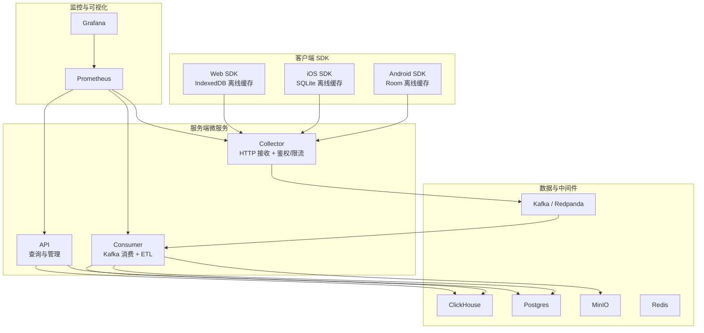
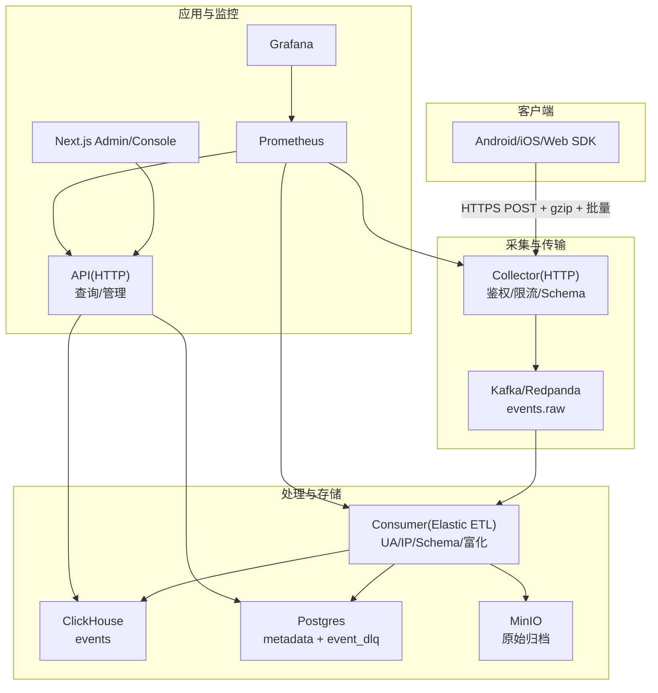
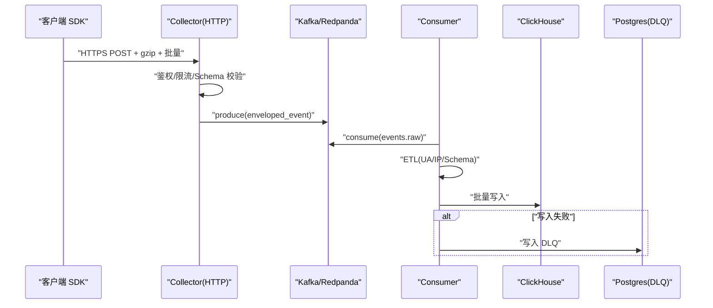
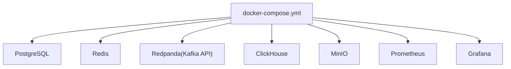
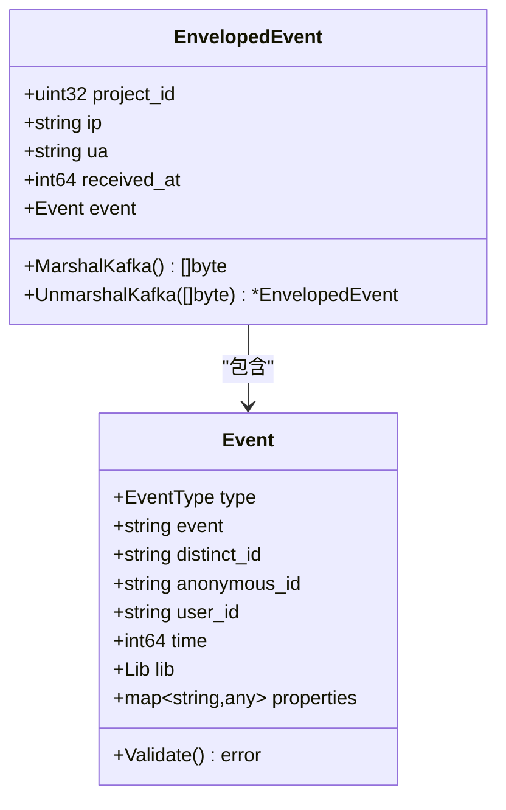
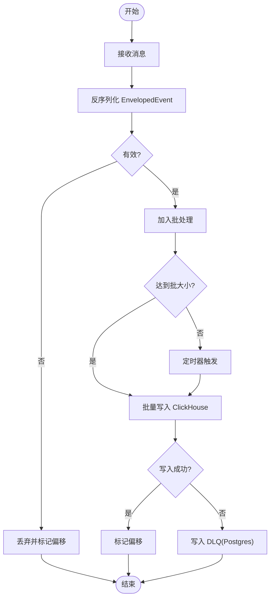
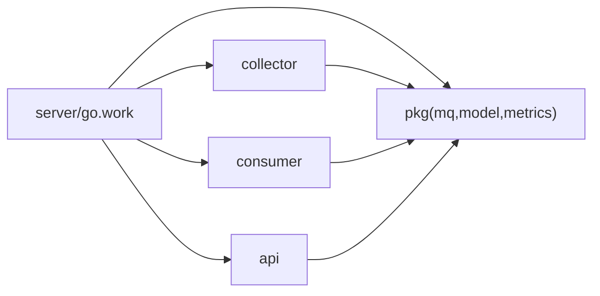

# 整体架构

<cite>
**本文引用的文件**
- [README.md](file://README.md)
- [架构文档](file://docs/architecture.md)
- [协议文档](file://docs/protocol.md)
- [事件 Schema](file://docs/event.schema.json)
- [Docker Compose 配置](file://deploy/docker-compose.yml)
- [Go 工作区](file://server/go.work)
- [Go 工作区摘要](file://server/go.work.sum)
- [收集器入口](file://server/collector/cmd/main.go)
- [消费者入口](file://server/consumer/cmd/main.go)
- [API 入口](file://server/api/cmd/main.go)
- [事件模型](file://server/pkg/model/event.go)
- [Kafka 生产者](file://server/pkg/mq/producer.go)
- [收集器配置](file://server/collector/internal/config/config.go)
- [消费者配置](file://server/consumer/internal/config/config.go)
- [API 配置](file://server/api/internal/config/config.go)
- [ETL 组件](file://server/consumer/internal/etl/etl.go)
- [消费者工作器](file://server/consumer/internal/worker/worker.go)
- [初始化脚本（ClickHouse）](file://deploy/init/clickhouse/01_schema.sql)
- [初始化脚本（Postgres）](file://deploy/init/postgres/01_schema.sql)
- [Prometheus 配置](file://deploy/prometheus/prometheus.yml)
- [Grafana 面板](file://deploy/grafana/dashboards/aerolog-overview.json)
- [Grafana 预置](file://deploy/grafana/provisioning/datasources/prometheus.yml)
- [Android SDK 存储](file://sdk/android/aerolog/src/main/java/dev/aerolog/sdk/storage/EventDatabase.kt)
- [iOS SDK 存储](file://sdk/ios/Sources/AeroLog/EventStore.swift)
- [Web SDK 存储](file://sdk/web/src/storage.ts)
</cite>

## 目录
1. [简介](#简介)
2. [项目结构](#项目结构)
3. [核心组件](#核心组件)
4. [架构总览](#架构总览)
5. [详细组件分析](#详细组件分析)
6. [依赖分析](#依赖分析)
7. [性能考虑](#性能考虑)
8. [故障排查指南](#故障排查指南)
9. [结论](#结论)
10. [附录](#附录)

## 简介
AeroLog 是一个自研的多端埋点平台，参考业界成熟的分层架构理念，围绕“数据采集—传输—处理—存储—应用”的完整链路进行设计。系统以 Go 微服务为核心，配合 Kafka 流式传输、ClickHouse 实时分析存储、Postgres 元数据与归档、MinIO 原始事件归档，以及 Next.js 前后台管理界面，形成完整的可观测、可扩展、可运维的数据分析基础设施。

- 三层客户端 SDK：Android（Room）、iOS（SQLite）、Web（IndexedDB），统一上报协议与批处理策略。
- 三层服务端微服务：Collector（接收与鉴权）、Consumer（Kafka 消费与 ETL）、API（查询与管理）。
- 开发环境一键启动：通过 Docker Compose 提供 PostgreSQL、Redis、Redpanda（Kafka API）、ClickHouse、MinIO、Prometheus、Grafana。

章节来源
- [README.md:1-50](file://README.md#L1-L50)
- [架构文档:1-53](file://docs/architecture.md#L1-L53)

## 项目结构
项目采用按“功能域+层次”混合组织方式：
- sdk：多端 SDK，负责离线缓存与批量上报。
- server：Go 微服务，包含 collector、consumer、api 三个服务与公共包 pkg。
- deploy：容器化与初始化脚本，含 docker-compose、Prometheus、Grafana、数据库初始化 SQL。
- docs：协议、架构、可观测性文档与事件 Schema。
- web：Next.js 前后台管理界面。

图表来源
- [README.md:24-34](file://README.md#L24-L34)
- [架构文档:3-35](file://docs/architecture.md#L3-L35)
- [Docker Compose 配置:3-147](file://deploy/docker-compose.yml#L3-L147)

章节来源
- [README.md:6-22](file://README.md#L6-L22)
- [Go 工作区:1-9](file://server/go.work#L1-L9)

## 核心组件
- 数据采集层（SDK 层）
  - Android/iOS/Web 三端 SDK 使用本地持久化（Room/SQLite/IndexedDB）缓存事件，支持批量、压缩、退避与幂等插入 ID。
- 传输层（Collector）
  - 基于 Gin 的 HTTP 接收服务，负责鉴权、限流、Schema 校验、批量入库 Kafka。
- 处理层（Consumer）
  - 基于 Kafka Consumer Group 的流式处理，执行 UA/IP/Schema 等富化与 ETL，批量写入 ClickHouse，并将异常事件写入 DLQ。
- 存储层
  - ClickHouse：事件明细与分析表，支持高吞吐写入与快速查询。
  - Postgres：元数据、项目配置、事件 DLQ 归档。
  - MinIO：原始事件归档（S3 兼容）。
- 应用层（API + 前台）
  - API 服务提供查询接口，Next.js 前后台用于项目管理与数据分析。

章节来源
- [架构文档:3-35](file://docs/architecture.md#L3-L35)
- [事件模型:27-69](file://server/pkg/model/event.go#L27-L69)
- [Kafka 生产者:12-40](file://server/pkg/mq/producer.go#L12-L40)
- [消费者工作器:40-83](file://server/consumer/internal/worker/worker.go#L40-L83)

## 架构总览
下图展示从 SDK 到最终查询的全链路拓扑与数据流向：

图表来源
- [README.md:24-34](file://README.md#L24-L34)
- [架构文档:3-35](file://docs/architecture.md#L3-L35)
- [Docker Compose 配置:37-147](file://deploy/docker-compose.yml#L37-L147)

## 详细组件分析

### 分层架构与职责边界
- 数据采集层
  - 职责：离线缓存、批量打包、压缩、退避重试、幂等插入 ID、统一上报协议。
  - 证据：三端 SDK 的存储实现与上报流程。
- 传输层（Collector）
  - 职责：鉴权、限流、Schema 校验、批量写 Kafka、暴露指标。
  - 证据：HTTP 入口、Producer 封装、配置项。
- 处理层（Consumer）
  - 职责：Kafka 消费、批处理、UA/IP/Schema 富化、写 ClickHouse、DLQ。
  - 证据：Consumer 入口、Worker 逻辑、ETL 组件。
- 存储层
  - 职责：ClickHouse 明细与分析表、Postgres 元数据与 DLQ、MinIO 原始归档。
  - 证据：初始化 SQL、容器编排。
- 应用层（API + 前台）
  - 职责：查询接口、项目与事件定义管理、可视化分析。
  - 证据：API 入口、路由注册、指标中间件。

章节来源
- [架构文档:3-35](file://docs/architecture.md#L3-L35)
- [收集器入口:22-74](file://server/collector/cmd/main.go#L22-L74)
- [消费者入口:18-55](file://server/consumer/cmd/main.go#L18-L55)
- [API 入口:35-78](file://server/api/cmd/main.go#L35-L78)
- [事件模型:27-69](file://server/pkg/model/event.go#L27-L69)
- [Kafka 生产者:12-40](file://server/pkg/mq/producer.go#L12-L40)
- [消费者工作器:40-83](file://server/consumer/internal/worker/worker.go#L40-L83)
- [ETL 组件:9-89](file://server/consumer/internal/etl/etl.go#L9-L89)

### 微服务架构与协作关系
- Collector
  - 作为唯一对外入口，负责接收 SDK 的 HTTPS POST，鉴权与限流后写入 Kafka。
  - 暴露指标端口，便于 Prometheus 抓取。
- Consumer
  - 以 Consumer Group 方式订阅 Kafka，按批次消费并执行 ETL，随后批量写入 ClickHouse。
  - 出错时写入 DLQ（Postgres），并记录指标。
- API
  - 提供管理与查询接口，连接 Postgres 与 ClickHouse，暴露健康检查与指标。
- 前台（Next.js）
  - 基于 API 提供项目管理与分析页面。

图表来源
- [README.md:24-34](file://README.md#L24-L34)
- [事件模型:62-83](file://server/pkg/model/event.go#L62-L83)
- [Kafka 生产者:42-60](file://server/pkg/mq/producer.go#L42-L60)
- [消费者工作器:92-154](file://server/consumer/internal/worker/worker.go#L92-L154)

章节来源
- [收集器入口:22-74](file://server/collector/cmd/main.go#L22-L74)
- [消费者入口:18-55](file://server/consumer/cmd/main.go#L18-L55)
- [API 入口:35-78](file://server/api/cmd/main.go#L35-L78)

### 容器化部署策略
- Docker Compose
  - 提供开发环境所需全部组件：PostgreSQL、Redis、Redpanda（Kafka API）、ClickHouse、MinIO、Prometheus、Grafana。
  - 通过卷挂载初始化数据库与面板，暴露必要端口。
- 服务发现与负载均衡
  - 开发环境通过容器名访问服务；生产可替换为 Kubernetes 服务发现与 Ingress。
- 指标与可观测性
  - Prometheus 拉取各服务 /metrics；Grafana 预置数据源与 AeroLog 面板。

图表来源
- [Docker Compose 配置:3-147](file://deploy/docker-compose.yml#L3-L147)

章节来源
- [Docker Compose 配置:3-147](file://deploy/docker-compose.yml#L3-L147)
- [Prometheus 配置](file://deploy/prometheus/prometheus.yml)
- [Grafana 预置](file://deploy/grafana/provisioning/datasources/prometheus.yml)

### 数据模型与协议
- 事件模型
  - SDK 上报原始事件 Event，经 Collector 包装为 EnvelopedEvent（携带项目 ID、IP、UA、接收时间）后写入 Kafka。
  - Consumer 解析后执行 ETL 并批量写入 ClickHouse。
- 协议与 Schema
  - 协议与事件 JSON Schema 在 docs 中维护，确保三端一致性。

图表来源
- [事件模型:27-83](file://server/pkg/model/event.go#L27-L83)

章节来源
- [事件模型:27-83](file://server/pkg/model/event.go#L27-L83)
- [协议文档](file://docs/protocol.md)
- [事件 Schema](file://docs/event.schema.json)

### Kafka 生产与消费流程
- Producer
  - 异步批量发送，启用 Snappy 压缩与重试，错误通道异步消费避免阻塞。
- Consumer
  - 基于 Consumer Group，按批次与定时器触发 flush，异常写 DLQ，标记偏移。

图表来源
- [Kafka 生产者:12-40](file://server/pkg/mq/producer.go#L12-L40)
- [消费者工作器:92-154](file://server/consumer/internal/worker/worker.go#L92-L154)

章节来源
- [Kafka 生产者:12-40](file://server/pkg/mq/producer.go#L12-L40)
- [消费者工作器:40-83](file://server/consumer/internal/worker/worker.go#L40-L83)

## 依赖分析
- 工作区组织
  - server/go.work 将 collector、consumer、api、pkg 作为模块统一管理，便于跨服务复用公共库。
- 外部依赖
  - Kafka 客户端（Sarama）、ClickHouse 客户端、Postgres 连接池（pgx）、Gin Web 框架、Prometheus 客户端等。
- 初始化脚本
  - ClickHouse 与 Postgres 的初始化 SQL 用于创建表结构与索引，支撑后续数据写入与查询。

图表来源
- [Go 工作区:3-8](file://server/go.work#L3-L8)

章节来源
- [Go 工作区:1-9](file://server/go.work#L1-L9)
- [Go 工作区摘要:1-180](file://server/go.work.sum#L1-L180)
- [初始化脚本（ClickHouse）](file://deploy/init/clickhouse/01_schema.sql)
- [初始化脚本（Postgres）](file://deploy/init/postgres/01_schema.sql)

## 性能考虑
- 写入路径
  - Collector 批量写 Kafka，Producer 启用 Snappy 压缩与高频 flush，降低端到端延迟。
  - Consumer 批处理写 ClickHouse，支持可调批大小与刷新周期，平衡吞吐与延迟。
- 存储优化
  - ClickHouse 使用 MergeTree/Replicated 等引擎（建议）以提升写入与查询性能。
  - Postgres 仅存放元数据与 DLQ，避免成为瓶颈。
- 指标与观测
  - 暴露 QPS、p99、Kafka lag、CH 写入耗时、DLQ 数量等核心指标，结合 Grafana 可视化。

章节来源
- [架构文档:43-47](file://docs/architecture.md#L43-L47)
- [Kafka 生产者:17-28](file://server/pkg/mq/producer.go#L17-L28)
- [消费者工作器:19-38](file://server/consumer/internal/worker/worker.go#L19-L38)

## 故障排查指南
- 常见问题定位
  - Collector：检查 /metrics 指标、Kafka 连接与权限、Postgres 连接池状态。
  - Consumer：关注 DLQ 数量、Kafka lag、CH 写入耗时、ETL 失败原因。
  - API：验证 CORS 配置、JWT 密钥、CH/PG 连通性。
- 日志与指标
  - 各服务均输出标准日志，Prometheus 抓取 /metrics，Grafana 展示关键面板。
- 数据一致性
  - SDK 离线缓存 + Collector WAL + Kafka 副本 + ClickHouse 幂等写，确保数据不丢。

章节来源
- [API 入口:80-120](file://server/api/cmd/main.go#L80-L120)
- [消费者工作器:156-172](file://server/consumer/internal/worker/worker.go#L156-L172)
- [Grafana 面板](file://deploy/grafana/dashboards/aerolog-overview.json)

## 结论
AeroLog 通过清晰的分层与微服务架构，实现了从多端 SDK 到实时分析的完整闭环。Collector、Consumer、API 三者职责明确、耦合度低，配合 Kafka 流式传输与 ClickHouse 高效存储，满足可观测、可扩展、可运维的要求。借助 Docker Compose 与 Prometheus/Grafana，开发与运维体验良好。建议在生产环境中进一步完善服务发现、负载均衡、安全加固与实时聚合能力。

## 附录
- 端到端链路
  - SDK → Collector → Kafka → Consumer → ClickHouse/Postgres/MinIO → API → 前台
- 开发环境一键启动
  - 进入 deploy 目录，执行 docker compose up -d 即可启动全部组件。

章节来源
- [README.md:36-43](file://README.md#L36-L43)
- [架构文档:24-35](file://docs/architecture.md#L24-L35)