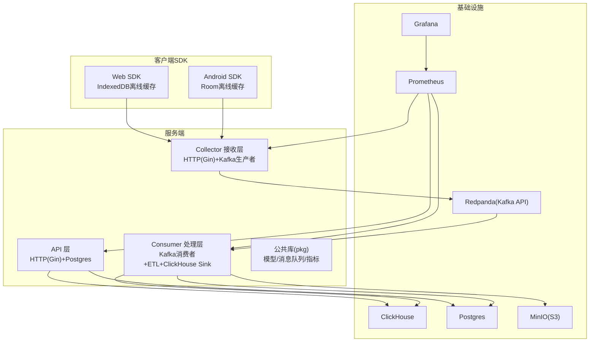
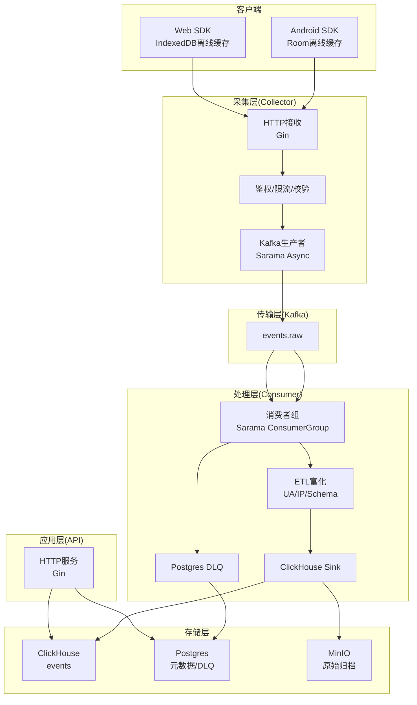
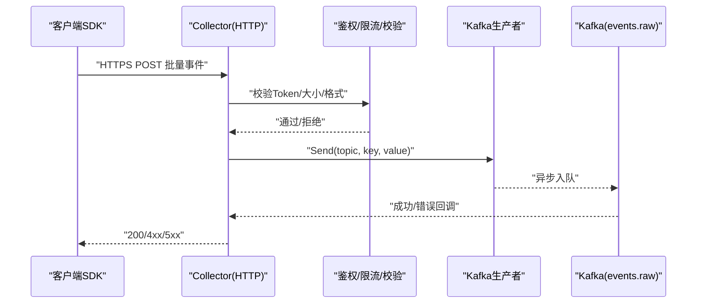
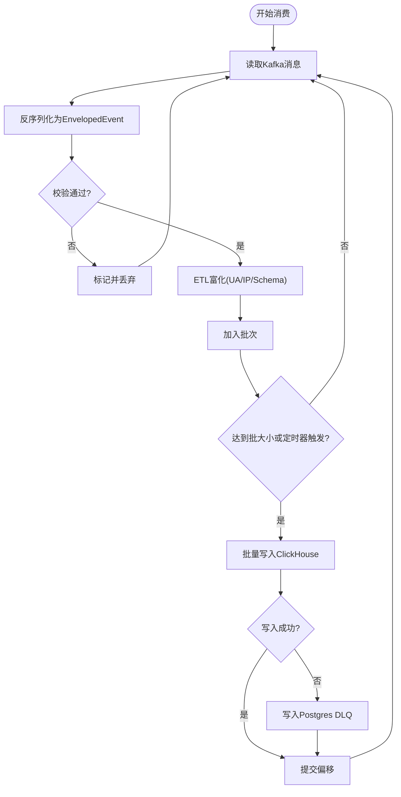
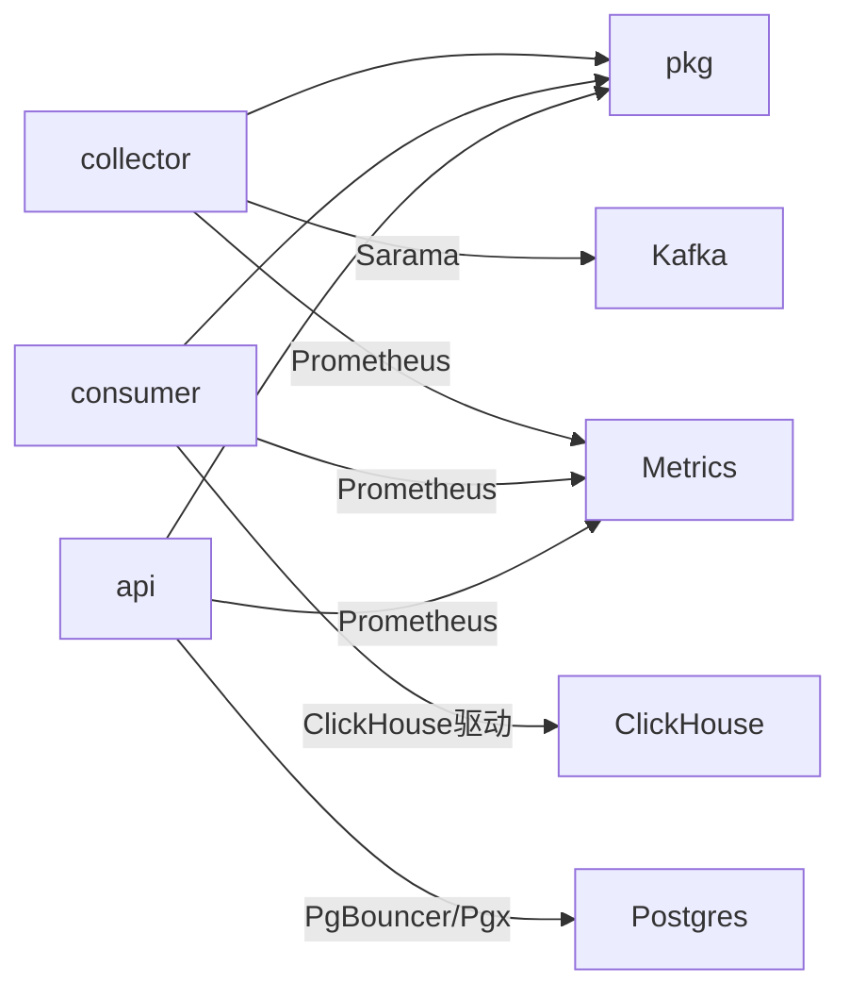

# 架构设计

<cite>
**本文引用的文件**
- [README.md](file://README.md)
- [docs/architecture.md](file://docs/architecture.md)
- [deploy/docker-compose.yml](file://deploy/docker-compose.yml)
- [server/go.work](file://server/go.work)
- [server/go.work.sum](file://server/go.work.sum)
- [server/api/cmd/main.go](file://server/api/cmd/main.go)
- [server/collector/cmd/main.go](file://server/collector/cmd/main.go)
- [server/consumer/cmd/main.go](file://server/consumer/cmd/main.go)
- [server/pkg/model/event.go](file://server/pkg/model/event.go)
- [server/pkg/mq/producer.go](file://server/pkg/mq/producer.go)
- [server/consumer/internal/etl/etl.go](file://server/consumer/internal/etl/etl.go)
- [server/consumer/internal/chsink/sink.go](file://server/consumer/internal/chsink/sink.go)
- [server/consumer/internal/worker/worker.go](file://server/consumer/internal/worker/worker.go)
- [sdk/android/aerolog/src/main/java/dev/aerolog/sdk/AeroLog.kt](file://sdk/android/aerolog/src/main/java/dev/aerolog/sdk/AeroLog.kt)
- [sdk/web/src/index.ts](file://sdk/web/src/index.ts)
</cite>

## 目录
1. [引言](#引言)
2. [项目结构](#项目结构)
3. [核心组件](#核心组件)
4. [架构总览](#架构总览)
5. [详细组件分析](#详细组件分析)
6. [依赖分析](#依赖分析)
7. [性能考量](#性能考量)
8. [故障排查指南](#故障排查指南)
9. [结论](#结论)
10. [附录](#附录)

## 引言
本文件面向AeroLog项目的架构设计与实现，围绕“分层架构 + 事件驱动 + OLAP”的整体思路，系统阐述数据采集层、传输层、处理层、存储层与应用层的职责边界与协作方式；深入说明基于Kafka的消息队列机制、异步处理流程与微服务间通信模式；解释ClickHouse在大规模数据分析场景下的优势与性能特征；给出容器化部署策略与扩展性建议；并通过多种图示帮助开发者快速理解复杂系统的交互关系。

## 项目结构
AeroLog采用多模块工作区组织服务端代码，按职责划分为采集、消费、API与公共库四个子项目，配合SDK与前端控制台，形成完整的端到端埋点平台。

图表来源
- [README.md:24-34](file://README.md#L24-L34)
- [docs/architecture.md:5-35](file://docs/architecture.md#L5-L35)
- [deploy/docker-compose.yml:37-147](file://deploy/docker-compose.yml#L37-L147)
- [server/go.work:1-9](file://server/go.work#L1-L9)

章节来源
- [README.md:6-22](file://README.md#L6-L22)
- [docs/architecture.md:1-53](file://docs/architecture.md#L1-L53)
- [deploy/docker-compose.yml:1-147](file://deploy/docker-compose.yml#L1-L147)
- [server/go.work:1-9](file://server/go.work#L1-L9)

## 核心组件
- 数据采集层（Collector）：接收来自SDK的HTTPS批量上报，进行鉴权、限流与基础校验，随后异步投递至Kafka。
- 传输层（Kafka）：作为高吞吐消息总线，解耦采集与处理，支持水平扩展与可靠投递。
- 处理层（Consumer）：消费Kafka消息，执行UA/IP/Schema等ETL富化，批量写入ClickHouse，并将异常消息写入Postgres DLQ。
- 存储层：ClickHouse用于OLAP分析，Postgres存储元数据与DLQ，MinIO提供原始事件归档能力。
- 应用层（API）：提供管理与查询接口，对接Postgres与ClickHouse，支撑后台管理与可视化。
- 公共库（pkg）：统一事件模型、Kafka生产者封装与Prometheus指标。
- 客户端SDK：Android（Room）、Web（IndexedDB）实现离线缓存与退避重试，确保弱网与离线场景的数据不丢。

章节来源
- [server/collector/cmd/main.go:22-74](file://server/collector/cmd/main.go#L22-L74)
- [server/consumer/cmd/main.go:18-55](file://server/consumer/cmd/main.go#L18-L55)
- [server/api/cmd/main.go:35-78](file://server/api/cmd/main.go#L35-L78)
- [server/pkg/mq/producer.go:12-69](file://server/pkg/mq/producer.go#L12-L69)
- [server/consumer/internal/chsink/sink.go:17-126](file://server/consumer/internal/chsink/sink.go#L17-L126)
- [server/consumer/internal/worker/worker.go:40-173](file://server/consumer/internal/worker/worker.go#L40-L173)
- [server/pkg/model/event.go:27-84](file://server/pkg/model/event.go#L27-L84)
- [sdk/android/aerolog/src/main/java/dev/aerolog/sdk/AeroLog.kt:59-216](file://sdk/android/aerolog/src/main/java/dev/aerolog/sdk/AeroLog.kt#L59-L216)
- [sdk/web/src/index.ts:28-307](file://sdk/web/src/index.ts#L28-L307)

## 架构总览
下图展示从客户端到存储与查询的完整数据流，体现事件驱动与分层解耦：

图表来源
- [docs/architecture.md:5-35](file://docs/architecture.md#L5-L35)
- [server/collector/cmd/main.go:39-48](file://server/collector/cmd/main.go#L39-L48)
- [server/pkg/mq/producer.go:18-40](file://server/pkg/mq/producer.go#L18-L40)
- [server/consumer/internal/worker/worker.go:60-83](file://server/consumer/internal/worker/worker.go#L60-L83)
- [server/consumer/internal/etl/etl.go:9-90](file://server/consumer/internal/etl/etl.go#L9-L90)
- [server/consumer/internal/chsink/sink.go:45-103](file://server/consumer/internal/chsink/sink.go#L45-L103)
- [server/api/cmd/main.go:55-58](file://server/api/cmd/main.go#L55-L58)

## 详细组件分析

### 数据采集层（Collector）
- 职责：接收HTTPS批量上报，鉴权、限流与基础校验，异步投递Kafka。
- 关键点：
  - 使用Gin构建HTTP服务，注册TrackHandler。
  - 通过pkg/mq生产者封装，启用Snappy压缩与重试。
  - 项目级缓存（ProjectCache）提升鉴权效率。
- 流程图（采集到Kafka）：

图表来源
- [server/collector/cmd/main.go:39-48](file://server/collector/cmd/main.go#L39-L48)
- [server/pkg/mq/producer.go:42-60](file://server/pkg/mq/producer.go#L42-L60)

章节来源
- [server/collector/cmd/main.go:22-74](file://server/collector/cmd/main.go#L22-L74)
- [server/pkg/mq/producer.go:12-69](file://server/pkg/mq/producer.go#L12-L69)

### 传输层（Kafka）
- 职责：作为事件总线，解耦采集与处理，支持水平扩展与副本容灾。
- 配置要点：
  - 使用Redpanda（Kafka API兼容）替代传统Kafka，简化运维。
  - 生产者启用Snappy压缩、批量与重试，降低网络开销与提高可靠性。
- 事件模型：
  - EnvelopedEvent在Collector侧包装上下文信息，避免Consumer重复解析HTTP头。

章节来源
- [docs/architecture.md:12-14](file://docs/architecture.md#L12-L14)
- [server/pkg/mq/producer.go:18-40](file://server/pkg/mq/producer.go#L18-L40)
- [server/pkg/model/event.go:62-74](file://server/pkg/model/event.go#L62-L74)

### 处理层（Consumer）
- 职责：消费Kafka消息，执行ETL富化（UA/IP/Schema），批量写入ClickHouse，并将异常写入Postgres DLQ。
- 关键点：
  - 使用Sarama ConsumerGroup实现分区均衡与会话管理。
  - 批处理策略：按消息数量与时间间隔触发flush。
  - 指标监控：消息总量、flush耗时、批大小、DLQ计数。
- 处理流程（消费→ETL→写入）：

图表来源
- [server/consumer/internal/worker/worker.go:92-154](file://server/consumer/internal/worker/worker.go#L92-L154)
- [server/consumer/internal/etl/etl.go:29-90](file://server/consumer/internal/etl/etl.go#L29-L90)
- [server/consumer/internal/chsink/sink.go:45-103](file://server/consumer/internal/chsink/sink.go#L45-L103)

章节来源
- [server/consumer/cmd/main.go:18-55](file://server/consumer/cmd/main.go#L18-L55)
- [server/consumer/internal/worker/worker.go:40-173](file://server/consumer/internal/worker/worker.go#L40-L173)
- [server/consumer/internal/etl/etl.go:1-90](file://server/consumer/internal/etl/etl.go#L1-L90)
- [server/consumer/internal/chsink/sink.go:17-126](file://server/consumer/internal/chsink/sink.go#L17-L126)

### 存储层（ClickHouse + Postgres + MinIO）
- ClickHouse：作为OLAP主存储，支持高并发写入与复杂分析查询；Consumer通过批量插入提升写入效率。
- Postgres：存储元数据与DLQ；DLQ用于记录无法写入ClickHouse的异常消息，便于事后审计与重放。
- MinIO：提供S3兼容的对象存储，用于原始事件归档与备份。
- 容器编排：通过docker-compose一键启动，包含Postgres、Redis、Redpanda、ClickHouse、MinIO、Prometheus、Grafana。

章节来源
- [docs/architecture.md:22-29](file://docs/architecture.md#L22-L29)
- [deploy/docker-compose.yml:4-147](file://deploy/docker-compose.yml#L4-L147)

### 应用层（API）
- 职责：提供管理与查询接口，对接Postgres与ClickHouse，支撑后台管理与可视化。
- 关键点：
  - Gin路由注册项目、事件定义与分析接口。
  - Prometheus指标暴露与CORS中间件支持管理后台跨域访问。
  - ClickHouse连接池与健康检查。

章节来源
- [server/api/cmd/main.go:35-78](file://server/api/cmd/main.go#L35-L78)

### 客户端SDK（Android/Web）
- Android SDK：
  - 使用Room进行离线持久化，结合内存缓冲与周期flush，确保弱网与离线场景的数据不丢。
  - 支持自动追踪生命周期与页面浏览，内置$session_id与$insert_id。
- Web SDK：
  - 使用IndexedDB进行离线持久化，结合内存缓冲与定时flush；支持sendBeacon在页面卸载时兜底上报。
  - 实现指数退避重试与在线恢复上传逻辑，保障数据最终一致性。

章节来源
- [sdk/android/aerolog/src/main/java/dev/aerolog/sdk/AeroLog.kt:59-216](file://sdk/android/aerolog/src/main/java/dev/aerolog/sdk/AeroLog.kt#L59-L216)
- [sdk/web/src/index.ts:28-307](file://sdk/web/src/index.ts#L28-L307)

## 依赖分析
- 工作区组织：server/go.work声明多模块工作区，包含collector、consumer、api、pkg。
- 外部依赖：
  - Gin：HTTP框架。
  - Sarama：Kafka客户端。
  - ClickHouse Go驱动：ClickHouse连接与批量写入。
  - PgBouncer/Pgx：Postgres连接池。
  - Prometheus：指标采集。
- 依赖关系图：

图表来源
- [server/go.work:3-8](file://server/go.work#L3-L8)
- [server/go.work.sum:1-180](file://server/go.work.sum#L1-L180)

章节来源
- [server/go.work:1-9](file://server/go.work#L1-L9)
- [server/go.work.sum:1-180](file://server/go.work.sum#L1-L180)

## 性能考量
- 写入路径优化：
  - Kafka生产者启用Snappy压缩与批量flush，减少网络与磁盘IO。
  - Consumer批量写入ClickHouse，利用PrepareBatch与异步插入参数提升吞吐。
- 查询路径优化：
  - ClickHouse适合宽表+时间序列+聚合分析，结合物化视图与分区策略可进一步优化。
  - API层对热点查询使用缓存与索引，避免对ClickHouse造成过大压力。
- 可观测性：
  - 暴露QPS、p99、Kafka lag、CH写入耗时、DLQ数量等核心指标，便于容量规划与问题定位。
- 容量演进：
  - MVP：单机Docker Compose承载约千级QPS。
  - 中规模：Collector水平扩展、Kafka 3节点、ClickHouse单副本、Postgres主从。
  - 大规模：Consumer按project分组消费、ClickHouse分布式表+ReplicatedMergeTree、引入Flink做实时聚合。

章节来源
- [docs/architecture.md:37-47](file://docs/architecture.md#L37-L47)
- [server/pkg/mq/producer.go:18-40](file://server/pkg/mq/producer.go#L18-L40)
- [server/consumer/internal/chsink/sink.go:23-43](file://server/consumer/internal/chsink/sink.go#L23-L43)

## 故障排查指南
- 常见问题与定位：
  - Kafka不可用：确认Redpanda服务健康与topic存在；查看生产者错误回调与消费者lag。
  - ClickHouse写入失败：检查Sink连接参数、表结构与权限；关注flush耗时与批大小。
  - DLQ堆积：检查Postgres event_dlq表，定位异常原因（无效消息、Schema不匹配、下游错误）。
  - API查询慢：确认ClickHouse索引与分区策略，必要时增加物化视图或缓存。
- 指标与告警：
  - Prometheus抓取各服务/metrics端点，设置QPS、p99、lag、DLQ数量阈值告警。
  - Grafana仪表盘预置，便于实时观察系统健康状况。

章节来源
- [server/consumer/internal/worker/worker.go:156-173](file://server/consumer/internal/worker/worker.go#L156-L173)
- [deploy/docker-compose.yml:113-147](file://deploy/docker-compose.yml#L113-L147)

## 结论
AeroLog以“分层架构 + 事件驱动 + OLAP”为核心设计思想，通过Kafka实现采集与处理解耦，借助ClickHouse满足大规模数据分析需求，配合Postgres与MinIO完善元数据与归档能力。容器化部署与可观测性体系保障了系统的可运维性与可扩展性。未来可在大规模场景引入Flink实时聚合与ClickHouse分布式复制，持续提升吞吐与可用性。

## 附录
- 一键启动开发环境：进入deploy目录，执行docker compose up -d，即可启动Postgres、Redis、Redpanda、ClickHouse、MinIO、Prometheus、Grafana。
- 系统拓扑与数据流：详见“架构总览”与“依赖分析”图示。

章节来源
- [README.md:36-43](file://README.md#L36-L43)
- [deploy/docker-compose.yml:1-147](file://deploy/docker-compose.yml#L1-L147)