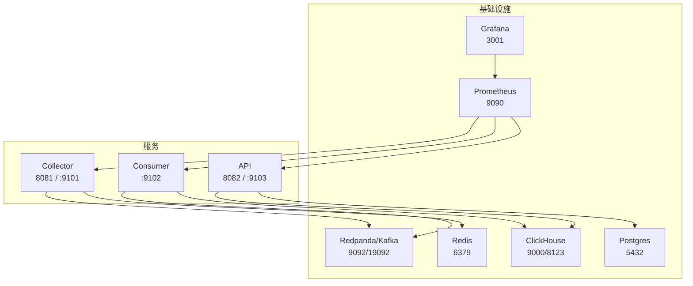
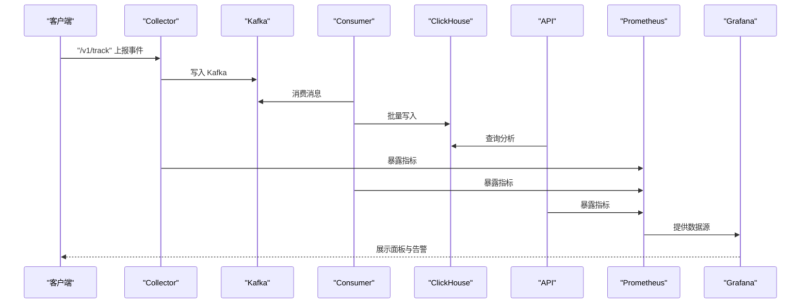
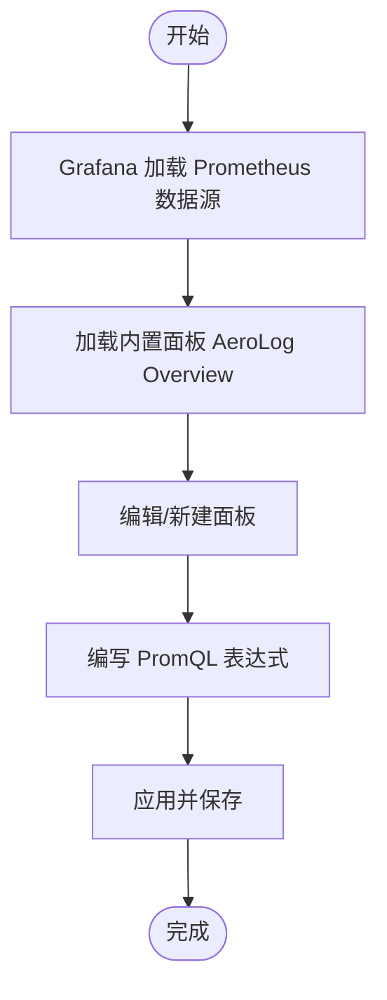
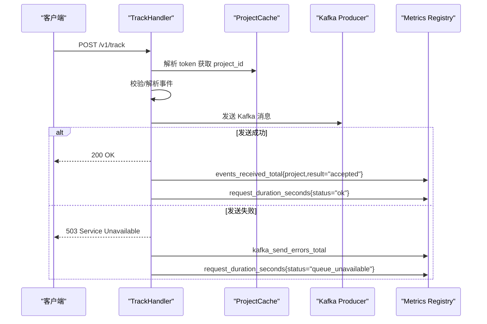
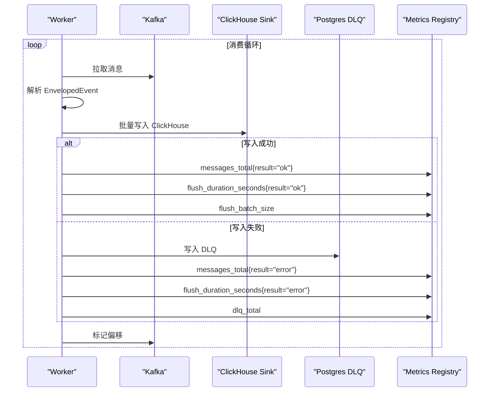
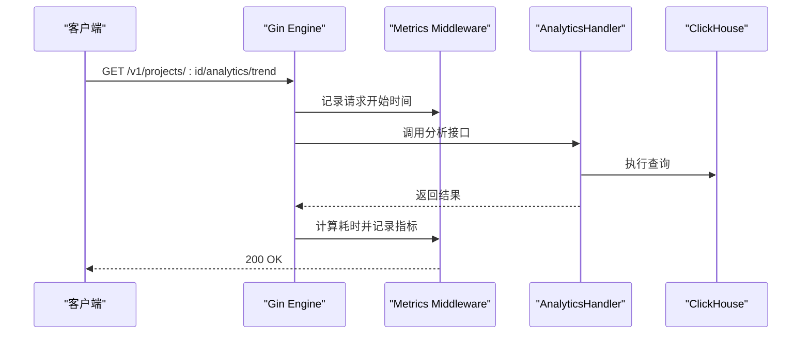
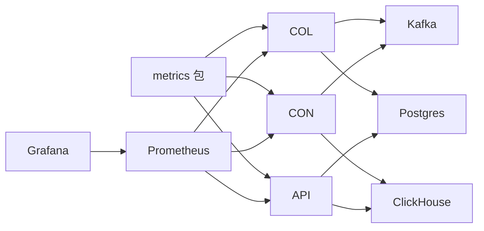

# 监控与可观测性

<cite>
**本文引用的文件**
- [deploy/prometheus/prometheus.yml](file://deploy/prometheus/prometheus.yml)
- [deploy/grafana/provisioning/datasources/prometheus.yml](file://deploy/grafana/provisioning/datasources/prometheus.yml)
- [deploy/grafana/dashboards/aerolog-overview.json](file://deploy/grafana/dashboards/aerolog-overview.json)
- [deploy/docker-compose.yml](file://deploy/docker-compose.yml)
- [docs/observability.md](file://docs/observability.md)
- [server/pkg/metrics/metrics.go](file://server/pkg/metrics/metrics.go)
- [server/api/cmd/main.go](file://server/api/cmd/main.go)
- [server/api/internal/handler/analytics.go](file://server/api/internal/handler/analytics.go)
- [server/collector/cmd/main.go](file://server/collector/cmd/main.go)
- [server/collector/internal/config/config.go](file://server/collector/internal/config/config.go)
- [server/collector/internal/handler/track.go](file://server/collector/internal/handler/track.go)
- [server/consumer/cmd/main.go](file://server/consumer/cmd/main.go)
- [server/consumer/internal/config/config.go](file://server/consumer/internal/config/config.go)
- [server/consumer/internal/worker/worker.go](file://server/consumer/internal/worker/worker.go)
- [server/consumer/internal/chsink/sink.go](file://server/consumer/internal/chsink/sink.go)
- [server/consumer/internal/etl/etl.go](file://server/consumer/internal/etl/etl.go)
- [server/pkg/model/event.go](file://server/pkg/model/event.go)
</cite>

## 目录
1. [简介](#简介)
2. [项目结构](#项目结构)
3. [核心组件](#核心组件)
4. [架构总览](#架构总览)
5. [组件详解](#组件详解)
6. [依赖关系分析](#依赖关系分析)
7. [性能考量](#性能考量)
8. [故障排查指南](#故障排查指南)
9. [结论](#结论)
10. [附录](#附录)

## 简介
本指南围绕 AeroLog 的监控与可观测性进行系统化说明，覆盖指标体系设计（业务指标、系统指标、应用指标）、Grafana 仪表板配置与自定义、日志聚合与分析策略、分布式追踪与性能监控最佳实践、告警规则配置与通知渠道集成，以及故障诊断与性能优化的实用技巧。文档基于仓库中实际实现与配置文件，确保内容可落地、可验证。

## 项目结构
AeroLog 的可观测性栈由以下部分组成：
- 指标采集：三个 Go 服务（collector、consumer、api）各自暴露独立的 /metrics 端口，Prometheus 通过静态发现抓取。
- 可视化：Grafana 通过 provision 配置自动加载 Prometheus 数据源，并内置 AeroLog Overview 面板。
- 基础设施：Prometheus、Grafana、Redpanda（Kafka）、ClickHouse、Postgres、Redis 通过 Docker Compose 编排。



图表来源
- [deploy/docker-compose.yml:114-147](file://deploy/docker-compose.yml#L114-L147)
- [deploy/prometheus/prometheus.yml:10-32](file://deploy/prometheus/prometheus.yml#L10-L32)
- [deploy/grafana/provisioning/datasources/prometheus.yml:1-10](file://deploy/grafana/provisioning/datasources/prometheus.yml#L1-L10)

章节来源
- [deploy/docker-compose.yml:1-147](file://deploy/docker-compose.yml#L1-L147)
- [docs/observability.md:1-67](file://docs/observability.md#L1-L67)

## 核心组件
- 指标注册与导出：统一的 Prometheus 注册表与 /metrics、/healthz 端点，各服务独立暴露，避免业务端口复杂化。
- 业务指标：
  - Collector：事件接收总量（含 accepted/rejected）、请求耗时直方图、Kafka 发送错误计数。
  - Consumer：消息消费总量（ok/invalid）、flush 耗时直方图、批大小直方图、DLQ 计数。
  - API：请求总量与状态码分布、请求耗时直方图。
- 系统指标：默认包含 Go runtime 与 process 指标，便于观察 goroutines、内存、CPU 等。
- 应用指标：Kafka/ClickHouse/Postgres/Redis 连接与健康检查，结合 Grafana 面板与告警规则。

章节来源
- [server/pkg/metrics/metrics.go:1-81](file://server/pkg/metrics/metrics.go#L1-L81)
- [docs/observability.md:30-67](file://docs/observability.md#L30-L67)

## 架构总览
下图展示从客户端到数据存储与监控的整体链路，以及指标如何在各组件中产生与消费。



图表来源
- [server/collector/internal/handler/track.go:60-133](file://server/collector/internal/handler/track.go#L60-L133)
- [server/consumer/internal/worker/worker.go:92-154](file://server/consumer/internal/worker/worker.go#L92-L154)
- [server/consumer/internal/chsink/sink.go:45-103](file://server/consumer/internal/chsink/sink.go#L45-L103)
- [server/api/internal/handler/analytics.go:34-74](file://server/api/internal/handler/analytics.go#L34-L74)
- [deploy/prometheus/prometheus.yml:10-32](file://deploy/prometheus/prometheus.yml#L10-L32)

## 组件详解

### 指标体系设计与实现
- 指标注册与导出
  - 统一注册表包含 Go runtime/process 指标，默认延迟桶（秒）。
  - 各服务独立 /metrics 端口，便于 Prometheus 抓取与健康检查。
- 业务指标
  - Collector：事件接收计数（按 result）、请求耗时直方图、Kafka 写失败计数。
  - Consumer：消息消费计数（ok/invalid）、flush 耗时直方图、批大小直方图、DLQ 计数。
  - API：请求总量与状态码分布、请求耗时直方图。
- 系统指标
  - 默认暴露 Go runtime 与 process 指标，可用于 CPU、内存、goroutines 等健康度监控。

```mermaid
classDiagram
class Metrics {
+Counter(name, help, labels)
+Histogram(name, help, labels)
+Gauge(name, help, labels)
+Serve(addr)
+Shutdown(server)
}
class Collector {
+events_received_total{project,result}
+request_duration_seconds{status}
+kafka_send_errors_total
}
class Consumer {
+messages_total{result}
+flush_duration_seconds{result}
+flush_batch_size
+dlq_total
}
class API {
+requests_total{method,path,status}
+request_duration_seconds{method,path,status}
}
Metrics <.. Collector : "注册/导出"
Metrics <.. Consumer : "注册/导出"
Metrics <.. API : "注册/导出"
```

图表来源
- [server/pkg/metrics/metrics.go:18-81](file://server/pkg/metrics/metrics.go#L18-L81)
- [server/collector/internal/handler/track.go:22-37](file://server/collector/internal/handler/track.go#L22-L37)
- [server/consumer/internal/worker/worker.go:19-38](file://server/consumer/internal/worker/worker.go#L19-L38)
- [server/api/cmd/main.go:22-33](file://server/api/cmd/main.go#L22-L33)

章节来源
- [server/pkg/metrics/metrics.go:1-81](file://server/pkg/metrics/metrics.go#L1-L81)
- [server/collector/internal/handler/track.go:22-37](file://server/collector/internal/handler/track.go#L22-L37)
- [server/consumer/internal/worker/worker.go:19-38](file://server/consumer/internal/worker/worker.go#L19-L38)
- [server/api/cmd/main.go:22-33](file://server/api/cmd/main.go#L22-L33)

### Grafana 仪表板配置与自定义
- 数据源
  - Grafana 通过 provision 自动加载名为 Prometheus 的数据源，URL 指向容器内服务名。
- 面板
  - 内置 AeroLog Overview 面板，包含 Collector/Consumer/API 的关键指标可视化。
  - 面板表达式直接使用已注册的指标名称与标签，例如 p99 延迟、拒绝率、DLQ 速率等。
- 自定义步骤
  - 新建面板时选择 Prometheus 数据源，编写 PromQL 表达式，参考现有面板中的表达式结构。
  - 对于新增指标，先在服务中注册并导出，再在 Grafana 中添加面板。



图表来源
- [deploy/grafana/provisioning/datasources/prometheus.yml:1-10](file://deploy/grafana/provisioning/datasources/prometheus.yml#L1-L10)
- [deploy/grafana/dashboards/aerolog-overview.json:10-131](file://deploy/grafana/dashboards/aerolog-overview.json#L10-L131)

章节来源
- [deploy/grafana/provisioning/datasources/prometheus.yml:1-10](file://deploy/grafana/provisioning/datasources/prometheus.yml#L1-L10)
- [deploy/grafana/dashboards/aerolog-overview.json:1-131](file://deploy/grafana/dashboards/aerolog-overview.json#L1-L131)
- [docs/observability.md:25-28](file://docs/observability.md#L25-L28)

### 日志聚合与分析策略
- 结构化日志
  - 服务通过标准输出输出结构化日志，Promtail/Fluent Bit 可采集并注入标签（如 service、cluster）。
  - 建议在容器编排中为每个服务设置唯一 job/instance 标签，便于区分来源。
- 查询语法
  - 使用 PromQL 对指标进行聚合与比率计算（如拒绝率、p99 延迟）。
  - 对于日志侧，建议使用 Loki 或类似系统配合 Grafana Logs 面板进行检索与聚合。
- 与指标联动
  - 将日志中的错误堆栈与指标异常（如 Kafka 写失败、DLQ 增长）关联，定位根因。

[本节为概念性说明，不直接分析具体文件，故不附加章节来源]

### 分布式追踪与性能监控最佳实践
- 追踪方案
  - 建议在 API 层引入 OpenTelemetry SDK，对 /v1/* 路径生成 Span 并注入 TraceID。
  - 将 Kafka 生产/消费、ClickHouse 写入封装为子 Span，形成端到端调用链。
- 性能监控
  - 以 p99 延迟为核心指标，结合直方图桶分布观察尾部延迟变化。
  - 关注批处理大小与 flush 耗时，平衡吞吐与延迟。
  - 对外部依赖（Kafka、ClickHouse、Postgres）设置健康检查与超时控制。

[本节为概念性说明，不直接分析具体文件，故不附加章节来源]

### 告警规则配置与通知渠道
- 规则建议
  - Kafka 写失败持续增长：基于计数器增量的阈值告警。
  - Collector p99 延迟退化：基于直方图分位数的阈值告警。
  - Consumer DLQ 增长：基于计数器增量的阈值告警。
  - 消费滞后：接入 Kafka lag 指标后，在 Grafana 中增加面板并设置阈值。
- 通知渠道
  - Grafana Alerting 支持多种通知通道（邮件、Webhook、Slack 等），可在面板或规则中配置。
  - 建议为不同严重级别（警告/严重）配置不同的通知策略与静默窗口。

章节来源
- [docs/observability.md:55-67](file://docs/observability.md#L55-L67)

### 服务与端口约定
- 端口分配
  - Collector：业务端口 8081，metrics 端口 9101。
  - Consumer：业务端口（无 HTTP），metrics 端口 9102。
  - API：业务端口 8082，metrics 端口 9103。
- 启动方式
  - 通过 Docker Compose 启动基础设施与可视化组件。
  - 本地开发时分别启动三个服务，Prometheus 通过 host.docker.internal 抓取宿主机目标。

章节来源
- [docs/observability.md:5-31](file://docs/observability.md#L5-L31)
- [deploy/prometheus/prometheus.yml:10-32](file://deploy/prometheus/prometheus.yml#L10-L32)

### 关键流程与指标映射

#### Collector 指标流


图表来源
- [server/collector/internal/handler/track.go:60-133](file://server/collector/internal/handler/track.go#L60-L133)
- [server/pkg/metrics/metrics.go:26-42](file://server/pkg/metrics/metrics.go#L26-L42)

章节来源
- [server/collector/internal/handler/track.go:22-37](file://server/collector/internal/handler/track.go#L22-L37)
- [server/collector/internal/config/config.go:19-30](file://server/collector/internal/config/config.go#L19-L30)

#### Consumer 指标流


图表来源
- [server/consumer/internal/worker/worker.go:92-154](file://server/consumer/internal/worker/worker.go#L92-L154)
- [server/consumer/internal/chsink/sink.go:45-103](file://server/consumer/internal/chsink/sink.go#L45-L103)

章节来源
- [server/consumer/internal/worker/worker.go:19-38](file://server/consumer/internal/worker/worker.go#L19-L38)
- [server/consumer/internal/config/config.go:28-44](file://server/consumer/internal/config/config.go#L28-L44)

#### API 指标流


图表来源
- [server/api/cmd/main.go:80-93](file://server/api/cmd/main.go#L80-L93)
- [server/api/internal/handler/analytics.go:34-74](file://server/api/internal/handler/analytics.go#L34-L74)

章节来源
- [server/api/cmd/main.go:22-33](file://server/api/cmd/main.go#L22-L33)
- [server/api/internal/handler/analytics.go:13-32](file://server/api/internal/handler/analytics.go#L13-L32)

## 依赖关系分析
- 组件耦合
  - 服务通过统一的 metrics 包注册指标，降低重复实现。
  - Collector 依赖 Kafka 与 Postgres（缓存），Consumer 依赖 Kafka 与 ClickHouse，API 依赖 ClickHouse 与 Postgres。
- 外部依赖
  - Prometheus 通过静态配置抓取各服务 metrics 端口。
  - Grafana 通过 provision 自动加载数据源与面板。



图表来源
- [server/pkg/metrics/metrics.go:18-81](file://server/pkg/metrics/metrics.go#L18-L81)
- [server/collector/cmd/main.go:31-35](file://server/collector/cmd/main.go#L31-L35)
- [server/consumer/cmd/main.go:27-32](file://server/consumer/cmd/main.go#L27-L32)
- [server/api/cmd/main.go:44-48](file://server/api/cmd/main.go#L44-L48)
- [deploy/prometheus/prometheus.yml:10-32](file://deploy/prometheus/prometheus.yml#L10-L32)

章节来源
- [deploy/prometheus/prometheus.yml:10-32](file://deploy/prometheus/prometheus.yml#L10-L32)
- [deploy/grafana/provisioning/datasources/prometheus.yml:1-10](file://deploy/grafana/provisioning/datasources/prometheus.yml#L1-L10)

## 性能考量
- 指标维度
  - 为关键指标设置合理标签（如 method/path/status、result、status），避免高基数导致指标膨胀。
- 直方图桶
  - 使用默认延迟桶覆盖常见场景；针对特定服务可调整桶边界以提升分位数精度。
- 批处理与刷新
  - Consumer 的批大小与刷新周期需结合吞吐与延迟目标调优；关注 flush 耗时与批大小分布。
- 外部依赖
  - 为 Kafka/ClickHouse/Postgres 设置合理的连接池、超时与重试策略，避免成为瓶颈。

[本节提供通用指导，不直接分析具体文件，故不附加章节来源]

## 故障排查指南
- 指标不可见
  - 确认服务已启动 metrics 服务并在指定端口暴露 /metrics 与 /healthz。
  - 检查 Prometheus 抓取配置与网络连通性。
- Collector 写 Kafka 失败
  - 查看 Kafka 写失败计数是否增长；检查 Broker 地址、Topic 权限与网络。
- Consumer DLQ 增长
  - 检查解析失败与写入失败原因；确认 DLQ 表写入是否正常。
- API 查询慢
  - 关注请求耗时直方图与 ClickHouse 性能；优化查询语句与索引。
- Grafana 面板空白
  - 确认数据源已正确加载；检查面板表达式与时间范围。

章节来源
- [docs/observability.md:55-67](file://docs/observability.md#L55-L67)
- [server/collector/internal/handler/track.go:120-128](file://server/collector/internal/handler/track.go#L120-L128)
- [server/consumer/internal/worker/worker.go:107-112](file://server/consumer/internal/worker/worker.go#L107-L112)
- [server/api/internal/handler/analytics.go:52-61](file://server/api/internal/handler/analytics.go#L52-L61)

## 结论
AeroLog 的可观测性体系以 Prometheus 为核心，结合 Grafana 面板与告警规则，实现了对业务、系统与应用的全链路监控。通过统一的指标注册与导出机制、清晰的端口约定与抓取配置，开发者可以快速定位问题并优化性能。建议在生产环境中进一步完善分布式追踪、日志聚合与通知渠道，并持续迭代指标与告警策略以适配业务演进。

## 附录
- 关键指标速查
  - Collector：事件接收总量、请求耗时直方图、Kafka 写失败计数。
  - Consumer：消息消费总量、flush 耗时直方图、批大小直方图、DLQ 计数。
  - API：请求总量与状态码分布、请求耗时直方图。
- 环境准备
  - 通过 Docker Compose 启动基础设施与可视化组件，本地开发时分别启动三个服务。

章节来源
- [docs/observability.md:30-67](file://docs/observability.md#L30-L67)
- [deploy/docker-compose.yml:114-147](file://deploy/docker-compose.yml#L114-L147)