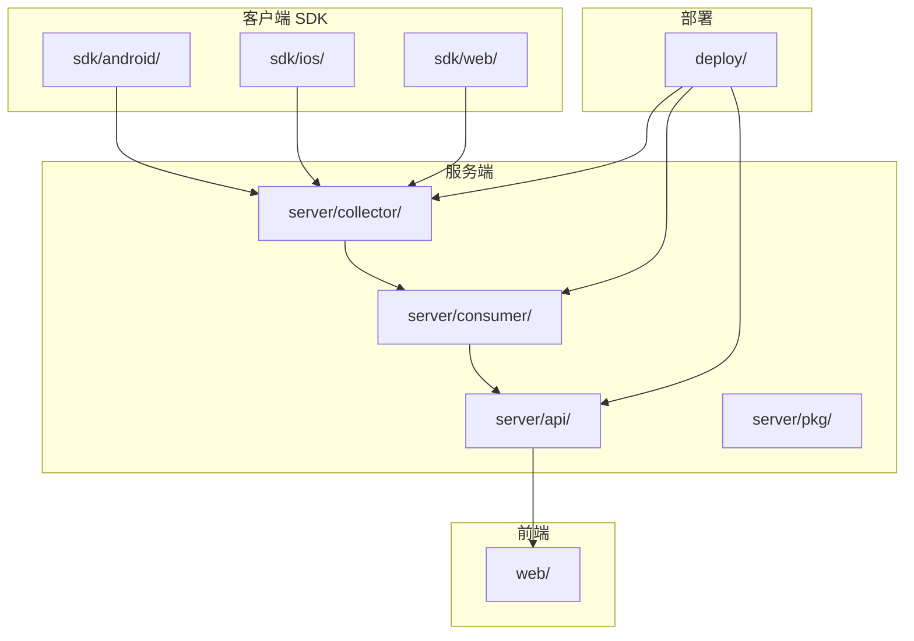
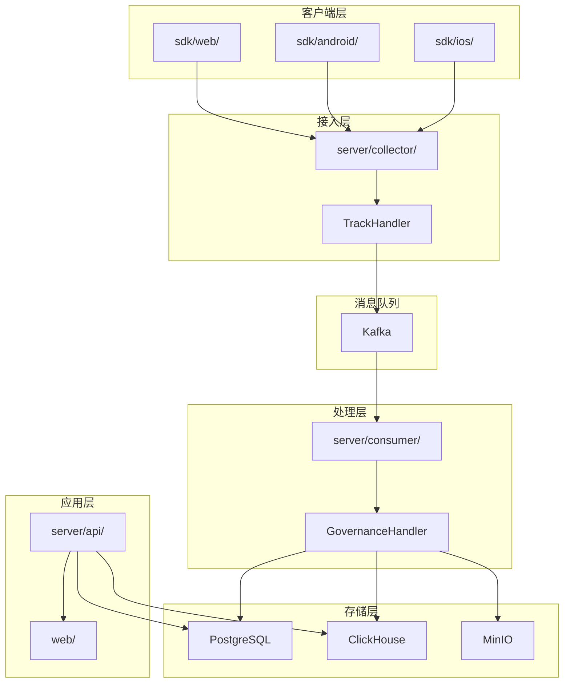
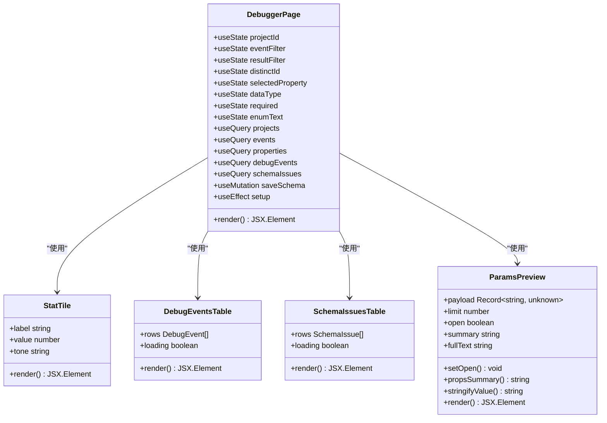
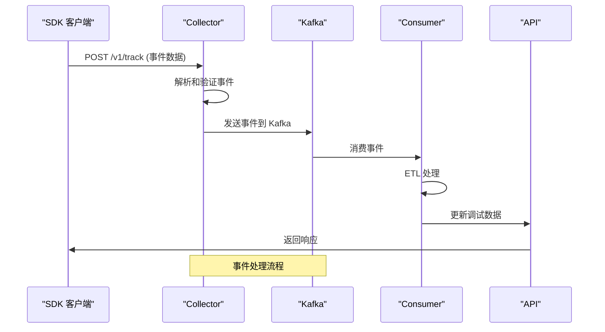
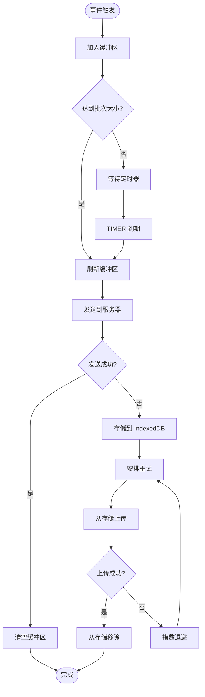
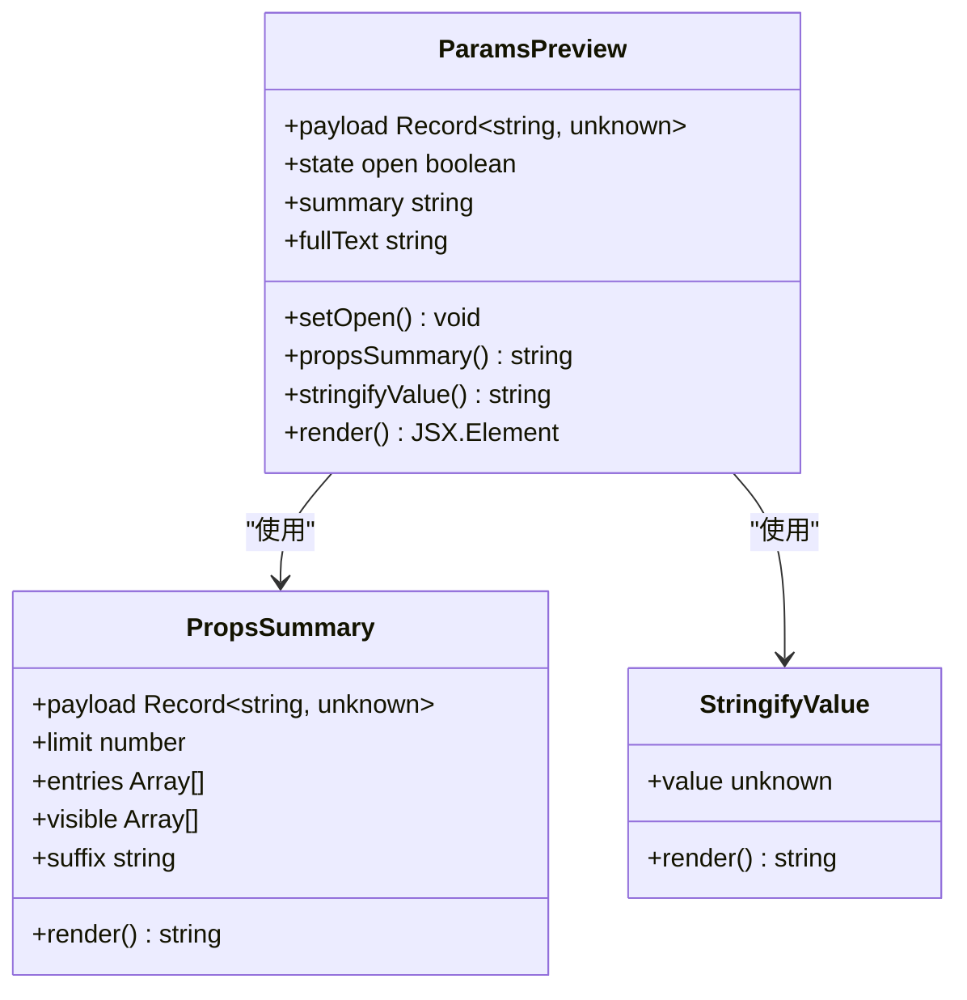
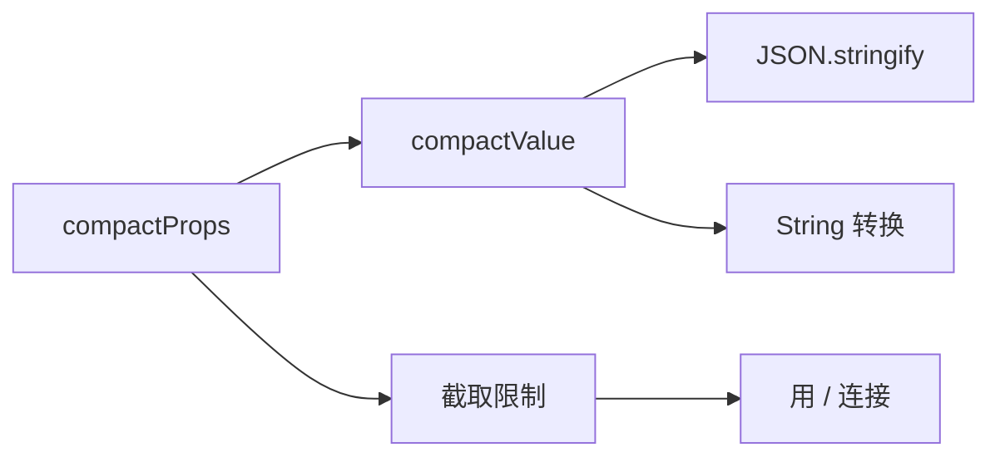
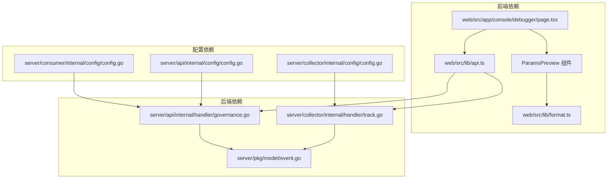

# 调试器系统

<cite>
**本文档引用的文件**
- [web/src/app/console/debugger/page.tsx](file://web/src/app/console/debugger/page.tsx)
- [web/src/lib/format.ts](file://web/src/lib/format.ts)
- [server/api/internal/handler/governance.go](file://server/api/internal/handler/governance.go)
- [server/collector/internal/handler/track.go](file://server/collector/internal/handler/track.go)
- [sdk/web/src/index.ts](file://sdk/web/src/index.ts)
- [sdk/web/src/storage.ts](file://sdk/web/src/storage.ts)
- [web/src/lib/api.ts](file://web/src/lib/api.ts)
- [server/pkg/model/event.go](file://server/pkg/model/event.go)
- [server/api/internal/config/config.go](file://server/api/internal/config/config.go)
- [server/collector/internal/config/config.go](file://server/collector/internal/config/config.go)
- [server/consumer/internal/config/config.go](file://server/consumer/internal/config/config.go)
- [deploy/docker-compose.yml](file://deploy/docker-compose.yml)
- [README.md](file://README.md)
</cite>

## 更新摘要
**所做更改**
- 新增 ParamsPreview 组件章节，详细介绍交互式参数预览功能
- 更新参数显示功能章节，说明从静态显示到交互式预览的升级
- 添加参数数量限制和展开显示功能的技术实现细节
- 更新调试器前端组件架构图，包含新的 ParamsPreview 组件

## 目录
1. [简介](#简介)
2. [项目结构](#项目结构)
3. [核心组件](#核心组件)
4. [架构概览](#架构概览)
5. [详细组件分析](#详细组件分析)
6. [参数预览系统](#参数预览系统)
7. [依赖关系分析](#依赖关系分析)
8. [性能考虑](#性能考虑)
9. [故障排除指南](#故障排除指南)
10. [结论](#结论)

## 简介

AeroLog 是一个自研的多端埋点平台，采用分层架构设计，支持 Android、iOS 和 Web 三个平台的 SDK。该系统的核心功能之一是调试器系统，它提供了实时监控 SDK 上报数据、配置参数 Schema、定位类型漂移和必填缺失等功能。

调试器系统通过以下方式工作：
- SDK 将事件上报到 Collector 服务
- Collector 将事件发送到 Kafka 消息队列
- Consumer 从 Kafka 消费事件并进行 ETL 处理
- API 服务提供调试接口，包括事件流和 Schema 问题检测
- Web 前端提供可视化界面进行调试和配置

## 项目结构

AeroLog 采用模块化的项目结构，主要分为以下几个部分：



**图表来源**
- [README.md:8-22](file://README.md#L8-L22)

**章节来源**
- [README.md:1-53](file://README.md#L1-L53)

## 核心组件

调试器系统由多个核心组件构成，每个组件都有特定的功能和职责：

### Web 调试器页面
- 提供用户友好的调试界面
- 支持事件过滤和结果筛选
- 实时显示调试事件和 Schema 问题
- 允许用户配置参数 Schema

### API 处理器
- 提供调试相关的 REST API
- 管理属性定义和 Schema
- 查询调试事件和 Schema 问题
- 处理身份映射和用户资料

### Collector 处理器
- 接收来自 SDK 的事件请求
- 验证事件格式和内容
- 将事件发送到 Kafka 消息队列
- 提供健康检查和指标收集

### SDK Web 实现
- 实现三阶段上报机制：内存批量 → 失败落盘 → 退避重传
- 支持自动页面浏览和点击跟踪
- 提供会话管理和用户识别
- 实现指数退避重传策略

**章节来源**
- [web/src/app/console/debugger/page.tsx:31-310](file://web/src/app/console/debugger/page.tsx#L31-L310)
- [server/api/internal/handler/governance.go:15-29](file://server/api/internal/handler/governance.go#L15-L29)
- [server/collector/internal/handler/track.go:39-51](file://server/collector/internal/handler/track.go#L39-L51)
- [sdk/web/src/index.ts:16-50](file://sdk/web/src/index.ts#L16-L50)

## 架构概览

AeroLog 采用分层架构设计，实现了高可用性和可扩展性：



**图表来源**
- [README.md:24-34](file://README.md#L24-L34)
- [server/collector/internal/handler/track.go:47-51](file://server/collector/internal/handler/track.go#L47-L51)
- [server/api/internal/handler/governance.go:21-29](file://server/api/internal/handler/governance.go#L21-L29)

## 详细组件分析

### 调试器前端组件

调试器页面是一个 React 组件，提供了完整的调试功能：



**图表来源**
- [web/src/app/console/debugger/page.tsx:31-310](file://web/src/app/console/debugger/page.tsx#L31-L310)
- [web/src/app/console/debugger/page.tsx:510-563](file://web/src/app/console/debugger/page.tsx#L510-L563)

调试器页面的主要功能包括：

1. **项目选择器**：允许用户在不同项目间切换
2. **事件过滤器**：按事件名称、结果状态和用户标识过滤
3. **Schema 配置**：设置参数类型、必填性和枚举值
4. **实时数据显示**：展示调试事件和 Schema 问题
5. **统计信息**：显示事件数量、告警数量等指标
6. **参数预览**：通过 ParamsPreview 组件提供交互式参数显示

**章节来源**
- [web/src/app/console/debugger/page.tsx:42-124](file://web/src/app/console/debugger/page.tsx#L42-L124)
- [web/src/app/console/debugger/page.tsx:137-310](file://web/src/app/console/debugger/page.tsx#L137-L310)

### API 处理器组件

API 处理器提供了调试器所需的所有后端功能：

```mermaid
classDiagram
class GovernanceHandler {
+PG *pgxpool.Pool
+CH driver.Conn
+Register(router) void
+properties(context) void
+updatePropertySchema(context) void
+debugEvents(context) void
+schemaIssues(context) void
+ensureDebuggerSchema(context) error
}
class DebugEvent {
+id int64
+event string
+eventType string
+distinctID string
+userID string
+anonymousID string
+result string
+reason string
+payload map[string]interface{}
+receivedAt *time.Time
+createdAt time.Time
}
class SchemaIssue {
+id int64
+event string
+property string
+expectedType string
+actualType string
+severity string
+message string
+payload map[string]interface{}
+observedAt *time.Time
+createdAt time.Time
}
GovernanceHandler --> DebugEvent : "返回"
GovernanceHandler --> SchemaIssue : "返回"
```

**图表来源**
- [server/api/internal/handler/governance.go:15-29](file://server/api/internal/handler/governance.go#L15-L29)
- [server/api/internal/handler/governance.go:196-277](file://server/api/internal/handler/governance.go#L196-L277)

API 处理器的关键功能：

1. **属性管理**：查询和更新属性定义
2. **Schema 管理**：锁定和配置参数 Schema
3. **调试事件查询**：获取最近的调试事件
4. **Schema 问题查询**：发现和报告 Schema 不匹配问题
5. **身份映射**：管理用户和匿名 ID 的关联

**章节来源**
- [server/api/internal/handler/governance.go:31-85](file://server/api/internal/handler/governance.go#L31-L85)
- [server/api/internal/handler/governance.go:87-158](file://server/api/internal/handler/governance.go#L87-L158)
- [server/api/internal/handler/governance.go:160-278](file://server/api/internal/handler/governance.go#L160-L278)

### Collector 处理器组件

Collector 处理器负责接收和验证来自 SDK 的事件：



**图表来源**
- [server/collector/internal/handler/track.go:60-133](file://server/collector/internal/handler/track.go#L60-L133)

Collector 处理器的核心功能：

1. **请求处理**：接收和处理 `/v1/track` 请求
2. **事件验证**：验证事件格式和必需字段
3. **消息发送**：将事件发送到 Kafka 消息队列
4. **错误处理**：处理各种错误情况并返回适当的响应
5. **指标收集**：收集请求处理时间和错误指标

**章节来源**
- [server/collector/internal/handler/track.go:60-133](file://server/collector/internal/handler/track.go#L60-L133)

### SDK Web 组件

SDK Web 实现了完整的事件上报和存储机制：



**图表来源**
- [sdk/web/src/index.ts:116-145](file://sdk/web/src/index.ts#L116-L145)

SDK Web 的关键特性：

1. **三阶段上报**：内存批量 → 失败落盘 → 退避重传
2. **离线支持**：使用 IndexedDB 存储失败的事件
3. **自动重传**：实现指数退避重传策略
4. **生命周期管理**：处理页面可见性和网络状态变化
5. **自动跟踪**：支持页面浏览和点击事件的自动跟踪

**章节来源**
- [sdk/web/src/index.ts:16-50](file://sdk/web/src/index.ts#L16-L50)
- [sdk/web/src/index.ts:116-182](file://sdk/web/src/index.ts#L116-L182)
- [sdk/web/src/storage.ts:46-94](file://sdk/web/src/storage.ts#L46-L94)

## 参数预览系统

### ParamsPreview 组件

ParamsPreview 是调试器系统中新引入的交互式参数预览组件，专门用于处理和显示复杂的事件参数数据。



**图表来源**
- [web/src/app/console/debugger/page.tsx:510-563](file://web/src/app/console/debugger/page.tsx#L510-L563)

#### 核心功能特性

1. **参数数量限制**：默认只显示前 6 个参数，其余参数通过 `+N` 形式提示
2. **交互式展开**：用户可以通过点击按钮展开查看所有参数详情
3. **智能截断**：支持移动端和桌面端的不同显示策略
4. **格式化显示**：对复杂数据结构进行 JSON 格式化输出
5. **响应式设计**：根据屏幕尺寸调整显示方式

#### 技术实现细节

组件使用了以下关键技术：

- **状态管理**：使用 React useState hook 管理展开/收起状态
- **条件渲染**：根据参数数量决定是否显示展开按钮
- **CSS 类名组合**：使用 cn 函数动态组合样式类名
- **无障碍支持**：提供 aria-expanded 属性和键盘导航支持

**章节来源**
- [web/src/app/console/debugger/page.tsx:510-563](file://web/src/app/console/debugger/page.tsx#L510-L563)

### 参数显示功能升级

调试器系统从简单的静态参数显示升级为智能的交互式参数预览功能：

#### 传统静态显示模式
- 显示前 3 个参数，用 `/` 分隔
- 固定宽度限制，超出部分被截断
- 无法查看完整的参数详情

#### 新的交互式预览模式
- 默认显示前 6 个参数，支持 +N 数量提示
- 点击后完整显示所有参数的 JSON 格式
- 支持移动端和桌面端的不同交互方式
- 提供展开/收起的完整控制

#### 格式化工具函数

系统还提供了通用的参数格式化工具：



**图表来源**
- [web/src/lib/format.ts:12-19](file://web/src/lib/format.ts#L12-L19)

**章节来源**
- [web/src/lib/format.ts:12-19](file://web/src/lib/format.ts#L12-L19)
- [web/src/app/console/debugger/page.tsx:510-563](file://web/src/app/console/debugger/page.tsx#L510-L563)

## 依赖关系分析

调试器系统的依赖关系展示了各组件之间的交互：



**图表来源**
- [web/src/app/console/debugger/page.tsx:26](file://web/src/app/console/debugger/page.tsx#L26)
- [web/src/app/console/debugger/page.tsx:510](file://web/src/app/console/debugger/page.tsx#L510)
- [web/src/lib/api.ts:3](file://web/src/lib/api.ts#L3)
- [web/src/lib/format.ts:1](file://web/src/lib/format.ts#L1)

**章节来源**
- [web/src/lib/api.ts:165-222](file://web/src/lib/api.ts#L165-L222)
- [server/api/internal/config/config.go:8-15](file://server/api/internal/config/config.go#L8-L15)
- [server/collector/internal/config/config.go:9-17](file://server/collector/internal/config/config.go#L9-L17)
- [server/consumer/internal/config/config.go:8-18](file://server/consumer/internal/config/config.go#L8-L18)

## 性能考虑

调试器系统在设计时充分考虑了性能优化：

### 缓冲和批处理
- SDK 使用 50 个事件的默认批次大小
- 5 秒的刷新间隔平衡了延迟和吞吐量
- 内存中的事件缓冲减少磁盘 I/O 操作

### 指数退避重传
- 最大重试间隔限制为 60 秒
- 避免网络拥塞时的级联效应
- 减少不必要的网络请求

### 数据库优化
- PostgreSQL 使用连接池管理数据库连接
- ClickHouse 优化了查询性能
- 合适的索引设计提高查询效率

### 消息队列优化
- Kafka 分区策略基于 `distinct_id` 确保同用户事件顺序
- 合适的批处理大小平衡延迟和吞吐量

### 参数预览性能优化
- **懒加载**：参数预览仅在用户需要时才加载完整数据
- **虚拟滚动**：大量参数时使用虚拟滚动技术提升性能
- **缓存机制**：已格式化的参数数据会被缓存避免重复计算
- **防抖处理**：频繁展开操作时使用防抖避免过度渲染

## 故障排除指南

### 常见问题和解决方案

#### SDK 无法连接到服务器
1. **检查网络连接**：确保客户端可以访问 API 服务器
2. **验证 Token**：确认使用的项目 Token 正确
3. **检查 CORS 设置**：确保 API 服务器允许跨域请求

#### 事件未出现在调试器中
1. **检查 SDK 初始化**：确认 SDK 已正确初始化
2. **验证事件格式**：确保事件名称和属性符合要求
3. **检查网络状态**：确认客户端有网络连接

#### Schema 验证失败
1. **检查属性定义**：确认属性类型和必填设置正确
2. **验证枚举值**：确保提供的值在允许范围内
3. **查看详细错误**：检查调试器中的错误信息

#### 参数预览功能异常
1. **检查浏览器兼容性**：确保使用的浏览器支持现代 JavaScript 特性
2. **验证数据格式**：确认事件数据格式正确且不包含循环引用
3. **查看控制台错误**：检查浏览器开发者工具中的 JavaScript 错误

#### 数据库连接问题
1. **检查连接字符串**：确认数据库连接参数正确
2. **验证数据库状态**：确保数据库服务正常运行
3. **检查权限设置**：确认应用程序有足够权限

**章节来源**
- [server/collector/internal/handler/track.go:67-76](file://server/collector/internal/handler/track.go#L67-L76)
- [server/api/internal/handler/governance.go:87-97](file://server/api/internal/handler/governance.go#L87-L97)

## 结论

AeroLog 调试器系统提供了一个完整、高效的事件调试和监控解决方案。通过分层架构设计，系统实现了高可用性、可扩展性和易维护性。

### 主要优势

1. **实时监控**：提供实时的事件流和 Schema 问题检测
2. **灵活配置**：支持动态配置参数 Schema 和验证规则
3. **多平台支持**：统一的 SDK 支持 Android、iOS 和 Web 平台
4. **高可用性**：采用消息队列和分布式架构确保系统稳定性
5. **可视化界面**：提供直观的 Web 界面进行调试和配置
6. **智能参数预览**：通过 ParamsPreview 组件提供交互式的参数显示体验

### 技术特点

1. **三阶段上报机制**：确保事件可靠传输
2. **智能重传策略**：优化网络资源使用
3. **Schema 验证**：防止数据质量问题
4. **性能监控**：内置指标收集和监控
5. **易于部署**：Docker Compose 支持快速部署
6. **参数预览优化**：支持参数数量限制和智能展开显示

调试器系统为 AeroLog 平台提供了强大的调试和监控能力，帮助开发者快速定位和解决数据上报问题，确保数据分析的准确性和可靠性。新增的 ParamsPreview 组件进一步提升了用户体验，使得复杂的参数数据能够以更加直观和高效的方式呈现给用户。