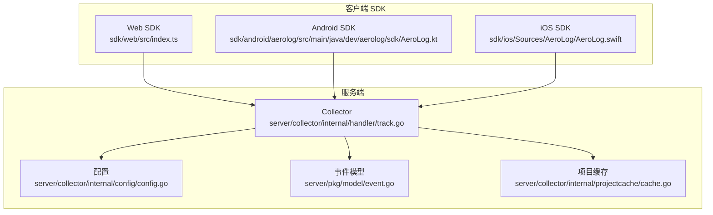
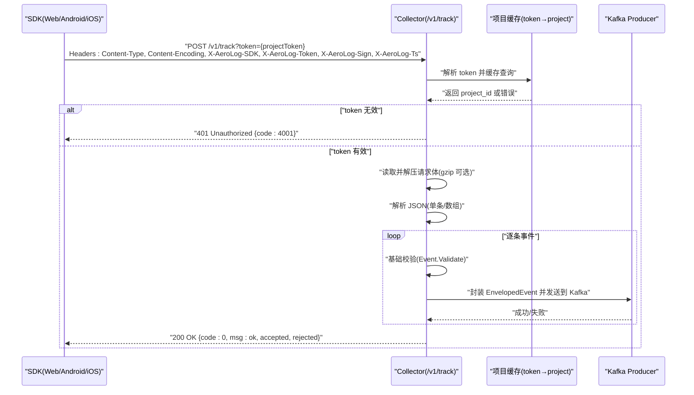
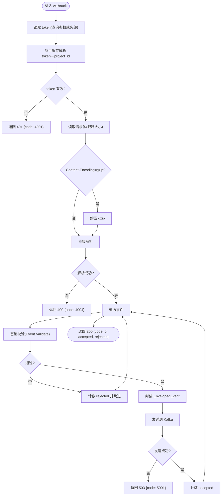
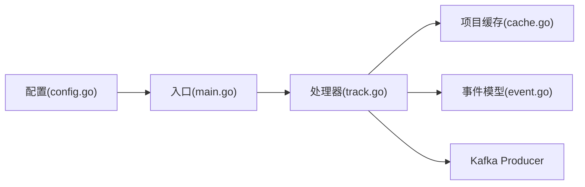

# 通信协议

<cite>
**本文引用的文件**
- [docs/protocol.md](file://docs/protocol.md)
- [docs/event.schema.json](file://docs/event.schema.json)
- [server/collector/cmd/main.go](file://server/collector/cmd/main.go)
- [server/collector/internal/handler/track.go](file://server/collector/internal/handler/track.go)
- [server/collector/internal/config/config.go](file://server/collector/internal/config/config.go)
- [server/collector/internal/projectcache/cache.go](file://server/collector/internal/projectcache/cache.go)
- [server/pkg/model/event.go](file://server/pkg/model/event.go)
- [sdk/web/src/types.ts](file://sdk/web/src/types.ts)
- [sdk/web/src/index.ts](file://sdk/web/src/index.ts)
- [sdk/android/aerolog/src/main/java/dev/aerolog/sdk/AeroLog.kt](file://sdk/android/aerolog/src/main/java/dev/aerolog/sdk/AeroLog.kt)
- [sdk/ios/Sources/AeroLog/AeroLog.swift](file://sdk/ios/Sources/AeroLog/AeroLog.swift)
</cite>

## 目录
1. [简介](#简介)
2. [项目结构](#项目结构)
3. [核心组件](#核心组件)
4. [架构总览](#架构总览)
5. [详细组件分析](#详细组件分析)
6. [依赖关系分析](#依赖关系分析)
7. [性能考量](#性能考量)
8. [故障排查指南](#故障排查指南)
9. [结论](#结论)
10. [附录](#附录)

## 简介
本文件为 AeroLog 事件上报协议的权威技术文档，覆盖 HTTP 请求格式、gzip 压缩机制、批量上报策略、事件数据结构 JSON Schema、认证与签名机制、安全传输策略、请求/响应示例、协议版本与兼容性、以及调试与测试方法。目标是帮助 SDK 与服务端开发者快速、准确地完成集成与排障。

## 项目结构
- 文档层
  - 协议说明：docs/protocol.md
  - 事件 Schema：docs/event.schema.json
- 服务端
  - Collector（接收端）：server/collector/*
  - 通用模型与消息队列：server/pkg/*
  - API/Consumer（其他子系统）：server/api/*、server/consumer/*
- SDK
  - Web：sdk/web/*
  - Android：sdk/android/aerolog/*
  - iOS：sdk/ios/Sources/AeroLog/*

图表来源
- [server/collector/internal/handler/track.go:48-51](file://server/collector/internal/handler/track.go#L48-L51)
- [server/collector/internal/config/config.go:19-30](file://server/collector/internal/config/config.go#L19-L30)
- [server/pkg/model/event.go:27-37](file://server/pkg/model/event.go#L27-L37)
- [server/collector/internal/projectcache/cache.go:18-32](file://server/collector/internal/projectcache/cache.go#L18-L32)

章节来源
- [docs/protocol.md:1-118](file://docs/protocol.md#L1-L118)
- [docs/event.schema.json:1-58](file://docs/event.schema.json#L1-L58)

## 核心组件
- 协议端点与请求格式
  - 端点：POST /v1/track
  - 查询参数：token（项目令牌）
  - 推荐头部：
    - Content-Type: application/json
    - Content-Encoding: gzip（可选，建议开启）
    - X-AeroLog-SDK: SDK 名称/版本（如 web/1.0.0）
    - X-AeroLog-Token: 备用令牌位置（可选）
    - X-AeroLog-Sign: HMAC-SHA256 签名（可选）
    - X-AeroLog-Ts: 时间戳（毫秒，建议在 5 分钟窗口内）
- 请求体
  - 支持单条事件或数组形式的批量事件
  - 事件字段遵循 JSON Schema 定义
- 响应
  - 成功：code=0，msg="ok"，并包含 accepted 计数
  - 失败：返回 code 与 msg，常见错误码参见协议文档
- 离线兜底
  - 批量阈值与周期：默认 50 条/5 秒
  - 存储上限：7 天/10000 条
  - 重试策略：指数退避（1s/3s/10s/30s/5min），网络恢复立即触发
  - 去重：每条事件写入 $insert_id，服务端可据此去重

章节来源
- [docs/protocol.md:5-118](file://docs/protocol.md#L5-L118)
- [docs/event.schema.json:1-58](file://docs/event.schema.json#L1-L58)

## 架构总览
下图展示从 SDK 发送事件到服务端处理与落库的整体流程。

图表来源
- [server/collector/internal/handler/track.go:60-133](file://server/collector/internal/handler/track.go#L60-L133)
- [server/collector/internal/projectcache/cache.go:34-56](file://server/collector/internal/projectcache/cache.go#L34-L56)
- [server/pkg/model/event.go:62-74](file://server/pkg/model/event.go#L62-L74)

## 详细组件分析

### 事件数据结构与 JSON Schema
- 必填字段
  - type、event、time、distinct_id
- 字段类型与约束
  - type：枚举 track/profile_set/profile_set_once/profile_increment/profile_unset/profile_delete
  - event：字符串，长度 1~128
  - distinct_id：字符串，长度 1~255
  - anonymous_id/user_id：字符串，最大长度 255
  - time：整数，毫秒时间戳，>0
  - lib：对象，name 必填（web/android/ios/server），version 可选
  - properties：对象，键值对，$ 开头为预置属性
- 预置属性（自动采集）
  - 包括 $lib、$lib_version、$os、$os_version、$model、$manufacturer、$app_version、$network_type、$screen_width、$screen_height、$browser、$browser_version、$user_agent、$ip、$session_id 等
- 预置事件
  - 如 $AppStart、$AppEnd、$AppViewScreen/$pageview、$AppClick/$WebClick、$SignUp 等

章节来源
- [docs/event.schema.json:6-58](file://docs/event.schema.json#L6-L58)
- [docs/protocol.md:50-79](file://docs/protocol.md#L50-L79)

### HTTP 请求与处理流程
- 端点与方法
  - POST /v1/track
- 认证与令牌
  - 支持查询参数 token 或头部 X-AeroLog-Token
  - 服务端通过项目缓存解析 token→project_id，并进行有效性校验
- 请求体解析
  - 支持单条事件或数组
  - 支持 gzip 压缩（Content-Encoding:gzip）
  - 最大请求体大小受配置限制
- 事件校验与投递
  - 逐条执行基础校验（Event.Validate）
  - 封装 EnvelopedEvent 并投递到 Kafka
  - 返回 accepted/rejected 数量统计

图表来源
- [server/collector/internal/handler/track.go:60-133](file://server/collector/internal/handler/track.go#L60-L133)
- [server/collector/internal/config/config.go:28-29](file://server/collector/internal/config/config.go#L28-L29)
- [server/pkg/model/event.go:39-60](file://server/pkg/model/event.go#L39-L60)

章节来源
- [server/collector/internal/handler/track.go:48-133](file://server/collector/internal/handler/track.go#L48-L133)
- [server/collector/internal/config/config.go:19-30](file://server/collector/internal/config/config.go#L19-L30)
- [server/pkg/model/event.go:39-60](file://server/pkg/model/event.go#L39-L60)

### 认证、签名与安全传输
- 认证
  - 使用项目令牌（token）进行鉴权
  - 支持查询参数 token 或头部 X-AeroLog-Token
  - 服务端通过项目缓存解析并校验 token
- 签名（可选）
  - 头部 X-AeroLog-Sign：HMAC-SHA256 签名（十六进制）
  - 服务端校验失败返回 401
- 时间戳（可选）
  - 头部 X-AeroLog-Ts：毫秒级 Unix 时间戳
  - 建议在 5 分钟窗口内，超出范围可被拒绝
- 安全传输
  - 建议使用 HTTPS
  - 建议启用 gzip 压缩以降低带宽占用

章节来源
- [docs/protocol.md:7-17](file://docs/protocol.md#L7-L17)
- [server/collector/internal/handler/track.go:67-76](file://server/collector/internal/handler/track.go#L67-L76)

### 批量上报与离线兜底
- 批量策略
  - 默认批量阈值：50 条
  - 默认上报周期：5 秒
- 离线存储与重试
  - 4xx（非 429）丢弃；5xx/网络错误/429 → 写本地存储
  - 重试策略：指数退避（1s/3s/10s/30s/5min），网络恢复立即触发
  - 存储上限：7 天/10000 条，超限丢弃最旧
- 去重
  - SDK 为每条事件生成 UUID 写入 properties.$insert_id，服务端可据此去重

章节来源
- [docs/protocol.md:100-107](file://docs/protocol.md#L100-L107)
- [sdk/web/src/types.ts:27-46](file://sdk/web/src/types.ts#L27-L46)
- [sdk/android/aerolog/src/main/java/dev/aerolog/sdk/AeroLog.kt:108-124](file://sdk/android/aerolog/src/main/java/dev/aerolog/sdk/AeroLog.kt#L108-L124)
- [sdk/ios/Sources/AeroLog/AeroLog.swift:77-82](file://sdk/ios/Sources/AeroLog/AeroLog.swift#L77-L82)

### 协议版本与兼容性
- 协议版本
  - 当前版本：v1
- 兼容性
  - 提供 /sa?project=xxx 兼容神策 SDK 协议（仅做字段映射），便于复用调试工具

章节来源
- [docs/protocol.md:1-3](file://docs/protocol.md#L1-L3)
- [docs/protocol.md:115-118](file://docs/protocol.md#L115-L118)

### SDK 侧实现要点
- Web SDK
  - 类型与配置：AeroEvent、AeroLogConfig
  - 缓冲与持久化：drainBuffer/uploadFromStore
- Android SDK
  - 生命周期自动埋点：$AppStart/$AppEnd/$AppViewScreen
  - flush 周期任务与本地存储
- iOS SDK
  - 自动属性收集与定时 flush
  - 发送逻辑与状态判断

章节来源
- [sdk/web/src/types.ts:16-46](file://sdk/web/src/types.ts#L16-L46)
- [sdk/web/src/index.ts:116-145](file://sdk/web/src/index.ts#L116-L145)
- [sdk/android/aerolog/src/main/java/dev/aerolog/sdk/AeroLog.kt:74-80](file://sdk/android/aerolog/src/main/java/dev/aerolog/sdk/AeroLog.kt#L74-L80)
- [sdk/android/aerolog/src/main/java/dev/aerolog/sdk/AeroLog.kt:175-190](file://sdk/android/aerolog/src/main/java/dev/aerolog/sdk/AeroLog.kt#L175-L190)
- [sdk/ios/Sources/AeroLog/AeroLog.swift:132-156](file://sdk/ios/Sources/AeroLog/AeroLog.swift#L132-L156)

## 依赖关系分析
- Collector 依赖
  - 配置模块：读取环境变量（监听地址、Kafka、Postgres、Redis、最大请求体等）
  - 项目缓存：token→project_id 的内存缓存，减少数据库压力
  - 事件模型：统一的 Event/EnvelopedEvent 结构
  - 消息队列：Kafka Producer
- SDK 依赖
  - Web：基于 fetch/XMLHttpRequest 的异步发送
  - Android：OkHttp 客户端
  - iOS：URLSession

图表来源
- [server/collector/cmd/main.go:22-54](file://server/collector/cmd/main.go#L22-L54)
- [server/collector/internal/handler/track.go:43-48](file://server/collector/internal/handler/track.go#L43-L48)
- [server/collector/internal/config/config.go:19-30](file://server/collector/internal/config/config.go#L19-L30)
- [server/collector/internal/projectcache/cache.go:18-32](file://server/collector/internal/projectcache/cache.go#L18-L32)
- [server/pkg/model/event.go:27-37](file://server/pkg/model/event.go#L27-L37)

章节来源
- [server/collector/cmd/main.go:22-54](file://server/collector/cmd/main.go#L22-L54)
- [server/collector/internal/handler/track.go:43-48](file://server/collector/internal/handler/track.go#L43-L48)

## 性能考量
- 压缩传输
  - 建议启用 gzip（Content-Encoding:gzip），显著降低带宽占用
- 批量与节流
  - 默认批量阈值 50 条/5 秒，有助于提升吞吐与降低 RTT
- 请求体大小限制
  - 服务端通过 MaxBytesReader 限制请求体大小，默认 5MB
- 分区键选择
  - 以 distinct_id 作为 Kafka 分区键，确保同一用户事件落在同一分区，利于后续处理

章节来源
- [docs/protocol.md:11](file://docs/protocol.md#L11)
- [server/collector/internal/handler/track.go:150-162](file://server/collector/internal/handler/track.go#L150-L162)
- [server/collector/internal/config/config.go:28-29](file://server/collector/internal/config/config.go#L28-L29)
- [server/collector/internal/handler/track.go:119-122](file://server/collector/internal/handler/track.go#L119-L122)

## 故障排查指南
- 常见错误码
  - 4001：token 无效
  - 4002：签名校验失败
  - 4003：时间戳过期
  - 4004：请求体过大或解析失败
  - 4005：Schema 校验失败（部分通过时按条返回拒绝列表）
  - 4290：触发限流，建议指数退避
  - 5xxx：服务端错误，SDK 应缓存并稍后重试
- 诊断步骤
  - 检查 token 是否正确传递（查询参数或头部）
  - 确认 Content-Type 为 application/json
  - 若启用 gzip，请确认压缩有效且服务端可正确解压
  - 校验事件字段是否满足 JSON Schema
  - 查看服务端日志与指标（请求耗时、队列发送错误计数）

章节来源
- [docs/protocol.md:80-99](file://docs/protocol.md#L80-L99)
- [server/collector/internal/handler/track.go:67-90](file://server/collector/internal/handler/track.go#L67-L90)

## 结论
AeroLog 事件上报协议以简洁明确的 JSON Schema 和清晰的批量/离线策略为核心，结合可选的签名与时间戳增强安全性，配合 SDK 的自动埋点与本地持久化能力，能够稳定支撑多端数据采集与分析场景。建议在生产环境中启用 gzip 压缩、合理设置批量阈值与重试策略，并严格遵循 JSON Schema 与错误码规范进行集成与排障。

## 附录

### 请求/响应示例（路径参考）
- 成功响应示例
  - [成功响应示例:82-86](file://docs/protocol.md#L82-L86)
- 失败响应示例与错误码
  - [失败响应与错误码:88-99](file://docs/protocol.md#L88-L99)

### 协议调试与测试方法
- 使用 /sa 兼容端点
  - 通过 /sa?project=xxx 兼容神策 SDK 协议，便于复用现有调试工具
- 本地开发建议
  - 使用 HTTPS（建议）与 gzip 压缩
  - 在 SDK 中开启 debug 模式以便捕获上报失败
  - 结合服务端指标（请求耗时、队列发送错误）定位问题

章节来源
- [docs/protocol.md:115-118](file://docs/protocol.md#L115-L118)