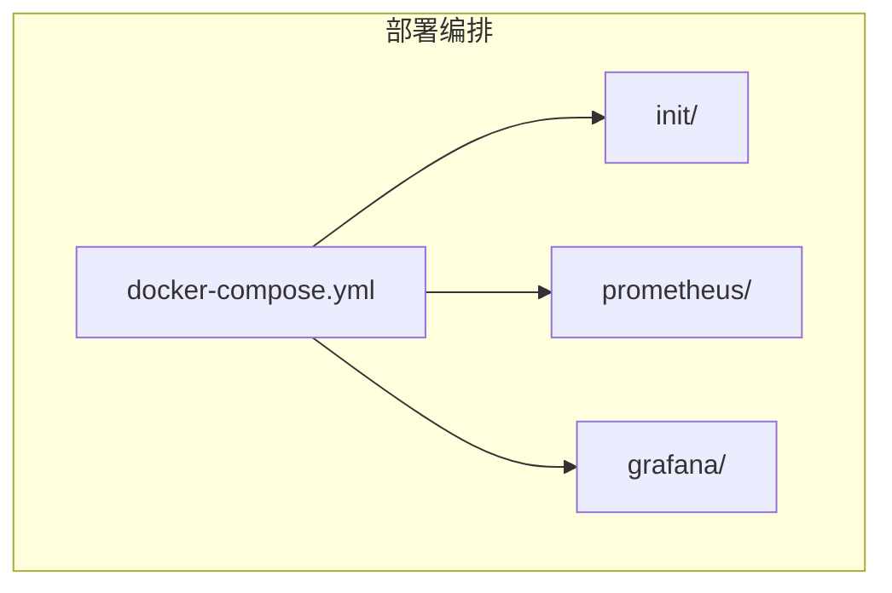
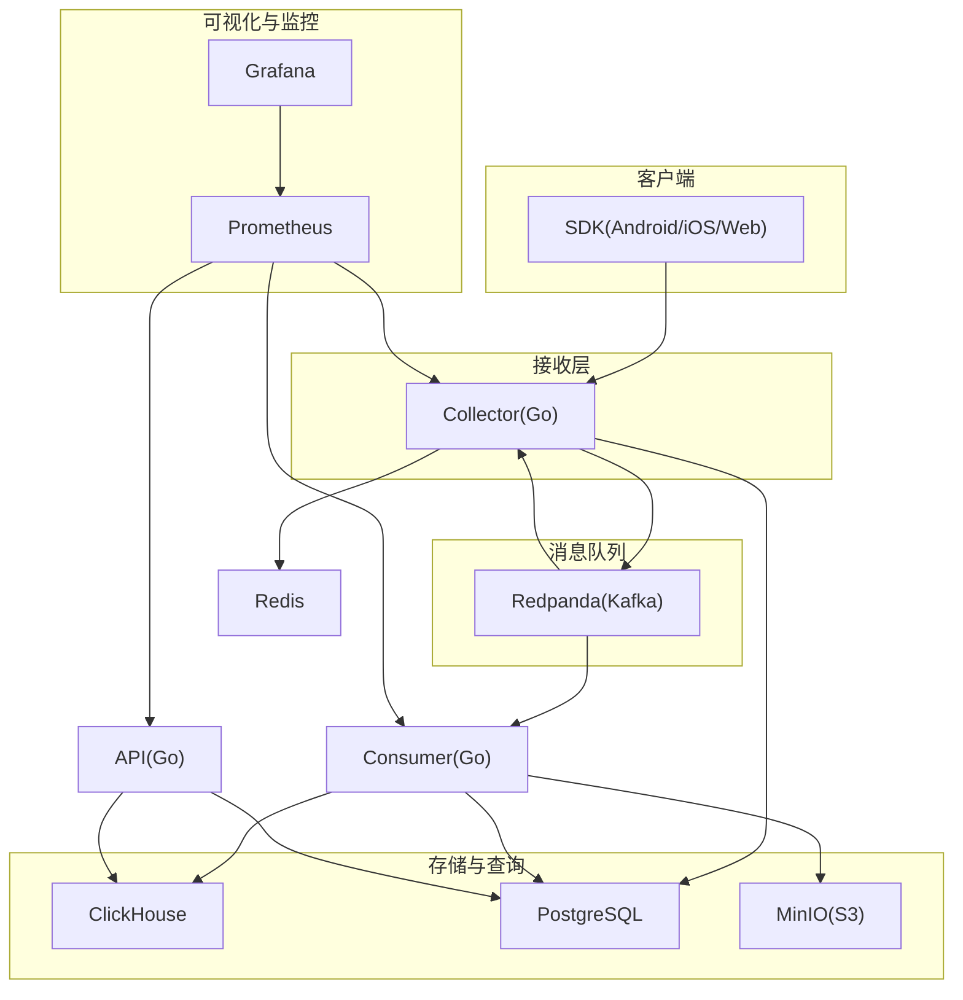

# Docker容器部署

<cite>
**本文引用的文件**
- [deploy/docker-compose.yml](file://deploy/docker-compose.yml)
- [deploy/init/postgres/01_schema.sql](file://deploy/init/postgres/01_schema.sql)
- [deploy/init/clickhouse/01_schema.sql](file://deploy/init/clickhouse/01_schema.sql)
- [deploy/prometheus/prometheus.yml](file://deploy/prometheus/prometheus.yml)
- [deploy/grafana/provisioning/datasources/prometheus.yml](file://deploy/grafana/provisioning/datasources/prometheus.yml)
- [deploy/grafana/provisioning/dashboards/aerolog.yml](file://deploy/grafana/provisioning/dashboards/aerolog.yml)
- [README.md](file://README.md)
- [docs/architecture.md](file://docs/architecture.md)
- [server/collector/internal/config/config.go](file://server/collector/internal/config/config.go)
- [server/consumer/internal/config/config.go](file://server/consumer/internal/config/config.go)
- [server/api/internal/config/config.go](file://server/api/internal/config/config.go)
- [server/collector/cmd/main.go](file://server/collector/cmd/main.go)
- [server/consumer/cmd/main.go](file://server/consumer/cmd/main.go)
- [server/api/cmd/main.go](file://server/api/cmd/main.go)
</cite>

## 目录
1. [简介](#简介)
2. [项目结构](#项目结构)
3. [核心组件](#核心组件)
4. [架构总览](#架构总览)
5. [详细组件分析](#详细组件分析)
6. [依赖关系分析](#依赖关系分析)
7. [性能考虑](#性能考虑)
8. [故障排查指南](#故障排查指南)
9. [结论](#结论)
10. [附录](#附录)

## 简介
本指南面向在本地或开发环境中使用 Docker Compose 部署 AeroLog 的用户，系统性解析 docker-compose.yml 的完整结构与各服务配置，涵盖网络、卷挂载、健康检查、依赖与启动顺序，并给出容器数据持久化最佳实践、常见问题排查与性能优化建议。同时结合初始化脚本与监控配置，帮助快速搭建可观察的开发环境。

## 项目结构
AeroLog 的部署相关目录集中在 deploy/ 下，包含：
- docker-compose.yml：Compose 编排文件，定义 PostgreSQL、Redis、Redpanda、ClickHouse、MinIO、Prometheus、Grafana 等服务及其依赖与端口映射。
- init/：数据库初始化脚本，PostgreSQL 与 ClickHouse 各自的初始化 SQL。
- prometheus/：Prometheus 抓取配置，用于采集后端服务指标。
- grafana/：Grafana 数据源与仪表盘的预置配置。

**章节来源**
- [README.md:36-41](file://README.md#L36-L41)
- [deploy/docker-compose.yml:1-147](file://deploy/docker-compose.yml#L1-L147)

## 核心组件
本节对 docker-compose 中的核心服务进行逐项解析，包括镜像版本、环境变量、端口映射、卷挂载、健康检查与资源限制要点。

- PostgreSQL
  - 镜像与端口：使用官方 alpine 版本，容器内默认端口对外映射。
  - 环境变量：设置用户名、密码、数据库名。
  - 卷挂载：数据目录与初始化脚本挂载到宿主机指定路径。
  - 健康检查：基于命令行工具检测数据库可用性。
  - 依赖：被其他服务（如 API、Collector、Consumer）通过连接字符串访问。
  - 参考路径：[deploy/docker-compose.yml:4-22](file://deploy/docker-compose.yml#L4-L22)

- Redis
  - 镜像与端口：使用 alpine 版本，提供缓存与会话存储能力。
  - 卷挂载：持久化数据目录。
  - 健康检查：通过 CLI 发送 ping。
  - 依赖：Collector 使用 Redis 作为临时缓存与限流辅助。
  - 参考路径：[deploy/docker-compose.yml:23-36](file://deploy/docker-compose.yml#L23-L36)

- Redpanda（Kafka 协议兼容）
  - 镜像与端口：提供 Kafka API、Schema Registry、REST Proxy、Admin API 端口映射。
  - 命令行参数：控制内存、节点、监听地址与广告地址，确保容器内外均可访问。
  - 卷挂载：数据目录持久化。
  - 依赖：Collector 将事件写入 Kafka 主题，Consumer 从主题读取并做 ETL。
  - 参考路径：[deploy/docker-compose.yml:37-62](file://deploy/docker-compose.yml#L37-L62)

- Redpanda Console
  - 镜像与端口：提供 Web 控制台，依赖 Redpanda。
  - 环境变量：配置 Kafka Broker 地址。
  - 依赖：受 Redpanda 服务依赖约束。
  - 参考路径：[deploy/docker-compose.yml:63-73](file://deploy/docker-compose.yml#L63-L73)

- ClickHouse
  - 镜像与端口：提供 HTTP 与原生端口映射。
  - 环境变量：数据库、用户、密码与默认访问控制。
  - 卷挂载：数据目录与初始化脚本挂载。
  - 健康检查：通过 HTTP 探针检测服务可用性。
  - 资源限制：设置文件描述符上限，提升写入吞吐。
  - 参考路径：[deploy/docker-compose.yml:74-98](file://deploy/docker-compose.yml#L74-L98)

- MinIO
  - 镜像与端口：提供 S3 API 与控制台端口映射。
  - 命令行参数：指定数据目录与控制台监听地址。
  - 环境变量：根用户与密码。
  - 卷挂载：数据目录持久化。
  - 参考路径：[deploy/docker-compose.yml:99-112](file://deploy/docker-compose.yml#L99-L112)

- Prometheus
  - 镜像与端口：提供 Web UI 端口映射。
  - 命令行参数：加载配置文件、TSDB 保留时长、生命周期接口。
  - 卷挂载：配置文件与 TSDB 数据目录。
  - extra_hosts：通过 host-gateway 访问宿主机进程指标。
  - 参考路径：[deploy/docker-compose.yml:113-129](file://deploy/docker-compose.yml#L113-L129)

- Grafana
  - 镜像与端口：提供 Web UI 端口映射。
  - 环境变量：管理员账号与密码、禁止用户注册。
  - 卷挂载：数据源与仪表盘配置、持久化目录。
  - 依赖：受 Prometheus 服务依赖约束。
  - 参考路径：[deploy/docker-compose.yml:130-147](file://deploy/docker-compose.yml#L130-L147)

**章节来源**
- [deploy/docker-compose.yml:4-147](file://deploy/docker-compose.yml#L4-L147)

## 架构总览
下图展示 AeroLog 在 Docker 环境中的整体数据流与服务交互关系，以及各服务在 Compose 中的职责定位。

**图表来源**
- [docs/architecture.md:3-35](file://docs/architecture.md#L3-L35)
- [deploy/docker-compose.yml:37-147](file://deploy/docker-compose.yml#L37-L147)

**章节来源**
- [docs/architecture.md:3-35](file://docs/architecture.md#L3-L35)

## 详细组件分析

### PostgreSQL 初始化与模式
- 初始化脚本负责创建扩展与核心元数据表，包括用户、项目、成员、事件与属性定义、死信队列、看板等。
- 在首次启动时，Compose 将初始化脚本挂载到容器入口初始化目录，实现数据库初始化。
- 参考路径：
  - [deploy/init/postgres/01_schema.sql:1-92](file://deploy/init/postgres/01_schema.sql#L1-L92)
  - [deploy/docker-compose.yml:14-16](file://deploy/docker-compose.yml#L14-L16)

**章节来源**
- [deploy/init/postgres/01_schema.sql:1-92](file://deploy/init/postgres/01_schema.sql#L1-L92)
- [deploy/docker-compose.yml:14-16](file://deploy/docker-compose.yml#L14-L16)

### ClickHouse 初始化与模式
- 初始化脚本创建数据库与核心表，包括事件明细表、缓冲表、用户属性表，并设置分区、排序键、TTL 与缓冲策略。
- 通过挂载初始化脚本，实现首次启动时自动建表。
- 参考路径：
  - [deploy/init/clickhouse/01_schema.sql:1-61](file://deploy/init/clickhouse/01_schema.sql#L1-L61)
  - [deploy/docker-compose.yml:90-92](file://deploy/docker-compose.yml#L90-L92)

**章节来源**
- [deploy/init/clickhouse/01_schema.sql:1-61](file://deploy/init/clickhouse/01_schema.sql#L1-L61)
- [deploy/docker-compose.yml:90-92](file://deploy/docker-compose.yml#L90-L92)

### Prometheus 与 Grafana 监控
- Prometheus 配置抓取 Collector、Consumer、API 的指标端点，并将 TSDB 数据持久化至卷。
- Grafana 通过预置的数据源与仪表盘配置，直接对接 Prometheus。
- 参考路径：
  - [deploy/prometheus/prometheus.yml:1-32](file://deploy/prometheus/prometheus.yml#L1-L32)
  - [deploy/grafana/provisioning/datasources/prometheus.yml:1-10](file://deploy/grafana/provisioning/datasources/prometheus.yml#L1-L10)
  - [deploy/grafana/provisioning/dashboards/aerolog.yml:1-13](file://deploy/grafana/provisioning/dashboards/aerolog.yml#L1-L13)
  - [deploy/docker-compose.yml:113-147](file://deploy/docker-compose.yml#L113-L147)

**章节来源**
- [deploy/prometheus/prometheus.yml:1-32](file://deploy/prometheus/prometheus.yml#L1-L32)
- [deploy/grafana/provisioning/datasources/prometheus.yml:1-10](file://deploy/grafana/provisioning/datasources/prometheus.yml#L1-L10)
- [deploy/grafana/provisioning/dashboards/aerolog.yml:1-13](file://deploy/grafana/provisioning/dashboards/aerolog.yml#L1-L13)
- [deploy/docker-compose.yml:113-147](file://deploy/docker-compose.yml#L113-L147)

### 服务间依赖与启动顺序
- Redpanda 与 Redpanda Console：Console 明确声明依赖 Redpanda，先启动 Redpanda 再启动 Console。
- Grafana：明确声明依赖 Prometheus，先启动 Prometheus 再启动 Grafana。
- 其他服务未显式声明 depends_on，但通过健康检查与连接字符串实现软依赖。
- 参考路径：
  - [deploy/docker-compose.yml:67-68](file://deploy/docker-compose.yml#L67-L68)
  - [deploy/docker-compose.yml:135-136](file://deploy/docker-compose.yml#L135-L136)

**章节来源**
- [deploy/docker-compose.yml:67-68](file://deploy/docker-compose.yml#L67-L68)
- [deploy/docker-compose.yml:135-136](file://deploy/docker-compose.yml#L135-L136)

### 环境变量与连接配置（服务侧）
- Collector 配置：监听地址、指标端口、Kafka Broker 列表、Topic、Postgres DSN、Redis 地址、请求体大小限制。
- Consumer 配置：Kafka Broker 列表、Topic、消费者组 ID、ClickHouse 连接信息、Postgres DSN、批处理参数、指标端口。
- API 配置：监听地址、指标端口、Postgres DSN、ClickHouse 连接信息、JWT Secret、CORS 允许来源。
- 参考路径：
  - [server/collector/internal/config/config.go:19-30](file://server/collector/internal/config/config.go#L19-L30)
  - [server/consumer/internal/config/config.go:28-44](file://server/consumer/internal/config/config.go#L28-L44)
  - [server/api/internal/config/config.go:24-37](file://server/api/internal/config/config.go#L24-L37)

**章节来源**
- [server/collector/internal/config/config.go:19-30](file://server/collector/internal/config/config.go#L19-L30)
- [server/consumer/internal/config/config.go:28-44](file://server/consumer/internal/config/config.go#L28-L44)
- [server/api/internal/config/config.go:24-37](file://server/api/internal/config/config.go#L24-L37)

### 启动流程与健康检查
- Compose 启动顺序：先启动数据库类（PostgreSQL、ClickHouse）、再启动消息队列（Redpanda）、然后启动应用层（Collector、Consumer、API）、最后启动监控（Prometheus、Grafana）。
- 健康检查：PostgreSQL、Redis、ClickHouse、Redpanda Console、Grafana 均配置了健康检查探针，Prometheus 与 MinIO 未配置健康检查。
- 参考路径：
  - [deploy/docker-compose.yml:17-21](file://deploy/docker-compose.yml#L17-L21)
  - [deploy/docker-compose.yml:31-35](file://deploy/docker-compose.yml#L31-L35)
  - [deploy/docker-compose.yml:93-97](file://deploy/docker-compose.yml#L93-L97)
  - [deploy/docker-compose.yml:67-73](file://deploy/docker-compose.yml#L67-L73)
  - [deploy/docker-compose.yml:135-147](file://deploy/docker-compose.yml#L135-L147)

**章节来源**
- [deploy/docker-compose.yml:17-21](file://deploy/docker-compose.yml#L17-L21)
- [deploy/docker-compose.yml:31-35](file://deploy/docker-compose.yml#L31-L35)
- [deploy/docker-compose.yml:93-97](file://deploy/docker-compose.yml#L93-L97)
- [deploy/docker-compose.yml:67-73](file://deploy/docker-compose.yml#L67-L73)
- [deploy/docker-compose.yml:135-147](file://deploy/docker-compose.yml#L135-L147)

## 依赖关系分析
- 环境变量与连接字符串：Collector、Consumer、API 通过环境变量读取数据库与消息队列地址，默认指向 localhost，但在 Compose 网络环境下应使用服务名与内部端口。
- Compose 网络：服务之间通过服务名相互访问，例如 Redpanda Console 使用 redpanda:9092。
- 健康检查与依赖：健康检查用于判定服务就绪，依赖声明用于控制启动顺序。
- 参考路径：
  - [server/collector/internal/config/config.go:20-29](file://server/collector/internal/config/config.go#L20-L29)
  - [server/consumer/internal/config/config.go:29-44](file://server/consumer/internal/config/config.go#L29-L44)
  - [server/api/internal/config/config.go:24-37](file://server/api/internal/config/config.go#L24-L37)
  - [deploy/docker-compose.yml:69-71](file://deploy/docker-compose.yml#L69-L71)

**章节来源**
- [server/collector/internal/config/config.go:20-29](file://server/collector/internal/config/config.go#L20-L29)
- [server/consumer/internal/config/config.go:29-44](file://server/consumer/internal/config/config.go#L29-L44)
- [server/api/internal/config/config.go:24-37](file://server/api/internal/config/config.go#L24-L37)
- [deploy/docker-compose.yml:69-71](file://deploy/docker-compose.yml#L69-L71)

## 性能考虑
- ClickHouse 文件描述符：通过 ulimit 将 nofile 设置为较高值，有助于提升写入性能与并发连接数。
- Redpanda 内存与线程：通过 smp、memory 参数限制资源占用，适合单机开发环境。
- Prometheus 存储：TSDB 保留时间可按需调整，避免磁盘空间不足。
- 建议：
  - 为数据库与消息队列设置合理的 CPU/内存限制，避免资源争抢。
  - 对外暴露的端口仅开放必要范围，减少攻击面。
  - 生产环境建议启用 TLS 与认证，严格限制访问来源。
  - 定期清理 Prometheus TSDB 与 ClickHouse TTL 过期数据，释放存储空间。
  - 参考路径：
    - [deploy/docker-compose.yml:78-81](file://deploy/docker-compose.yml#L78-L81)
    - [deploy/docker-compose.yml:45-50](file://deploy/docker-compose.yml#L45-L50)
    - [deploy/docker-compose.yml:120](file://deploy/docker-compose.yml#L120)

**章节来源**
- [deploy/docker-compose.yml:78-81](file://deploy/docker-compose.yml#L78-L81)
- [deploy/docker-compose.yml:45-50](file://deploy/docker-compose.yml#L45-L50)
- [deploy/docker-compose.yml:120](file://deploy/docker-compose.yml#L120)

## 故障排查指南
- 健康检查失败
  - PostgreSQL/Redis/ClickHouse：检查健康检查命令是否与镜像支持的探针匹配，确认容器日志是否存在权限或端口冲突。
  - Redpanda Console：确认 Redpanda 已就绪且 Broker 地址正确。
  - 参考路径：
    - [deploy/docker-compose.yml:17-21](file://deploy/docker-compose.yml#L17-L21)
    - [deploy/docker-compose.yml:31-35](file://deploy/docker-compose.yml#L31-L35)
    - [deploy/docker-compose.yml:93-97](file://deploy/docker-compose.yml#L93-L97)
    - [deploy/docker-compose.yml:67-73](file://deploy/docker-compose.yml#L67-L73)

- 数据库初始化未生效
  - 确认初始化脚本已挂载到容器入口初始化目录，且容器内执行顺序满足依赖。
  - 参考路径：
    - [deploy/docker-compose.yml:14-16](file://deploy/docker-compose.yml#L14-L16)
    - [deploy/docker-compose.yml:90-92](file://deploy/docker-compose.yml#L90-L92)

- 指标无法采集
  - 确认 Prometheus 抓取目标与端口正确，extra_hosts 是否允许访问宿主机进程。
  - 参考路径：
    - [deploy/prometheus/prometheus.yml:10-28](file://deploy/prometheus/prometheus.yml#L10-L28)
    - [deploy/docker-compose.yml:122-123](file://deploy/docker-compose.yml#L122-L123)

- 服务间连通性问题
  - 使用服务名而非 localhost 访问数据库与消息队列，确保容器网络互通。
  - 参考路径：
    - [server/collector/internal/config/config.go:24-26](file://server/collector/internal/config/config.go#L24-L26)
    - [server/consumer/internal/config/config.go:31-40](file://server/consumer/internal/config/config.go#L31-L40)
    - [server/api/internal/config/config.go:28-34](file://server/api/internal/config/config.go#L28-L34)

**章节来源**
- [deploy/docker-compose.yml:14-16](file://deploy/docker-compose.yml#L14-L16)
- [deploy/docker-compose.yml:90-92](file://deploy/docker-compose.yml#L90-L92)
- [deploy/prometheus/prometheus.yml:10-28](file://deploy/prometheus/prometheus.yml#L10-L28)
- [deploy/docker-compose.yml:122-123](file://deploy/docker-compose.yml#L122-L123)
- [server/collector/internal/config/config.go:24-26](file://server/collector/internal/config/config.go#L24-L26)
- [server/consumer/internal/config/config.go:31-40](file://server/consumer/internal/config/config.go#L31-L40)
- [server/api/internal/config/config.go:28-34](file://server/api/internal/config/config.go#L28-L34)

## 结论
通过 docker-compose.yml 的合理编排，AeroLog 在本地即可完成从数据采集、消息传输、存储与查询到监控可视化的全链路部署。结合初始化脚本与监控配置，开发者可以快速验证系统功能。建议在生产环境中进一步完善安全、资源限制与备份策略，并根据业务规模扩展组件规模与架构。

## 附录

### 启动与停止
- 启动：进入 deploy 目录，使用 Compose 后台启动。
- 停止：使用 Compose 停止并移除容器。
- 参考路径：
  - [README.md:36-41](file://README.md#L36-L41)

**章节来源**
- [README.md:36-41](file://README.md#L36-L41)

### 数据持久化最佳实践
- 卷挂载路径
  - PostgreSQL：数据目录与初始化脚本挂载到宿主机路径。
  - Redis：数据目录挂载到宿主机路径。
  - ClickHouse：数据目录与初始化脚本挂载到宿主机路径。
  - MinIO：数据目录挂载到宿主机路径。
  - Prometheus：配置文件与 TSDB 数据目录挂载到宿主机路径。
  - Grafana：数据源/仪表盘配置与持久化目录挂载到宿主机路径。
- 备份策略
  - 定期导出 ClickHouse 表结构与数据，备份 PostgreSQL 与 MinIO 数据目录。
  - 使用 Compose 备份卷快照或外部存储策略，确保灾难恢复。
- 参考路径：
  - [deploy/docker-compose.yml:14-16](file://deploy/docker-compose.yml#L14-L16)
  - [deploy/docker-compose.yml:29-31](file://deploy/docker-compose.yml#L29-L31)
  - [deploy/docker-compose.yml:90-92](file://deploy/docker-compose.yml#L90-L92)
  - [deploy/docker-compose.yml:110-112](file://deploy/docker-compose.yml#L110-L112)
  - [deploy/docker-compose.yml:126-128](file://deploy/docker-compose.yml#L126-L128)
  - [deploy/docker-compose.yml:143-146](file://deploy/docker-compose.yml#L143-L146)

**章节来源**
- [deploy/docker-compose.yml:14-16](file://deploy/docker-compose.yml#L14-L16)
- [deploy/docker-compose.yml:29-31](file://deploy/docker-compose.yml#L29-L31)
- [deploy/docker-compose.yml:90-92](file://deploy/docker-compose.yml#L90-L92)
- [deploy/docker-compose.yml:110-112](file://deploy/docker-compose.yml#L110-L112)
- [deploy/docker-compose.yml:126-128](file://deploy/docker-compose.yml#L126-L128)
- [deploy/docker-compose.yml:143-146](file://deploy/docker-compose.yml#L143-L146)