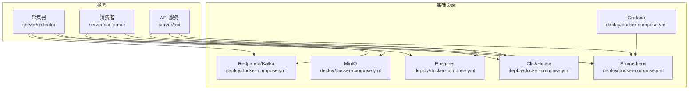
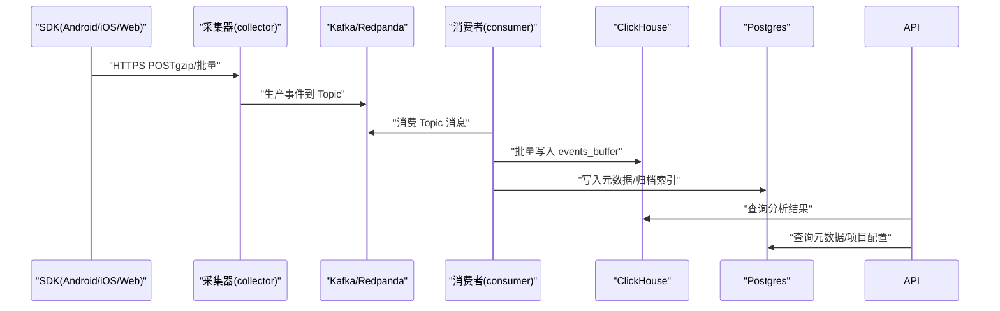
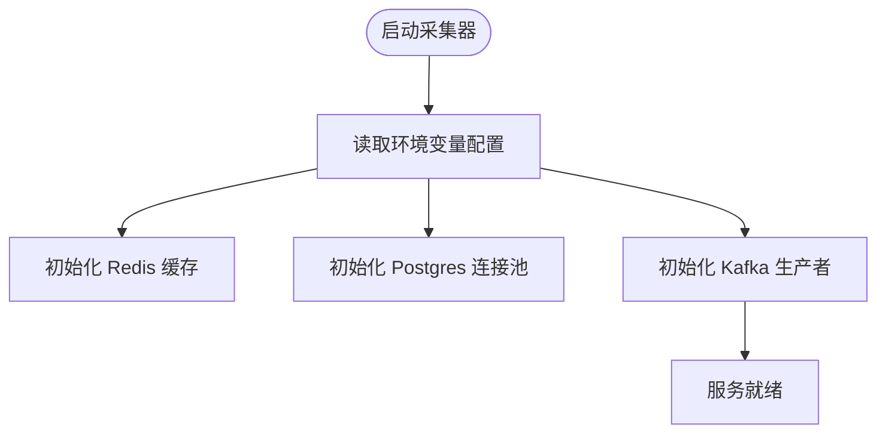
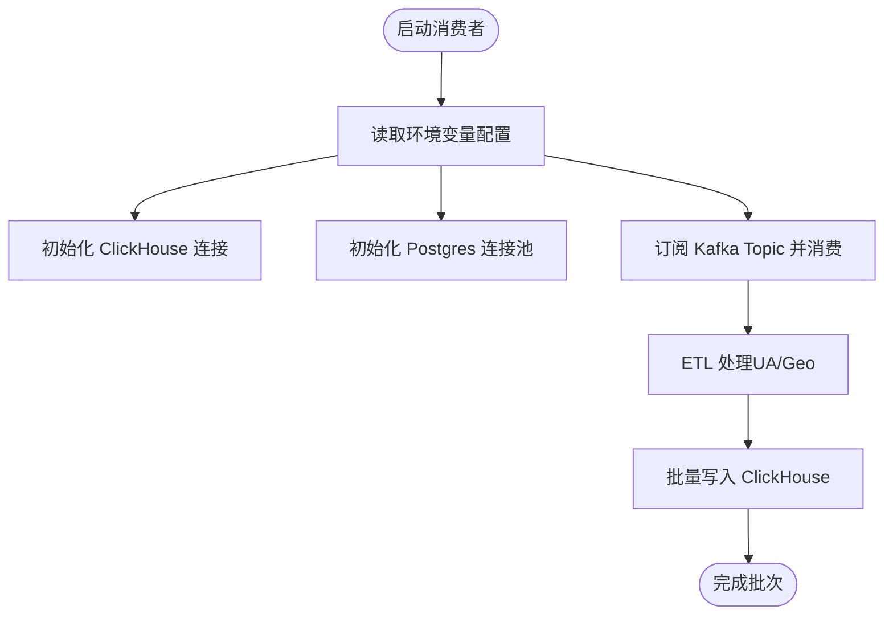
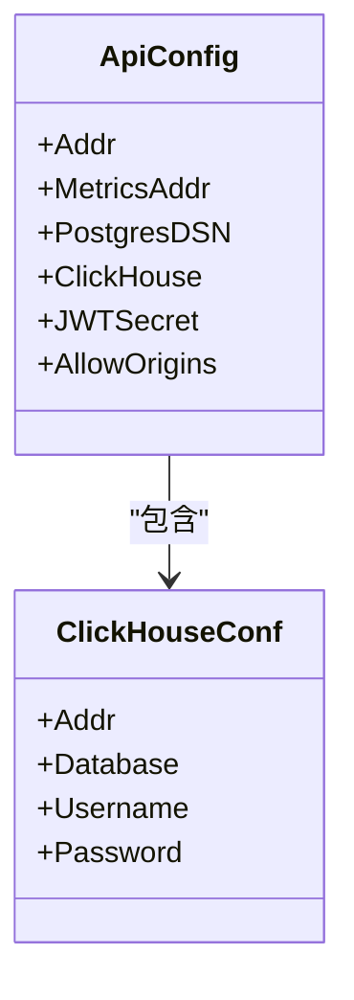
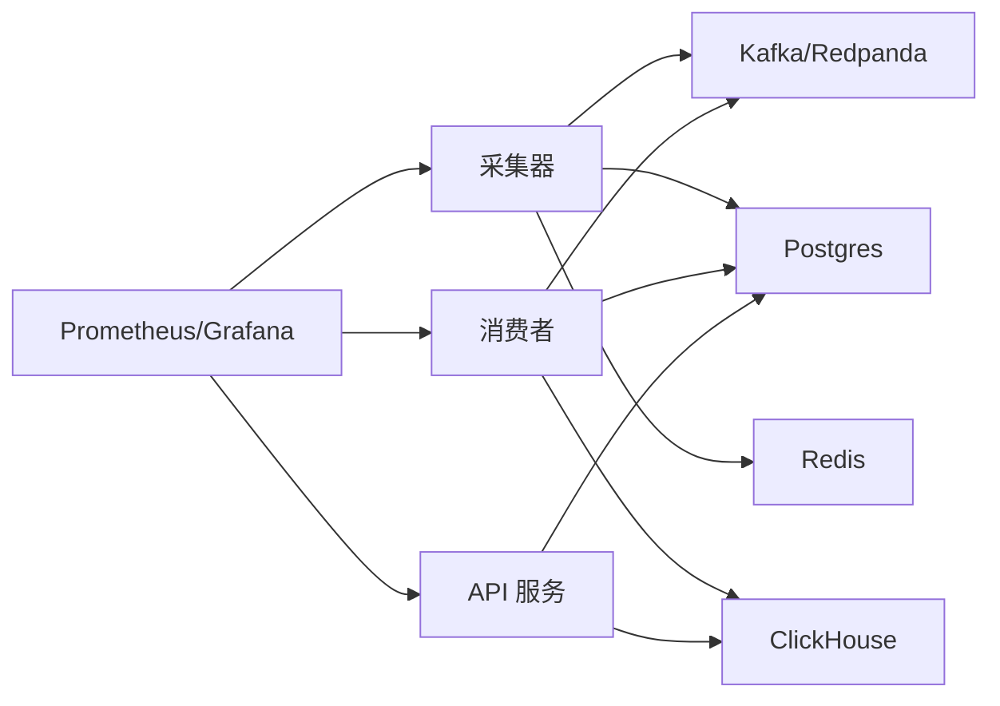

# 环境变量配置

<cite>
**本文引用的文件**
- [server/api/internal/config/config.go](file://server/api/internal/config/config.go)
- [server/collector/internal/config/config.go](file://server/collector/internal/config/config.go)
- [server/consumer/internal/config/config.go](file://server/consumer/internal/config/config.go)
- [server/consumer/internal/chsink/sink.go](file://server/consumer/internal/chsink/sink.go)
- [server/consumer/internal/etl/etl.go](file://server/consumer/internal/etl/etl.go)
- [server/pkg/mq/producer.go](file://server/pkg/mq/producer.go)
- [deploy/docker-compose.yml](file://deploy/docker-compose.yml)
- [deploy/init/postgres/01_schema.sql](file://deploy/init/postgres/01_schema.sql)
- [server/collector/internal/handler/track.go](file://server/collector/internal/handler/track.go)
</cite>

## 目录
1. [简介](#简介)
2. [项目结构](#项目结构)
3. [核心组件](#核心组件)
4. [架构总览](#架构总览)
5. [详细组件分析](#详细组件分析)
6. [依赖分析](#依赖分析)
7. [性能考虑](#性能考虑)
8. [故障排查指南](#故障排查指南)
9. [结论](#结论)
10. [附录](#附录)

## 简介
本指南面向AeroLog的运维与开发团队，系统性梳理各服务的环境变量配置项、敏感信息安全管理策略、多环境配置模板与最佳实践、配置验证方法以及容器环境下Secret注入方案。通过统一的配置来源与严格的默认值策略，确保服务在开发、测试与生产环境中的一致性与安全性。

## 项目结构
AeroLog的服务端由三个Go微服务组成：采集器（collector）、消费者（consumer）、API（api）。它们共享通用的消息队列（Kafka/Redpanda）、时序数据库（ClickHouse）、关系型数据库（Postgres）与对象存储（MinIO）。部署采用docker-compose进行本地快速搭建，便于开发与测试。

图表来源
- [deploy/docker-compose.yml:1-147](file://deploy/docker-compose.yml#L1-L147)
- [server/collector/internal/config/config.go:1-38](file://server/collector/internal/config/config.go#L1-L38)
- [server/consumer/internal/config/config.go:1-53](file://server/consumer/internal/config/config.go#L1-L53)
- [server/api/internal/config/config.go:1-46](file://server/api/internal/config/config.go#L1-L46)

章节来源
- [deploy/docker-compose.yml:1-147](file://deploy/docker-compose.yml#L1-L147)
- [README.md:1-50](file://README.md#L1-L50)

## 核心组件
本节汇总三大服务的环境变量配置项与默认值策略，帮助快速定位与校验配置。

- 采集器（collector）
  - 监听地址与指标端口
  - Kafka Broker列表与Topic
  - Postgres DSN
  - Redis 地址
  - 最大请求体大小
  - 参考路径：[server/collector/internal/config/config.go:1-38](file://server/collector/internal/config/config.go#L1-L38)

- 消费者（consumer）
  - Kafka Broker列表与Topic
  - 消费组ID
  - ClickHouse连接参数（地址、库名、用户名、密码）
  - Postgres DSN
  - 批处理大小与频率
  - 指标端口
  - 参考路径：[server/consumer/internal/config/config.go:1-53](file://server/consumer/internal/config/config.go#L1-L53)

- API 服务（api）
  - 监听地址与指标端口
  - Postgres DSN
  - ClickHouse连接参数（地址、库名、用户名、密码）
  - JWT 密钥
  - CORS 允许来源（逗号分隔）
  - 参考路径：[server/api/internal/config/config.go:1-46](file://server/api/internal/config/config.go#L1-L46)

章节来源
- [server/collector/internal/config/config.go:1-38](file://server/collector/internal/config/config.go#L1-L38)
- [server/consumer/internal/config/config.go:1-53](file://server/consumer/internal/config/config.go#L1-L53)
- [server/api/internal/config/config.go:1-46](file://server/api/internal/config/config.go#L1-L46)

## 架构总览
下图展示采集器如何通过Kafka接收事件，消费者从Kafka消费并写入ClickHouse与Postgres，API服务同时对接ClickHouse与Postgres以提供查询与管理能力。

图表来源
- [server/collector/internal/handler/track.go:67-96](file://server/collector/internal/handler/track.go#L67-L96)
- [server/consumer/internal/chsink/sink.go:45-103](file://server/consumer/internal/chsink/sink.go#L45-L103)
- [server/consumer/internal/etl/etl.go:1-90](file://server/consumer/internal/etl/etl.go#L1-L90)
- [server/api/internal/config/config.go:1-46](file://server/api/internal/config/config.go#L1-L46)

## 详细组件分析

### 采集器（collector）配置要点
- Kafka Broker与Topic
  - Broker列表默认值与分隔符策略
  - Topic名称用于事件原始流
  - 参考路径：[server/collector/internal/config/config.go:20-30](file://server/collector/internal/config/config.go#L20-L30)
- Redis
  - 用于项目令牌到ID的内存缓存
  - 参考路径：[server/collector/internal/projectcache/cache.go:18-32](file://server/collector/internal/projectcache/cache.go#L18-L32)
- Postgres DSN
  - 存储项目元数据（含token与secret）
  - 参考路径：[server/collector/internal/config/config.go:20-30](file://server/collector/internal/config/config.go#L20-L30)
- 最大请求体
  - 默认限制，防止异常流量
  - 参考路径：[server/collector/internal/config/config.go:28-29](file://server/collector/internal/config/config.go#L28-L29)
- 认证流程
  - 采集器根据token解析项目ID，失败返回未授权
  - 参考路径：[server/collector/internal/handler/track.go:67-96](file://server/collector/internal/handler/track.go#L67-L96)

图表来源
- [server/collector/internal/config/config.go:1-38](file://server/collector/internal/config/config.go#L1-L38)
- [server/pkg/mq/producer.go:17-40](file://server/pkg/mq/producer.go#L17-L40)

章节来源
- [server/collector/internal/config/config.go:1-38](file://server/collector/internal/config/config.go#L1-L38)
- [server/collector/internal/projectcache/cache.go:1-56](file://server/collector/internal/projectcache/cache.go#L1-L56)
- [server/collector/internal/handler/track.go:67-96](file://server/collector/internal/handler/track.go#L67-L96)
- [server/pkg/mq/producer.go:1-69](file://server/pkg/mq/producer.go#L1-L69)

### 消费者（consumer）配置要点
- Kafka
  - Broker列表、Topic、消费组ID
  - 参考路径：[server/consumer/internal/config/config.go:28-44](file://server/consumer/internal/config/config.go#L28-L44)
- ClickHouse
  - 连接参数与Ping校验
  - 参考路径：[server/consumer/internal/config/config.go:34-39](file://server/consumer/internal/config/config.go#L34-L39)
  - 批量写入实现与表字段映射
  - 参考路径：[server/consumer/internal/chsink/sink.go:45-103](file://server/consumer/internal/chsink/sink.go#L45-L103)
- Postgres DSN
  - 元数据与归档索引写入
  - 参考路径：[server/consumer/internal/config/config.go:40-40](file://server/consumer/internal/config/config.go#L40-L40)
- ETL
  - 用户代理解析与地理信息占位
  - 参考路径：[server/consumer/internal/etl/etl.go:29-89](file://server/consumer/internal/etl/etl.go#L29-L89)

图表来源
- [server/consumer/internal/config/config.go:1-53](file://server/consumer/internal/config/config.go#L1-L53)
- [server/consumer/internal/chsink/sink.go:1-126](file://server/consumer/internal/chsink/sink.go#L1-L126)
- [server/consumer/internal/etl/etl.go:1-90](file://server/consumer/internal/etl/etl.go#L1-L90)

章节来源
- [server/consumer/internal/config/config.go:1-53](file://server/consumer/internal/config/config.go#L1-L53)
- [server/consumer/internal/chsink/sink.go:1-126](file://server/consumer/internal/chsink/sink.go#L1-L126)
- [server/consumer/internal/etl/etl.go:1-90](file://server/consumer/internal/etl/etl.go#L1-L90)

### API 服务（api）配置要点
- 监听与指标端口
  - 参考路径：[server/api/internal/config/config.go:24-37](file://server/api/internal/config/config.go#L24-L37)
- 数据库
  - Postgres DSN与ClickHouse连接参数
  - 参考路径：[server/api/internal/config/config.go:24-37](file://server/api/internal/config/config.go#L24-L37)
- 认证与跨域
  - JWT密钥与CORS允许来源
  - 参考路径：[server/api/internal/config/config.go:35-36](file://server/api/internal/config/config.go#L35-L36)
- 项目管理与事件查询
  - 项目表结构与token/secret字段
  - 参考路径：[deploy/init/postgres/01_schema.sql:18-28](file://deploy/init/postgres/01_schema.sql#L18-L28)

图表来源
- [server/api/internal/config/config.go:8-22](file://server/api/internal/config/config.go#L8-L22)

章节来源
- [server/api/internal/config/config.go:1-46](file://server/api/internal/config/config.go#L1-L46)
- [deploy/init/postgres/01_schema.sql:1-28](file://deploy/init/postgres/01_schema.sql#L1-L28)

## 依赖分析
- 采集器依赖Kafka/Redpanda、Postgres与Redis，负责高吞吐事件接收与初步鉴权。
- 消费者依赖Kafka/Redpanda、ClickHouse与Postgres，负责事件ETL与落库。
- API服务依赖ClickHouse与Postgres，提供管理与查询接口。
- Prometheus/Grafana用于指标采集与可视化。

图表来源
- [deploy/docker-compose.yml:1-147](file://deploy/docker-compose.yml#L1-L147)
- [server/collector/internal/config/config.go:1-38](file://server/collector/internal/config/config.go#L1-L38)
- [server/consumer/internal/config/config.go:1-53](file://server/consumer/internal/config/config.go#L1-L53)
- [server/api/internal/config/config.go:1-46](file://server/api/internal/config/config.go#L1-L46)

章节来源
- [deploy/docker-compose.yml:1-147](file://deploy/docker-compose.yml#L1-L147)

## 性能考虑
- Kafka生产者配置
  - 已启用Snappy压缩与异步批量发送，减少网络开销与提升吞吐
  - 参考路径：[server/pkg/mq/producer.go:17-40](file://server/pkg/mq/producer.go#L17-L40)
- ClickHouse批量写入
  - 使用PrepareBatch一次性提交，降低往返次数
  - 参考路径：[server/consumer/internal/chsink/sink.go:45-103](file://server/consumer/internal/chsink/sink.go#L45-L103)
- Redis缓存
  - 采集器对token→project_id进行短时缓存，降低DB压力
  - 参考路径：[server/collector/internal/projectcache/cache.go:34-56](file://server/collector/internal/projectcache/cache.go#L34-L56)

## 故障排查指南
- 采集器鉴权失败
  - 现象：返回未授权
  - 排查：确认token是否正确、项目状态是否有效
  - 参考路径：[server/collector/internal/handler/track.go:67-96](file://server/collector/internal/handler/track.go#L67-L96)
- Kafka不可达
  - 现象：生产/消费异常
  - 排查：核对Broker列表与Topic名称
  - 参考路径：[server/collector/internal/config/config.go:24-25](file://server/collector/internal/config/config.go#L24-L25)
  - 参考路径：[server/consumer/internal/config/config.go:31-32](file://server/consumer/internal/config/config.go#L31-L32)
- ClickHouse连接失败
  - 现象：Ping失败或写入报错
  - 排查：检查地址、库名、用户名、密码与网络连通性
  - 参考路径：[server/consumer/internal/chsink/sink.go:23-43](file://server/consumer/internal/chsink/sink.go#L23-L43)
- Postgres连接失败
  - 现象：项目查询或元数据写入失败
  - 排查：检查DSN格式与数据库状态
  - 参考路径：[server/collector/internal/config/config.go:26-26](file://server/collector/internal/config/config.go#L26-L26)
  - 参考路径：[server/consumer/internal/config/config.go:40-40](file://server/consumer/internal/config/config.go#L40-L40)
  - 参考路径：[server/api/internal/config/config.go:28-28](file://server/api/internal/config/config.go#L28-L28)

章节来源
- [server/collector/internal/handler/track.go:67-96](file://server/collector/internal/handler/track.go#L67-L96)
- [server/pkg/mq/producer.go:1-69](file://server/pkg/mq/producer.go#L1-L69)
- [server/consumer/internal/chsink/sink.go:1-126](file://server/consumer/internal/chsink/sink.go#L1-L126)
- [server/collector/internal/config/config.go:1-38](file://server/collector/internal/config/config.go#L1-L38)
- [server/consumer/internal/config/config.go:1-53](file://server/consumer/internal/config/config.go#L1-L53)
- [server/api/internal/config/config.go:1-46](file://server/api/internal/config/config.go#L1-L46)

## 结论
通过统一的环境变量配置与严格的默认值策略，AeroLog实现了采集、消费与查询环节的解耦与可移植性。结合容器化部署与Prometheus/Grafana监控，可在不同环境中稳定运行。建议在生产中强化敏感信息保护与配置变更审计，确保安全与可观测性。

## 附录

### 环境变量清单与默认值
- 采集器（collector）
  - AEROLOG_ADDR：监听地址，默认值见路径
  - AEROLOG_METRICS_ADDR：指标端口，默认值见路径
  - AEROLOG_KAFKA_BROKERS：Kafka Broker列表，默认值见路径
  - AEROLOG_KAFKA_TOPIC：Kafka Topic，默认值见路径
  - AEROLOG_PG_DSN：Postgres DSN，默认值见路径
  - AEROLOG_REDIS_ADDR：Redis地址，默认值见路径
  - 参考路径：[server/collector/internal/config/config.go:20-30](file://server/collector/internal/config/config.go#L20-L30)

- 消费者（consumer）
  - AEROLOG_KAFKA_BROKERS：Kafka Broker列表，默认值见路径
  - AEROLOG_KAFKA_TOPIC：Kafka Topic，默认值见路径
  - AEROLOG_GROUP_ID：消费组ID，默认值见路径
  - AEROLOG_CH_ADDR：ClickHouse地址，默认值见路径
  - AEROLOG_CH_DB：ClickHouse库名，默认值见路径
  - AEROLOG_CH_USER：ClickHouse用户名，默认值见路径
  - AEROLOG_CH_PASSWORD：ClickHouse密码，默认值见路径
  - AEROLOG_PG_DSN：Postgres DSN，默认值见路径
  - AEROLOG_METRICS_ADDR：指标端口，默认值见路径
  - 参考路径：[server/consumer/internal/config/config.go:28-44](file://server/consumer/internal/config/config.go#L28-L44)

- API 服务（api）
  - AEROLOG_API_ADDR：监听地址，默认值见路径
  - AEROLOG_METRICS_ADDR：指标端口，默认值见路径
  - AEROLOG_PG_DSN：Postgres DSN，默认值见路径
  - AEROLOG_CH_ADDR：ClickHouse地址，默认值见路径
  - AEROLOG_CH_DB：ClickHouse库名，默认值见路径
  - AEROLOG_CH_USER：ClickHouse用户名，默认值见路径
  - AEROLOG_CH_PASSWORD：ClickHouse密码，默认值见路径
  - AEROLOG_JWT_SECRET：JWT密钥，默认值见路径
  - AEROLOG_CORS：CORS允许来源，默认值见路径
  - 参考路径：[server/api/internal/config/config.go:24-37](file://server/api/internal/config/config.go#L24-L37)

章节来源
- [server/collector/internal/config/config.go:1-38](file://server/collector/internal/config/config.go#L1-L38)
- [server/consumer/internal/config/config.go:1-53](file://server/consumer/internal/config/config.go#L1-L53)
- [server/api/internal/config/config.go:1-46](file://server/api/internal/config/config.go#L1-L46)

### 敏感信息安全管理策略
- 密钥轮换
  - 项目级密钥（token/secret）应定期轮换，旧密钥应在系统中禁用并逐步下线
  - 参考路径：[deploy/init/postgres/01_schema.sql:18-28](file://deploy/init/postgres/01_schema.sql#L18-L28)
- 加密存储
  - 将数据库凭据与JWT密钥置于Secret管理器（如Kubernetes Secret、Vault），不以明文形式保存
- 访问控制
  - 严格限制对数据库与消息队列的访问范围，最小权限原则
  - 对外暴露的API需启用鉴权与限流

### 不同部署环境的最佳实践
- 开发环境
  - 使用docker-compose一键启动所有依赖
  - 参考路径：[deploy/docker-compose.yml:1-147](file://deploy/docker-compose.yml#L1-L147)
- 测试环境
  - 启动独立的测试数据库与消息队列实例，隔离数据
- 生产环境
  - 使用容器编排平台（如Kubernetes）管理Secret与服务发现
  - 启用健康检查与自动扩缩容

### 配置验证方法
- 启动自检
  - Kafka：确认Broker可达且Topic存在
  - ClickHouse：执行Ping与简单查询
  - Postgres：连接池初始化成功
  - 参考路径：[server/consumer/internal/chsink/sink.go:23-43](file://server/consumer/internal/chsink/sink.go#L23-L43)
- 指标验证
  - 通过AEROLOG_METRICS_ADDR端口导出指标，结合Prometheus抓取
  - 参考路径：[server/collector/internal/config/config.go:22-22](file://server/collector/internal/config/config.go#L22-L22)
  - 参考路径：[server/consumer/internal/config/config.go:43-43](file://server/consumer/internal/config/config.go#L43-L43)
  - 参考路径：[server/api/internal/config/config.go:26-26](file://server/api/internal/config/config.go#L26-L26)

### 动态配置更新
- 当前实现
  - 各服务通过启动时读取环境变量构建配置，未内置热重载机制
  - 参考路径：[server/collector/internal/config/config.go:19-30](file://server/collector/internal/config/config.go#L19-L30)
  - 参考路径：[server/consumer/internal/config/config.go:28-44](file://server/consumer/internal/config/config.go#L28-L44)
  - 参考路径：[server/api/internal/config/config.go:24-37](file://server/api/internal/config/config.go#L24-L37)
- 建议
  - 在容器编排层面通过滚动重启触发新配置生效
  - 对关键参数（如Kafka Broker、数据库DSN）建议在CI/CD中进行灰度发布与回滚演练

### 容器环境下的配置注入与Secret管理
- docker-compose示例
  - 通过environment字段注入数据库与对象存储的初始凭据
  - 参考路径：[deploy/docker-compose.yml:8-11](file://deploy/docker-compose.yml#L8-L11)
  - 参考路径：[deploy/docker-compose.yml:82-86](file://deploy/docker-compose.yml#L82-L86)
  - 参考路径：[deploy/docker-compose.yml:104-107](file://deploy/docker-compose.yml#L104-L107)
- Kubernetes Secret
  - 将JWT密钥、数据库DSN、Kafka/ClickHouse凭据放入Secret
  - Pod通过envFrom或env引用Secret，避免镜像或YAML中明文
- 最小权限与网络隔离
  - 服务间通过命名空间与NetworkPolicy隔离
  - 仅开放必要的端口（如9092/8082等）