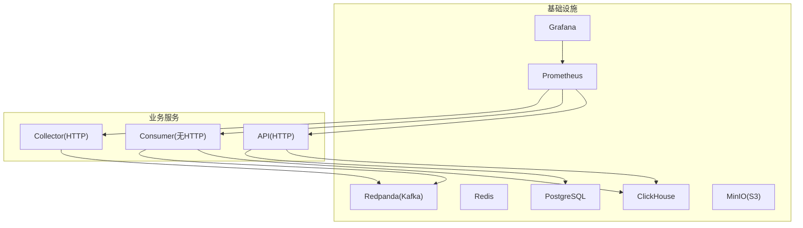
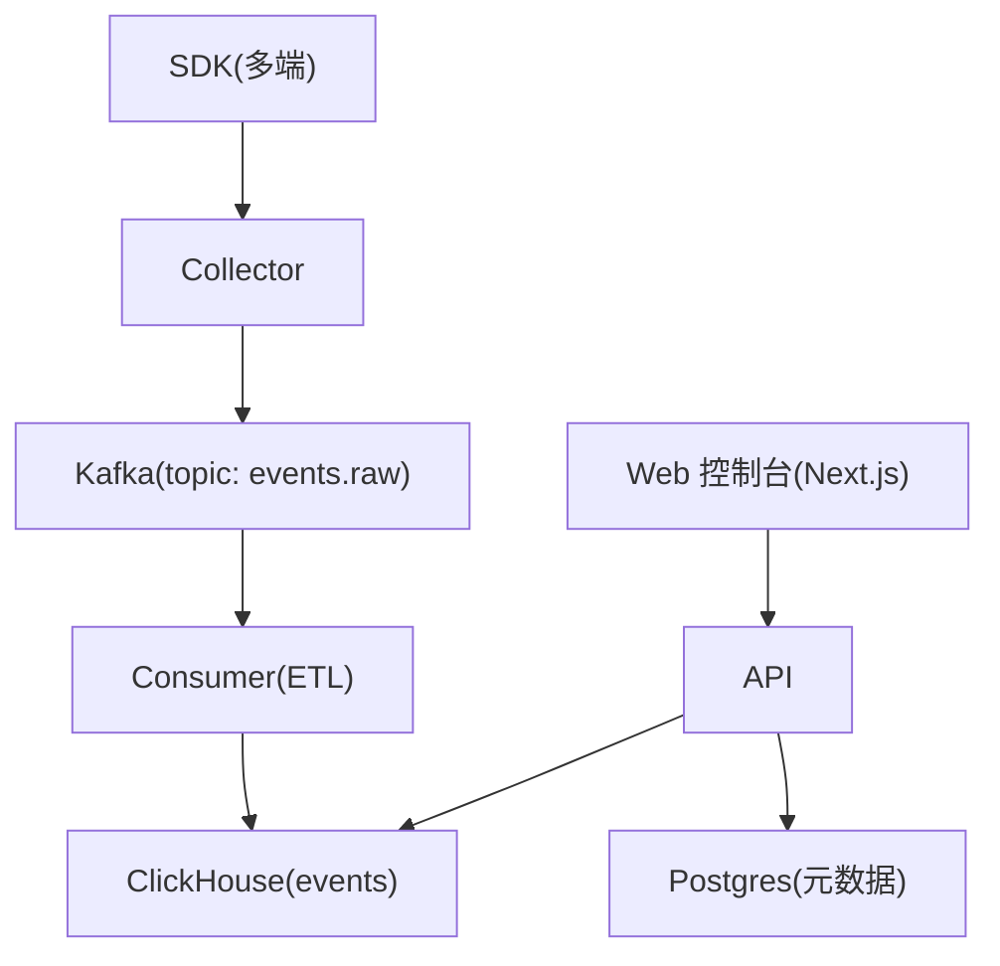
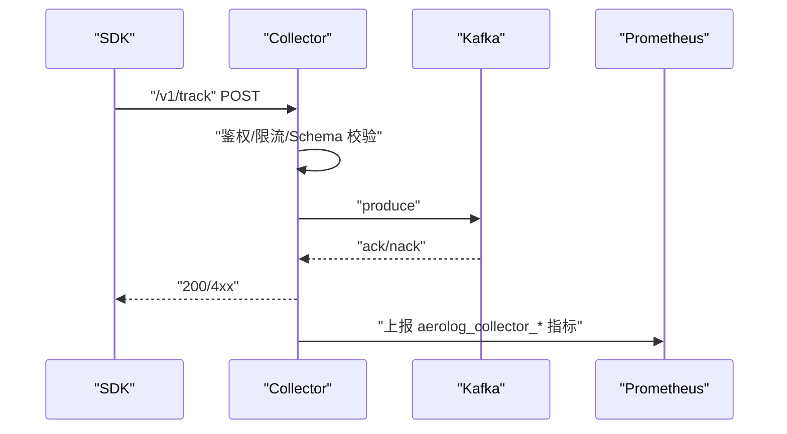
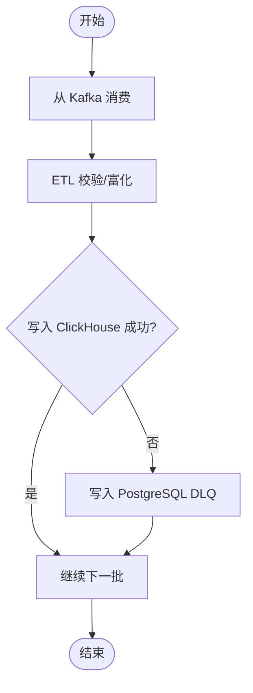
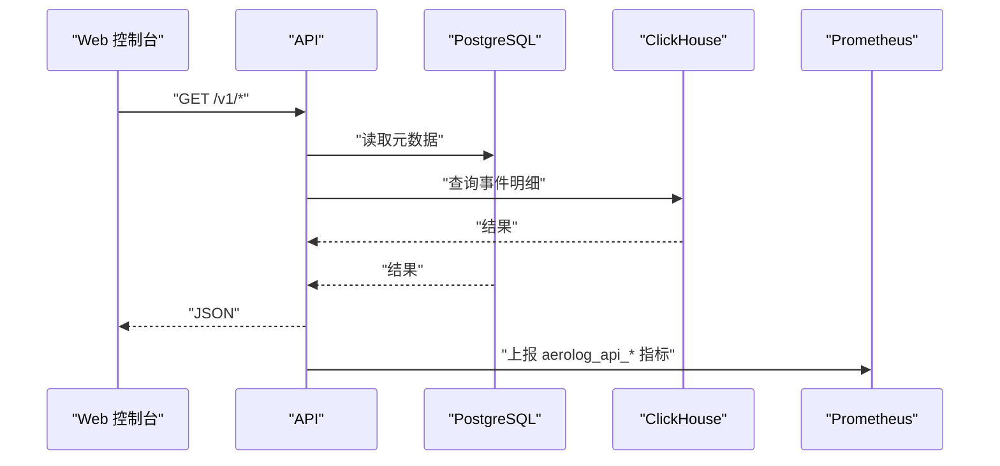
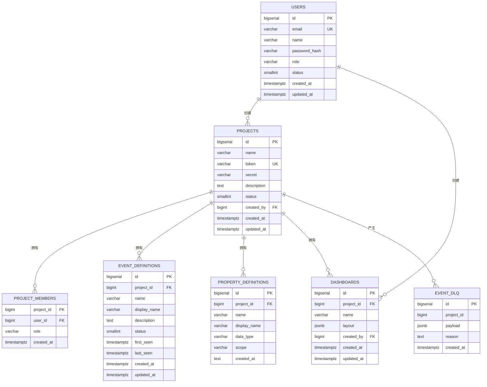
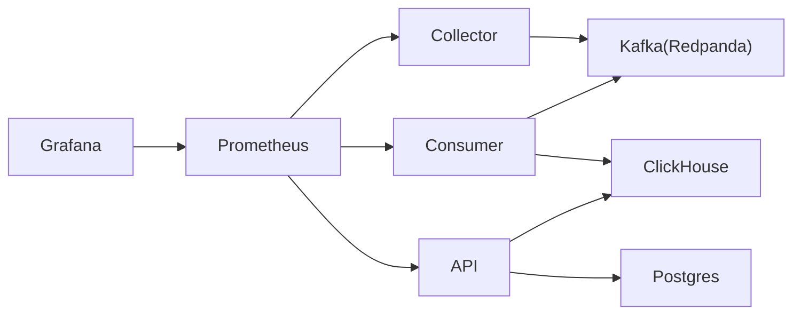

# 生产环境部署

<cite>
**本文引用的文件**
- [deploy/docker-compose.yml](file://deploy/docker-compose.yml)
- [deploy/prometheus/prometheus.yml](file://deploy/prometheus/prometheus.yml)
- [deploy/grafana/provisioning/datasources/prometheus.yml](file://deploy/grafana/provisioning/datasources/prometheus.yml)
- [deploy/grafana/dashboards/aerolog-overview.json](file://deploy/grafana/dashboards/aerolog-overview.json)
- [deploy/init/clickhouse/01_schema.sql](file://deploy/init/clickhouse/01_schema.sql)
- [deploy/init/postgres/01_schema.sql](file://deploy/init/postgres/01_schema.sql)
- [server/api/cmd/main.go](file://server/api/cmd/main.go)
- [server/api/internal/config/config.go](file://server/api/internal/config/config.go)
- [server/collector/cmd/main.go](file://server/collector/cmd/main.go)
- [server/collector/internal/config/config.go](file://server/collector/internal/config/config.go)
- [server/consumer/cmd/main.go](file://server/consumer/cmd/main.go)
- [server/consumer/internal/config/config.go](file://server/consumer/internal/config/config.go)
- [server/pkg/metrics/metrics.go](file://server/pkg/metrics/metrics.go)
- [docs/architecture.md](file://docs/architecture.md)
- [docs/observability.md](file://docs/observability.md)
</cite>

## 目录
1. [简介](#简介)
2. [项目结构](#项目结构)
3. [核心组件](#核心组件)
4. [架构总览](#架构总览)
5. [详细组件分析](#详细组件分析)
6. [依赖分析](#依赖分析)
7. [性能考虑](#性能考虑)
8. [故障排查指南](#故障排查指南)
9. [结论](#结论)
10. [附录](#附录)

## 简介
本指南面向生产环境，围绕硬件资源、性能基准、高可用与故障转移、容器编排与资源调度、备份与灾备、安全加固以及监控与容量规划等方面，结合仓库中的部署与可观测性配置，给出可落地的实施方案。目标是在满足“采集无状态、消费可扩展、存储高性能”的前提下，构建稳定、可观测、可扩展且安全的事件分析平台。

## 项目结构
AeroLog 的生产部署由“基础设施容器编排 + 业务服务 + 观测性栈”构成：
- 基础设施：PostgreSQL、Redis、Redpanda（Kafka 协议）、ClickHouse、MinIO、Prometheus、Grafana
- 业务服务：Collector（事件采集）、Consumer（事件消费与 ETL）、API（查询与管理）
- 观测性：Prometheus 抓取各服务 /metrics，Grafana 预置仪表盘

图表来源
- [deploy/docker-compose.yml:1-147](file://deploy/docker-compose.yml#L1-L147)
- [server/collector/cmd/main.go:1-74](file://server/collector/cmd/main.go#L1-L74)
- [server/consumer/cmd/main.go:1-55](file://server/consumer/cmd/main.go#L1-L55)
- [server/api/cmd/main.go:1-121](file://server/api/cmd/main.go#L1-L121)

章节来源
- [deploy/docker-compose.yml:1-147](file://deploy/docker-compose.yml#L1-L147)
- [docs/architecture.md:1-53](file://docs/architecture.md#L1-L53)

## 核心组件
- Collector：接收 SDK 上报，鉴权、限流、Schema 校验，写入 Kafka；暴露独立 metrics 端口，支持优雅退出。
- Consumer：从 Kafka 消费事件，做 UA/IP/Schema 等 ETL，写入 ClickHouse；支持死信队列；暴露独立 metrics 端口。
- API：基于 Gin 提供查询接口，连接 PostgreSQL（元数据）与 ClickHouse（事件明细），暴露独立 metrics 端口。
- 基础设施：PostgreSQL 存元数据，ClickHouse 存事件明细，Redpanda 提供消息通道，Redis 可用于限流或缓存，MinIO 提供对象存储能力，Prometheus/Grafana 提供指标与可视化。

章节来源
- [server/collector/cmd/main.go:1-74](file://server/collector/cmd/main.go#L1-L74)
- [server/consumer/cmd/main.go:1-55](file://server/consumer/cmd/main.go#L1-L55)
- [server/api/cmd/main.go:1-121](file://server/api/cmd/main.go#L1-L121)
- [server/pkg/metrics/metrics.go:1-81](file://server/pkg/metrics/metrics.go#L1-L81)

## 架构总览
整体数据流从 SDK 到 Collector，进入 Kafka，再由 Consumer 消费并写入 ClickHouse，API 查询 PostgreSQL 与 ClickHouse 提供前端控制台与报表。

图表来源
- [docs/architecture.md:3-35](file://docs/architecture.md#L3-L35)

章节来源
- [docs/architecture.md:1-53](file://docs/architecture.md#L1-L53)

## 详细组件分析

### Collector 组件
- 无状态设计：依赖外部 Redis（可选）进行限流，核心逻辑不保存状态，便于水平扩展。
- Kafka 写入：Producer 将事件写入 Kafka，失败计数指标可用于告警。
- 环境变量：监听地址、metrics 地址、Kafka 地址、Topic、Postgres DSN、Redis 地址、最大请求体大小等。
- 指标：事件接收总量、拒绝率、写 Kafka 错误次数等。

图表来源
- [server/collector/cmd/main.go:22-57](file://server/collector/cmd/main.go#L22-L57)
- [server/collector/internal/config/config.go:19-38](file://server/collector/internal/config/config.go#L19-L38)
- [docs/observability.md:30-46](file://docs/observability.md#L30-L46)

章节来源
- [server/collector/cmd/main.go:1-74](file://server/collector/cmd/main.go#L1-L74)
- [server/collector/internal/config/config.go:1-38](file://server/collector/internal/config/config.go#L1-L38)
- [docs/observability.md:13-31](file://docs/observability.md#L13-L31)

### Consumer 组件
- 消费与 ETL：从 Kafka 消费事件，执行 UA/IP/Schema 等富化与校验，写入 ClickHouse。
- 死信队列：失败事件写入 PostgreSQL 的 DLQ 表，便于后续重放与审计。
- 批处理策略：可通过 BatchSize/BatchMs 调整刷写节奏，平衡吞吐与时延。
- 指标：消息消费速率、flush 耗时、批次大小、DLQ 数量等。

图表来源
- [server/consumer/cmd/main.go:18-54](file://server/consumer/cmd/main.go#L18-L54)
- [server/consumer/internal/config/config.go:28-53](file://server/consumer/internal/config/config.go#L28-L53)
- [deploy/init/postgres/01_schema.sql:66-73](file://deploy/init/postgres/01_schema.sql#L66-L73)

章节来源
- [server/consumer/cmd/main.go:1-55](file://server/consumer/cmd/main.go#L1-L55)
- [server/consumer/internal/config/config.go:1-53](file://server/consumer/internal/config/config.go#L1-L53)
- [deploy/init/postgres/01_schema.sql:1-92](file://deploy/init/postgres/01_schema.sql#L1-L92)

### API 组件
- 查询接口：提供项目、事件定义、分析查询等接口，连接 PostgreSQL 和 ClickHouse。
- 中间件：统一恢复、CORS、指标中间件，独立 metrics 端口暴露。
- 指标：请求总量、请求耗时分布等。

图表来源
- [server/api/cmd/main.go:35-78](file://server/api/cmd/main.go#L35-L78)
- [server/api/internal/config/config.go:24-38](file://server/api/internal/config/config.go#L24-L38)
- [docs/observability.md:47-53](file://docs/observability.md#L47-L53)

章节来源
- [server/api/cmd/main.go:1-121](file://server/api/cmd/main.go#L1-L121)
- [server/api/internal/config/config.go:1-46](file://server/api/internal/config/config.go#L1-L46)
- [docs/observability.md:30-53](file://docs/observability.md#L30-L53)

### 基础设施组件
- PostgreSQL：存储用户、项目、成员、事件/属性定义、看板、DLQ 等元数据。
- ClickHouse：事件明细表与 Buffer 表，按项目+月分区，TTL 365 天，提升写入与查询效率。
- Redpanda：Kafka 协议兼容，无 Zookeeper，支持 Schema Registry、REST Proxy、Console。
- MinIO：S3 兼容的对象存储，可用于归档或导出。
- Prometheus/Grafana：抓取各服务 /metrics，内置 AeroLog 概览面板。

图表来源
- [deploy/init/postgres/01_schema.sql:7-92](file://deploy/init/postgres/01_schema.sql#L7-L92)

章节来源
- [deploy/docker-compose.yml:3-147](file://deploy/docker-compose.yml#L3-L147)
- [deploy/init/clickhouse/01_schema.sql:1-61](file://deploy/init/clickhouse/01_schema.sql#L1-L61)
- [deploy/init/postgres/01_schema.sql:1-92](file://deploy/init/postgres/01_schema.sql#L1-L92)

## 依赖分析
- 服务间耦合：Collector/Consumer/API 通过 Kafka 与 ClickHouse/PostgreSQL 解耦；API 与 ClickHouse 通过独立连接池交互。
- 外部依赖：Kafka（Redpanda）、ClickHouse、PostgreSQL、Redis、MinIO。
- 观测性：各服务独立暴露 /metrics，Prometheus 统一抓取，Grafana 可视化。

图表来源
- [server/collector/cmd/main.go:31-35](file://server/collector/cmd/main.go#L31-L35)
- [server/consumer/cmd/main.go:27-32](file://server/consumer/cmd/main.go#L27-L32)
- [server/api/cmd/main.go:38-48](file://server/api/cmd/main.go#L38-L48)
- [deploy/prometheus/prometheus.yml:10-31](file://deploy/prometheus/prometheus.yml#L10-L31)

章节来源
- [server/collector/cmd/main.go:1-74](file://server/collector/cmd/main.go#L1-L74)
- [server/consumer/cmd/main.go:1-55](file://server/consumer/cmd/main.go#L1-L55)
- [server/api/cmd/main.go:1-121](file://server/api/cmd/main.go#L1-L121)
- [deploy/prometheus/prometheus.yml:1-32](file://deploy/prometheus/prometheus.yml#L1-L32)

## 性能考虑
- 硬件与资源
  - CPU：采集与消费阶段 CPU 密集，建议为 Collector/Consumer 预留足够 vCPU；ClickHouse/PostgreSQL 需要高 IOPS SSD。
  - 内存：为 Kafka/ClickHouse/PostgreSQL 设置合理 JVM/进程内存与缓存；容器需设置内存限制与预留。
  - 存储：ClickHouse 使用高吞吐磁盘；PostgreSQL WAL 与数据分离；对象存储用于冷数据归档。
- 性能基准
  - 基准目标：单机约 1000 QPS / 千万事件/天（MVP）；中规模可水平扩展 Collector、Kafka 3 节点、Postgres 主从。
  - 压力测试：使用压测工具对 /v1/track 与查询接口施压，关注 p99 延迟、错误率、Kafka lag、CH 写入耗时。
- 资源调度
  - Pod 分离：Collector/Consumer/API/DB/Sidecar 独立调度；敏感服务优先级更高。
  - 资源配额：为 Kafka/ClickHouse/PostgreSQL 设置 requests/limits；Prometheus/Grafana 与业务分离。
- 写入优化
  - ClickHouse：Buffer 表降低写放大；分区与 TTL 策略；列式压缩与低基数字段优化。
  - Kafka：合理分区数与副本；Producer 批处理与压缩；Consumer 并发与拉取策略。

章节来源
- [docs/architecture.md:37-47](file://docs/architecture.md#L37-L47)
- [deploy/init/clickhouse/01_schema.sql:44-61](file://deploy/init/clickhouse/01_schema.sql#L44-L61)

## 故障排查指南
- 健康检查
  - 各服务均提供 /healthz；Prometheus 通过静态配置抓取 metrics 端口。
- 常见问题定位
  - 写 Kafka 失败：检查 aerolog_collector_kafka_send_errors_total 是否持续增长。
  - p99 延迟升高：查看 aerolog_collector_request_duration_seconds 与 aerolog_api_request_duration_seconds。
  - 消费滞后：结合 kminion 指标 kafka_consumer_group_lag；关注 aerolog_consumer_dlq_total。
  - DLQ 积压：检查 PostgreSQL event_dlq 表，定位失败原因并重放。
- 优雅停机
  - 服务收到 SIGINT/SIGTERM 后，先停止接受新请求，再关闭 metrics 与数据库连接。

章节来源
- [server/pkg/metrics/metrics.go:51-81](file://server/pkg/metrics/metrics.go#L51-L81)
- [server/collector/cmd/main.go:64-78](file://server/collector/cmd/main.go#L64-L78)
- [server/consumer/cmd/main.go:39-54](file://server/consumer/cmd/main.go#L39-L54)
- [server/api/cmd/main.go:60-78](file://server/api/cmd/main.go#L60-L78)
- [docs/observability.md:55-67](file://docs/observability.md#L55-L67)

## 结论
通过“采集无状态 + 消费可扩展 + 存储高性能”的架构设计，配合完善的可观测性与生产级资源规划，AeroLog 可在生产环境中实现高可用、可扩展与可维护。建议在 Kubernetes 上实施容器编排，结合 Helm 或 Kustomize 管理配置，逐步引入分布式 Kafka/ClickHouse 与多副本策略，完善备份与安全加固，持续优化容量与性能。

## 附录

### 生产环境硬件与资源建议
- Collector：CPU 2-4 核，内存 2-4Gi，独立 Pod；根据 QPS 调整副本数。
- Consumer：CPU 2-8 核，内存 4-16Gi；按项目分组消费时注意分区与并发。
- API：CPU 1-2 核，内存 1-2Gi；连接池大小与查询超时需调优。
- ClickHouse：SSD 集群，CPU/内存充足；Buffer 表 + 分区 + TTL。
- PostgreSQL：主从复制，独立存储；WAL 与数据分离。
- Kafka/Redpanda：3 节点，副本因子≥2；Schema Registry 与 Console。
- MinIO：分布式集群，Tiering 冷数据至对象存储。

### 负载均衡、高可用与故障转移
- 负载均衡：API 前置 Nginx/Ingress，后端多副本；Collector 无状态，直接水平扩展。
- 高可用：Kafka/ClickHouse/Postgres 均配置副本与仲裁；服务侧健康检查与自动重启。
- 故障转移：Kafka 短暂不可用时，Collector 本地 WAL 兜底，恢复后回灌；DLQ 支持人工重放。

章节来源
- [docs/architecture.md:43-47](file://docs/architecture.md#L43-L47)

### 容器编排最佳实践（Kubernetes）
- 部署清单要点
  - Deployment/StatefulSet：PostgreSQL/ClickHouse/Redpanda 使用 StatefulSet；Collector/Consumer/API 使用 Deployment。
  - Service：为每个服务暴露 ClusterIP；Prometheus 使用 ServiceMonitor/Service 发现。
  - ConfigMap/Secret：分离配置与密钥；ClickHouse/Postgres/MinIO 初始化 SQL 通过 initContainer 或 Job。
  - PVC：ClickHouse/PostgreSQL/MinIO 使用持久卷；Prometheus/Grafana 使用临时卷或持久卷。
- 资源调度
  - 节点选择器与亲和性：将数据库与 Kafka 放在同一拓扑；业务服务与数据库分离。
  - 资源限制：为每个容器设置 requests/limits；Prometheus/Grafana 与业务分离。
  - 滚动更新：设置 maxUnavailable/maxSurge；优雅停机窗口 5-10s。
- 网络策略
  - 仅开放必要端口；内部服务通过 ClusterDNS 访问；对外入口统一经 Ingress/NLB。

### 备份与灾备
- 数据分类
  - 元数据（PostgreSQL）：定时逻辑备份 + 归档 WAL；支持点恢复。
  - 事件明细（ClickHouse）：冷热分层 + 对象存储归档；定期快照。
  - 流水线（Kafka）：保留期与副本策略；监控 lag 与分区分配。
- 备份策略
  - PostgreSQL：全量 + 增量 + WAL 归档；验证恢复路径。
  - ClickHouse：表级快照（本地/远程）；导出关键报表与物化视图定义。
  - 对象存储：归档长期数据；版本控制与生命周期策略。
- 灾难恢复
  - RTO/RPO 目标：明确各组件目标；演练恢复流程。
  - 多活/异地：跨 AZ/Region 部署；自动化切换与回切。

### 安全加固
- 网络隔离
  - VPC/子网划分：数据库与消息队列置于内网；API 通过公网 NLB/ALB 暴露。
  - 安全组/NetworkPolicy：最小化放通；禁止外联。
- 访问控制
  - TLS：启用 HTTPS 与 mTLS；证书轮换。
  - 认证授权：API JWT 密钥管理；RBAC 权限最小化。
  - SDK 凭证：项目 Token/Secret 严格保密；定期轮换。
- 审计日志
  - API 访问日志与操作审计；Kafka/ClickHouse/Postgres 审计开启。
  - 日志集中收集与保留策略。

### 监控与容量规划
- 指标体系
  - 采集层：QPS、p99、拒绝率、Kafka 写失败。
  - 消费层：消费速率、flush 耗时、批次大小、DLQ。
  - 查询层：API p99、ClickHouse merges/replication/part。
- 告警策略
  - 基于 PromQL 的阈值与趋势告警；结合 Grafana 告警与通知。
- 容量规划
  - 历史峰值与增长趋势；热点指标（分区、连接数、磁盘 IO）。
  - 自动扩缩容：HPA/VPAs；资源预留与突发能力。

章节来源
- [docs/observability.md:13-67](file://docs/observability.md#L13-L67)
- [deploy/prometheus/prometheus.yml:1-32](file://deploy/prometheus/prometheus.yml#L1-L32)
- [deploy/grafana/dashboards/aerolog-overview.json:1-131](file://deploy/grafana/dashboards/aerolog-overview.json#L1-L131)