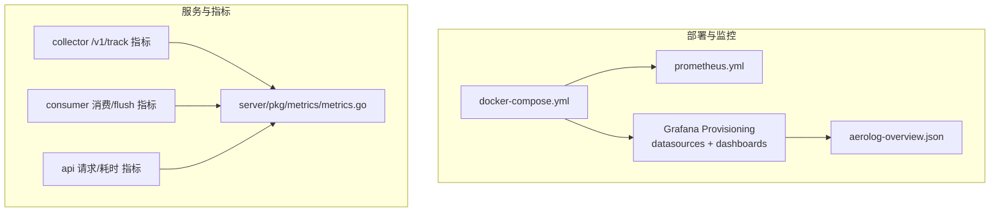
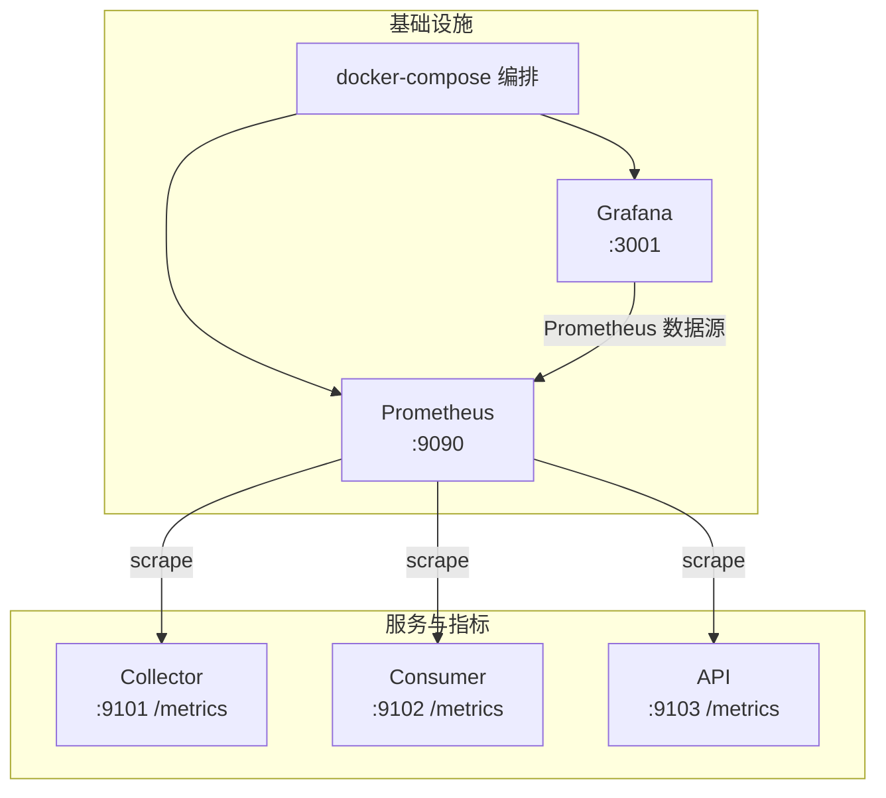
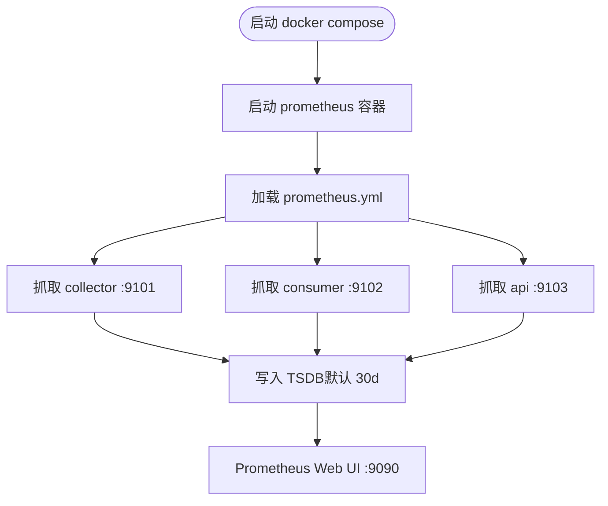
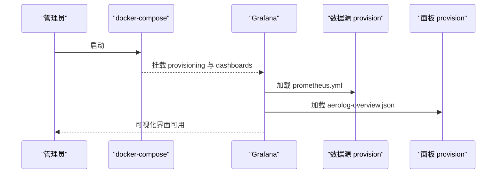
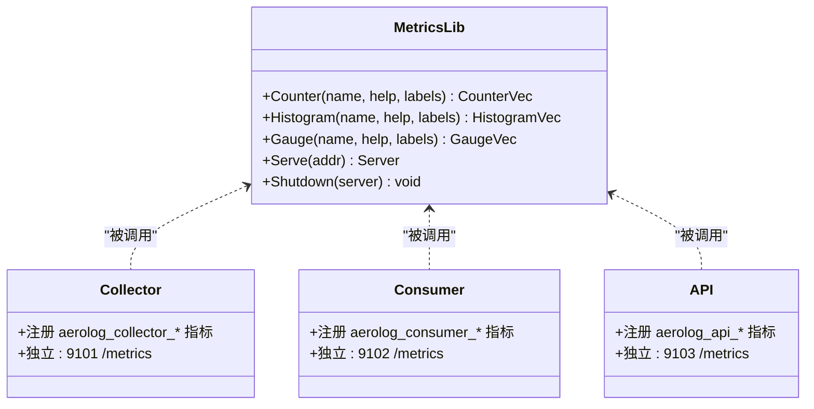
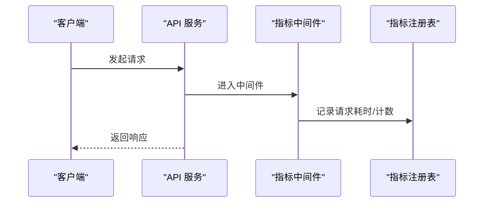
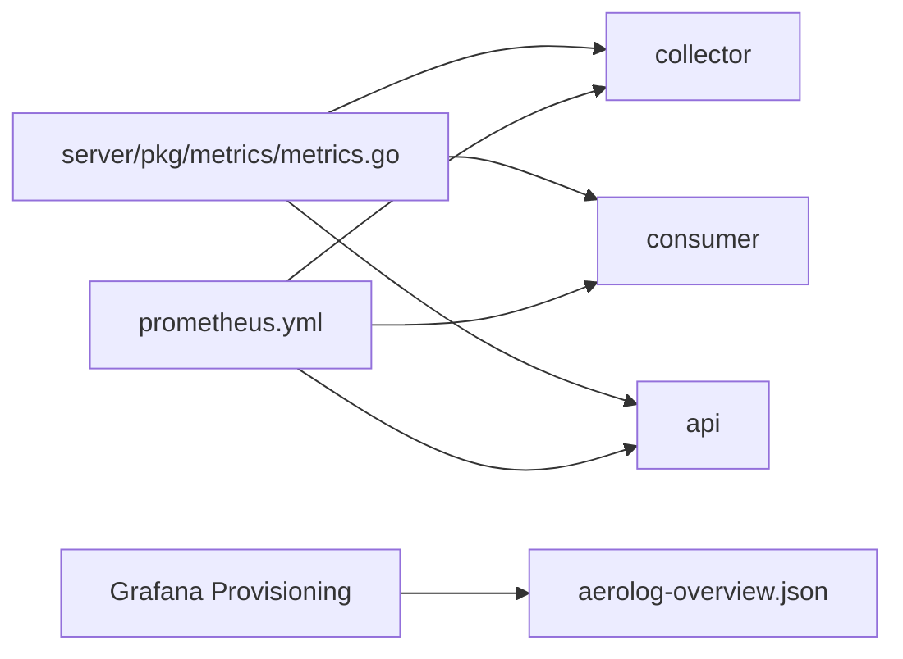

# 监控系统配置

<cite>
**本文引用的文件**
- [deploy/prometheus/prometheus.yml](file://deploy/prometheus/prometheus.yml)
- [deploy/docker-compose.yml](file://deploy/docker-compose.yml)
- [deploy/grafana/provisioning/datasources/prometheus.yml](file://deploy/grafana/provisioning/datasources/prometheus.yml)
- [deploy/grafana/provisioning/dashboards/aerolog.yml](file://deploy/grafana/provisioning/dashboards/aerolog.yml)
- [deploy/grafana/dashboards/aerolog-overview.json](file://deploy/grafana/dashboards/aerolog-overview.json)
- [server/pkg/metrics/metrics.go](file://server/pkg/metrics/metrics.go)
- [server/collector/internal/handler/track.go](file://server/collector/internal/handler/track.go)
- [server/consumer/internal/worker/worker.go](file://server/consumer/internal/worker/worker.go)
- [server/api/cmd/main.go](file://server/api/cmd/main.go)
- [server/collector/internal/config/config.go](file://server/collector/internal/config/config.go)
- [server/consumer/internal/config/config.go](file://server/consumer/internal/config/config.go)
- [server/api/internal/config/config.go](file://server/api/internal/config/config.go)
- [docs/observability.md](file://docs/observability.md)
</cite>

## 目录
1. [简介](#简介)
2. [项目结构](#项目结构)
3. [核心组件](#核心组件)
4. [架构总览](#架构总览)
5. [详细组件分析](#详细组件分析)
6. [依赖关系分析](#依赖关系分析)
7. [性能考虑](#性能考虑)
8. [故障排查指南](#故障排查指南)
9. [结论](#结论)
10. [附录](#附录)

## 简介
本指南面向AeroLog的监控系统配置，覆盖Prometheus安装与配置、各服务指标暴露机制、Grafana仪表板的预配置与自定义方法、告警规则配置与通知渠道集成，以及监控数据的长期存储策略与查询优化技巧。文档基于仓库中的部署与代码实现，确保读者能够快速搭建并维护生产级可观测性体系。

## 项目结构
AeroLog的监控相关资源集中在deploy目录中，包含Prometheus配置、Grafana数据源与仪表板配置、以及Compose编排文件。服务端代码在server/pkg/metrics中统一提供指标注册与/metrics端点，在各业务服务中按需使用。

**图表来源**
- [deploy/docker-compose.yml:113-147](file://deploy/docker-compose.yml#L113-L147)
- [deploy/prometheus/prometheus.yml:10-32](file://deploy/prometheus/prometheus.yml#L10-L32)
- [deploy/grafana/provisioning/datasources/prometheus.yml:1-10](file://deploy/grafana/provisioning/datasources/prometheus.yml#L1-L10)
- [deploy/grafana/provisioning/dashboards/aerolog.yml:1-13](file://deploy/grafana/provisioning/dashboards/aerolog.yml#L1-L13)
- [deploy/grafana/dashboards/aerolog-overview.json:1-131](file://deploy/grafana/dashboards/aerolog-overview.json#L1-L131)
- [server/pkg/metrics/metrics.go:1-81](file://server/pkg/metrics/metrics.go#L1-L81)
- [server/collector/internal/handler/track.go:22-37](file://server/collector/internal/handler/track.go#L22-L37)
- [server/consumer/internal/worker/worker.go:19-38](file://server/consumer/internal/worker/worker.go#L19-L38)
- [server/api/cmd/main.go:22-33](file://server/api/cmd/main.go#L22-L33)

**章节来源**
- [deploy/docker-compose.yml:1-147](file://deploy/docker-compose.yml#L1-L147)
- [deploy/prometheus/prometheus.yml:1-32](file://deploy/prometheus/prometheus.yml#L1-L32)
- [deploy/grafana/provisioning/datasources/prometheus.yml:1-10](file://deploy/grafana/provisioning/datasources/prometheus.yml#L1-L10)
- [deploy/grafana/provisioning/dashboards/aerolog.yml:1-13](file://deploy/grafana/provisioning/dashboards/aerolog.yml#L1-L13)
- [deploy/grafana/dashboards/aerolog-overview.json:1-131](file://deploy/grafana/dashboards/aerolog-overview.json#L1-L131)
- [server/pkg/metrics/metrics.go:1-81](file://server/pkg/metrics/metrics.go#L1-L81)

## 核心组件
- Prometheus：负责从各服务的独立metrics端口拉取指标，持久化TSDB，默认保留30天。
- Grafana：通过Provisioning自动加载Prometheus数据源与AeroLog仪表板，内置“AeroLog Overview”。
- 服务指标库：统一的Prometheus注册表与/metrics端点，支持Counter/Histogram/Gauge，自动暴露Go runtime/process指标。
- 三类服务指标：
  - Collector：事件接收总量、请求耗时、Kafka发送错误、拒绝率等。
  - Consumer：消息消费速率、flush耗时、批次大小、DLQ计数等。
  - API：请求总量、请求耗时、路径/状态维度统计。

**章节来源**
- [docs/observability.md:1-67](file://docs/observability.md#L1-L67)
- [server/pkg/metrics/metrics.go:18-49](file://server/pkg/metrics/metrics.go#L18-L49)
- [server/collector/internal/handler/track.go:22-37](file://server/collector/internal/handler/track.go#L22-L37)
- [server/consumer/internal/worker/worker.go:19-38](file://server/consumer/internal/worker/worker.go#L19-L38)
- [server/api/cmd/main.go:22-33](file://server/api/cmd/main.go#L22-L33)

## 架构总览
下图展示Prometheus拉取、Grafana可视化与服务指标暴露的整体流程。

**图表来源**
- [deploy/docker-compose.yml:113-147](file://deploy/docker-compose.yml#L113-L147)
- [deploy/prometheus/prometheus.yml:10-32](file://deploy/prometheus/prometheus.yml#L10-L32)
- [deploy/grafana/provisioning/datasources/prometheus.yml:1-10](file://deploy/grafana/provisioning/datasources/prometheus.yml#L1-L10)

**章节来源**
- [deploy/docker-compose.yml:113-147](file://deploy/docker-compose.yml#L113-L147)
- [deploy/prometheus/prometheus.yml:1-32](file://deploy/prometheus/prometheus.yml#L1-L32)
- [deploy/grafana/provisioning/datasources/prometheus.yml:1-10](file://deploy/grafana/provisioning/datasources/prometheus.yml#L1-L10)

## 详细组件分析

### Prometheus 安装与配置
- 安装：使用官方镜像，挂载配置与数据卷，开启生命周期接口。
- 配置要点：
  - 全局参数：抓取间隔、评估间隔、外部标签cluster。
  - 抓取目标：分别指向collector/consumer/api的独立metrics端口，并打上service标签。
  - 存储：TSDB保留期默认30天，可通过命令行参数调整。
- 与Compose联动：通过extra_hosts映射host.docker.internal，使容器内能解析宿主机地址。

**图表来源**
- [deploy/docker-compose.yml:113-129](file://deploy/docker-compose.yml#L113-L129)
- [deploy/prometheus/prometheus.yml:4-32](file://deploy/prometheus/prometheus.yml#L4-L32)

**章节来源**
- [deploy/docker-compose.yml:113-129](file://deploy/docker-compose.yml#L113-L129)
- [deploy/prometheus/prometheus.yml:1-32](file://deploy/prometheus/prometheus.yml#L1-L32)

### Grafana 数据源与仪表板
- 数据源：通过Provisioning自动创建名为“Prometheus”的数据源，URL指向容器内prometheus:9090。
- 仪表板：通过Provisioning将dashboards目录下的JSON文件加载为“AeroLog”文件夹内的面板，允许UI更新。
- 预置面板：AeroLog Overview，包含Collector/Consumer/API的关键指标可视化与告警建议表达式。

**图表来源**
- [deploy/docker-compose.yml:130-147](file://deploy/docker-compose.yml#L130-L147)
- [deploy/grafana/provisioning/datasources/prometheus.yml:1-10](file://deploy/grafana/provisioning/datasources/prometheus.yml#L1-L10)
- [deploy/grafana/provisioning/dashboards/aerolog.yml:1-13](file://deploy/grafana/provisioning/dashboards/aerolog.yml#L1-L13)
- [deploy/grafana/dashboards/aerolog-overview.json:1-131](file://deploy/grafana/dashboards/aerolog-overview.json#L1-L131)

**章节来源**
- [deploy/docker-compose.yml:130-147](file://deploy/docker-compose.yml#L130-L147)
- [deploy/grafana/provisioning/datasources/prometheus.yml:1-10](file://deploy/grafana/provisioning/datasources/prometheus.yml#L1-L10)
- [deploy/grafana/provisioning/dashboards/aerolog.yml:1-13](file://deploy/grafana/provisioning/dashboards/aerolog.yml#L1-L13)
- [deploy/grafana/dashboards/aerolog-overview.json:1-131](file://deploy/grafana/dashboards/aerolog-overview.json#L1-L131)

### 服务指标暴露机制
- 统一指标库：提供Counter/Histogram/Gauge工厂函数与/metrics端点，自动注册Go runtime/process指标。
- Collector：
  - 指标：事件接收总量（按result）、请求耗时直方图、Kafka发送错误计数。
  - 暴露：在独立端口启动metrics server，业务端口为HTTP。
- Consumer：
  - 指标：消息消费总量（按result）、flush耗时直方图、批次大小直方图、DLQ计数。
  - 暴露：独立metrics端口，无HTTP业务端口。
- API：
  - 指标：请求总量（按method/path/status）、请求耗时直方图。
  - 暴露：独立metrics端口，业务端口为HTTP。

**图表来源**
- [server/pkg/metrics/metrics.go:18-70](file://server/pkg/metrics/metrics.go#L18-L70)
- [server/collector/internal/handler/track.go:22-37](file://server/collector/internal/handler/track.go#L22-L37)
- [server/consumer/internal/worker/worker.go:19-38](file://server/consumer/internal/worker/worker.go#L19-L38)
- [server/api/cmd/main.go:22-33](file://server/api/cmd/main.go#L22-L33)

**章节来源**
- [server/pkg/metrics/metrics.go:1-81](file://server/pkg/metrics/metrics.go#L1-L81)
- [server/collector/internal/handler/track.go:22-37](file://server/collector/internal/handler/track.go#L22-L37)
- [server/consumer/internal/worker/worker.go:19-38](file://server/consumer/internal/worker/worker.go#L19-L38)
- [server/api/cmd/main.go:22-33](file://server/api/cmd/main.go#L22-L33)

### 指标定义与使用（代码级）
- Collector
  - 事件接收计数器：aerolog_collector_events_received_total，标签project/result。
  - 请求耗时直方图：aerolog_collector_request_duration_seconds，标签status。
  - Kafka发送错误计数器：aerolog_collector_kafka_send_errors_total。
- Consumer
  - 消息消费计数器：aerolog_consumer_messages_total，标签result。
  - flush耗时直方图：aerolog_consumer_flush_duration_seconds，标签result。
  - 批次大小直方图：aerolog_consumer_flush_batch_size。
  - DLQ计数器：aerolog_consumer_dlq_total。
- API
  - 请求计数器：aerolog_api_requests_total，标签method/path/status。
  - 请求耗时直方图：aerolog_api_request_duration_seconds，标签method/path/status。

**图表来源**
- [server/api/cmd/main.go:80-93](file://server/api/cmd/main.go#L80-L93)
- [server/pkg/metrics/metrics.go:26-49](file://server/pkg/metrics/metrics.go#L26-L49)

**章节来源**
- [server/collector/internal/handler/track.go:22-37](file://server/collector/internal/handler/track.go#L22-L37)
- [server/consumer/internal/worker/worker.go:19-38](file://server/consumer/internal/worker/worker.go#L19-L38)
- [server/api/cmd/main.go:22-33](file://server/api/cmd/main.go#L22-L33)
- [server/pkg/metrics/metrics.go:26-49](file://server/pkg/metrics/metrics.go#L26-L49)

### Grafana 仪表板：预置与自定义
- 预置面板：AeroLog Overview，包含Collector/Consumer/API关键指标的统计与延迟分位数面板。
- 自定义面板：可在Grafana中新建面板，选择Prometheus数据源，编写PromQL表达式（如rate、histogram_quantile、increase等）。
- 数据源连接：通过Provisioning自动配置，无需手动添加。

**章节来源**
- [deploy/grafana/dashboards/aerolog-overview.json:1-131](file://deploy/grafana/dashboards/aerolog-overview.json#L1-L131)
- [deploy/grafana/provisioning/datasources/prometheus.yml:1-10](file://deploy/grafana/provisioning/datasources/prometheus.yml#L1-L10)

### 告警规则配置与通知渠道
- 建议规则（基于现有指标）：
  - Kafka写失败持续出现：rate(aerolog_collector_kafka_send_errors_total[5m]) > 0，持续3分钟。
  - Collector p99延迟退化：histogram_quantile(0.99, rate(aerolog_collector_request_duration_seconds_bucket[5m])) > 阈值。
  - Consumer进入DLQ：rate(aerolog_consumer_dlq_total[5m]) > 0。
  - 消费滞后：接入kminion导出kafka_consumer_group_lag指标，Dashboard新增面板。
- 通知渠道：可在Grafana中配置Webhook/Email/PagerDuty等，结合Alertmanager进行收敛与路由。

**章节来源**
- [docs/observability.md:55-60](file://docs/observability.md#L55-L60)

## 依赖关系分析
- 服务与指标库：各服务通过server/pkg/metrics统一注册与暴露指标，降低重复实现成本。
- Prometheus与服务：Prometheus通过静态配置抓取各服务独立metrics端口，避免业务端口与监控端口耦合。
- Grafana与Prometheus：通过Provisioning自动加载数据源与面板，便于版本化管理与团队协作。

**图表来源**
- [server/pkg/metrics/metrics.go:18-70](file://server/pkg/metrics/metrics.go#L18-L70)
- [server/collector/internal/handler/track.go:22-37](file://server/collector/internal/handler/track.go#L22-L37)
- [server/consumer/internal/worker/worker.go:19-38](file://server/consumer/internal/worker/worker.go#L19-L38)
- [server/api/cmd/main.go:22-33](file://server/api/cmd/main.go#L22-L33)
- [deploy/prometheus/prometheus.yml:10-32](file://deploy/prometheus/prometheus.yml#L10-L32)
- [deploy/grafana/provisioning/dashboards/aerolog.yml:1-13](file://deploy/grafana/provisioning/dashboards/aerolog.yml#L1-L13)

**章节来源**
- [server/pkg/metrics/metrics.go:1-81](file://server/pkg/metrics/metrics.go#L1-L81)
- [server/collector/internal/handler/track.go:22-37](file://server/collector/internal/handler/track.go#L22-L37)
- [server/consumer/internal/worker/worker.go:19-38](file://server/consumer/internal/worker/worker.go#L19-L38)
- [server/api/cmd/main.go:22-33](file://server/api/cmd/main.go#L22-L33)
- [deploy/prometheus/prometheus.yml:1-32](file://deploy/prometheus/prometheus.yml#L1-L32)
- [deploy/grafana/provisioning/dashboards/aerolog.yml:1-13](file://deploy/grafana/provisioning/dashboards/aerolog.yml#L1-L13)

## 性能考虑
- 指标数量与标签基数：合理控制标签维度，避免高基数导致内存与查询开销上升。
- 直方图桶设置：已针对典型延迟场景设置桶，可根据实际分布进一步优化。
- 抓取频率与存储：根据SLA调整scrape_interval与retention.time，平衡精度与成本。
- 查询优化：优先使用聚合与rate/increase，避免对原始计数器进行复杂运算；利用分位数计算时限定标签范围。

[本节为通用指导，不直接分析具体文件]

## 故障排查指南
- Prometheus无法抓取：
  - 检查Prometheus配置targets与服务端口映射。
  - 确认Compose中extra_hosts是否正确解析host.docker.internal。
- Grafana无法访问数据源：
  - 确认数据源URL与容器网络可达。
  - 检查Provisioning文件权限与路径。
- 指标缺失或异常：
  - 确认各服务独立metrics端口已启动且未与其他端口冲突。
  - 检查服务日志中metrics监听输出与健康检查端点。

**章节来源**
- [deploy/docker-compose.yml:122-124](file://deploy/docker-compose.yml#L122-L124)
- [deploy/prometheus/prometheus.yml:10-32](file://deploy/prometheus/prometheus.yml#L10-L32)
- [deploy/grafana/provisioning/datasources/prometheus.yml:1-10](file://deploy/grafana/provisioning/datasources/prometheus.yml#L1-L10)

## 结论
AeroLog的监控体系以Prometheus为核心，配合Grafana实现可视化与告警闭环。通过统一的指标库与独立metrics端口设计，实现了清晰的服务边界与可维护性。结合预置仪表板与建议告警规则，可快速构建生产级可观测性平台。

## 附录

### 端口与环境变量约定
- Collector：业务端口8081，metrics端口9101，环境变量AEROLOG_METRICS_ADDR=:9101。
- Consumer：业务端口（无HTTP），metrics端口9102，环境变量AEROLOG_METRICS_ADDR=:9102。
- API：业务端口8082，metrics端口9103，环境变量AEROLOG_METRICS_ADDR=:9103。

**章节来源**
- [docs/observability.md:5-11](file://docs/observability.md#L5-L11)
- [server/collector/internal/config/config.go:21-30](file://server/collector/internal/config/config.go#L21-L30)
- [server/consumer/internal/config/config.go:28-44](file://server/consumer/internal/config/config.go#L28-L44)
- [server/api/internal/config/config.go:24-37](file://server/api/internal/config/config.go#L24-L37)