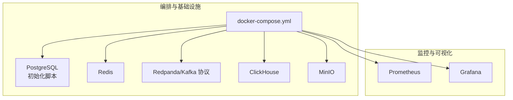
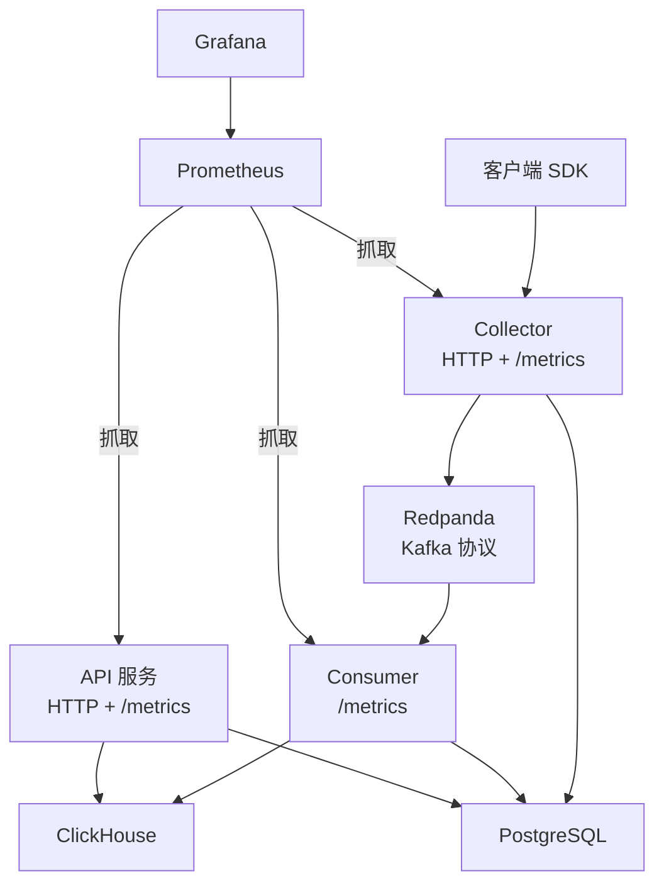
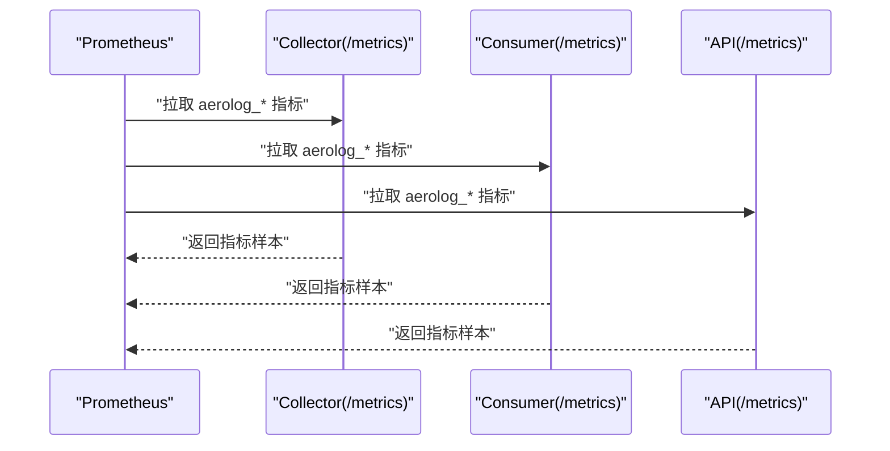
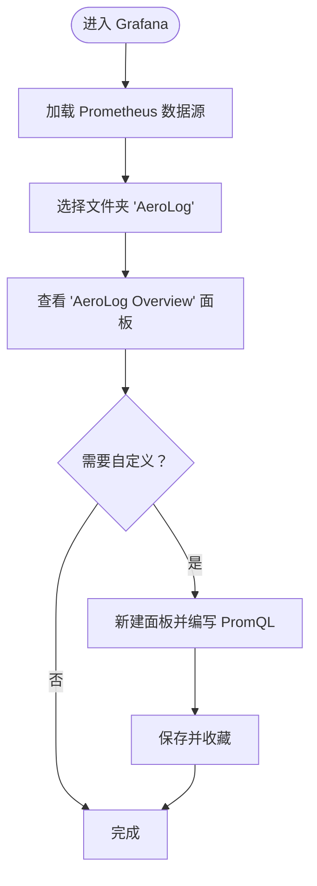
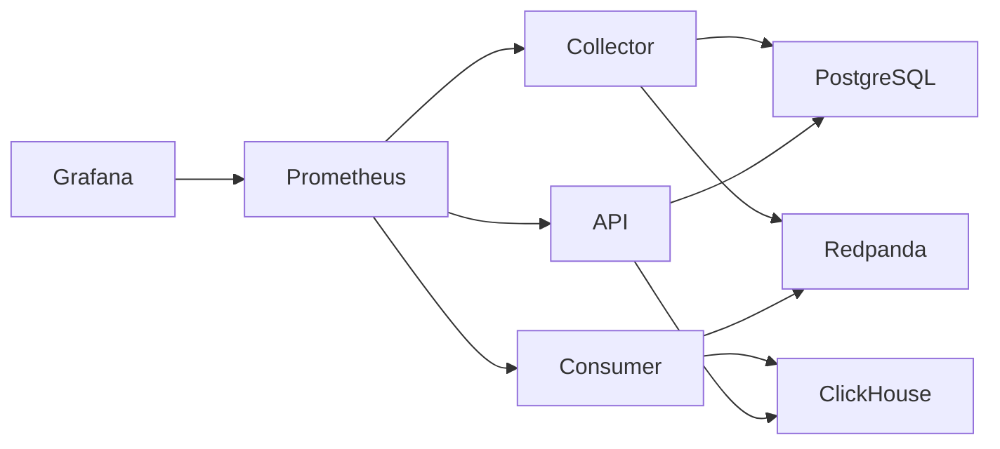

# 部署配置

<cite>
**本文引用的文件**
- [deploy/docker-compose.yml](file://deploy/docker-compose.yml)
- [deploy/prometheus/prometheus.yml](file://deploy/prometheus/prometheus.yml)
- [deploy/grafana/provisioning/datasources/prometheus.yml](file://deploy/grafana/provisioning/datasources/prometheus.yml)
- [deploy/grafana/provisioning/dashboards/aerolog.yml](file://deploy/grafana/provisioning/dashboards/aerolog.yml)
- [deploy/grafana/dashboards/aerolog-overview.json](file://deploy/grafana/dashboards/aerolog-overview.json)
- [deploy/init/postgres/01_schema.sql](file://deploy/init/postgres/01_schema.sql)
- [deploy/init/clickhouse/01_schema.sql](file://deploy/init/clickhouse/01_schema.sql)
- [server/collector/cmd/main.go](file://server/collector/cmd/main.go)
- [server/consumer/cmd/main.go](file://server/consumer/cmd/main.go)
- [server/api/cmd/main.go](file://server/api/cmd/main.go)
- [server/collector/internal/config/config.go](file://server/collector/internal/config/config.go)
- [server/consumer/internal/config/config.go](file://server/consumer/internal/config/config.go)
- [server/api/internal/config/config.go](file://server/api/internal/config/config.go)
- [server/pkg/metrics/metrics.go](file://server/pkg/metrics/metrics.go)
- [docs/observability.md](file://docs/observability.md)
</cite>

## 目录
1. [简介](#简介)
2. [项目结构](#项目结构)
3. [核心组件](#核心组件)
4. [架构总览](#架构总览)
5. [详细组件分析](#详细组件分析)
6. [依赖关系分析](#依赖关系分析)
7. [性能考虑](#性能考虑)
8. [故障排查指南](#故障排查指南)
9. [结论](#结论)
10. [附录](#附录)

## 简介
本指南面向在本地或生产环境中部署 AeroLog 的工程团队，提供从 Docker Compose 编排、环境变量与安全配置、Prometheus 监控与告警、Grafana 仪表板到生产级资源规划与容量扩展的完整落地方案。文档中的所有技术细节均基于仓库现有配置与实现进行梳理与总结。

## 项目结构
AeroLog 的部署相关资产集中在 deploy 目录，包含：
- 基础设施编排：docker-compose.yml
- 监控与可视化：prometheus.yml、grafana/provisioning、grafana/dashboards
- 初始化脚本：PostgreSQL 与 ClickHouse 的 DDL
- 服务端指标导出：各服务通过独立 metrics 端口暴露 Prometheus 指标

图表来源
- [deploy/docker-compose.yml:1-147](file://deploy/docker-compose.yml#L1-L147)

章节来源
- [deploy/docker-compose.yml:1-147](file://deploy/docker-compose.yml#L1-L147)

## 核心组件
- PostgreSQL：存储业务元数据（用户、项目、事件/属性定义、看板、DLQ 等），首次启动通过初始化脚本创建表结构与默认管理员。
- Redis：缓存与会话支持（由各服务按需使用）。
- Redpanda：Kafka 协议兼容的消息系统，提供事件采集入口；同时提供控制台用于运维观察。
- ClickHouse：事件明细与用户属性的高性能 OLAP 存储，按项目+月分区并带 TTL。
- MinIO：对象存储，提供 S3 兼容接口（用于未来扩展场景）。
- Prometheus：拉取各服务独立 metrics 端口，持久化 TSDB。
- Grafana：自动加载 Prometheus 数据源与 AeroLog 预置仪表板。

章节来源
- [deploy/docker-compose.yml:1-147](file://deploy/docker-compose.yml#L1-L147)
- [deploy/init/postgres/01_schema.sql:1-92](file://deploy/init/postgres/01_schema.sql#L1-L92)
- [deploy/init/clickhouse/01_schema.sql:1-61](file://deploy/init/clickhouse/01_schema.sql#L1-L61)

## 架构总览
下图展示容器化部署的整体交互：客户端 SDK 通过 Collector 接入事件，经 Redpanda 传输，Consumer 将数据批量写入 ClickHouse；PostgreSQL 存储元数据；Prometheus/Grafana 实时观测系统健康与性能。

图表来源
- [deploy/docker-compose.yml:1-147](file://deploy/docker-compose.yml#L1-L147)
- [server/collector/cmd/main.go:1-74](file://server/collector/cmd/main.go#L1-L74)
- [server/consumer/cmd/main.go:1-55](file://server/consumer/cmd/main.go#L1-L55)
- [server/api/cmd/main.go:1-121](file://server/api/cmd/main.go#L1-L121)

## 详细组件分析

### Docker Compose 配置要点
- 服务定义与端口映射
  - PostgreSQL：5432 映射，挂载数据与初始化脚本。
  - Redis：6379 映射，挂载数据目录。
  - Redpanda：Kafka API/Schema/REST/Admin 端口映射，挂载数据目录。
  - Redpanda Console：8088 映射，连接 Redpanda。
  - ClickHouse：8123/9000 映射，挂载数据与初始化脚本。
  - MinIO：9000/9001 映射，挂载数据目录。
  - Prometheus：9090 映射，挂载配置与 TSDB 数据。
  - Grafana：3001 映射，挂载 provisioning 与仪表板目录，挂载数据目录。
- 网络与健康检查
  - 使用默认网络，服务间通过服务名互访。
  - 各服务均配置健康检查，确保依赖可用。
- 卷挂载策略
  - 数据卷统一挂载至 ./data/<service>，便于持久化与备份。
  - 初始化脚本通过只读挂载注入数据库初始化逻辑。

章节来源
- [deploy/docker-compose.yml:1-147](file://deploy/docker-compose.yml#L1-L147)

### 环境变量与敏感信息管理
- 服务端环境变量解析
  - Collector：监听业务端口与 metrics 端口，Kafka Broker/Topic、Postgres DSN、Redis 地址、最大请求体等。
  - Consumer：Kafka Broker/Topic/GroupID、ClickHouse 连接参数、Postgres DSN、Batch 参数、metrics 端口。
  - API：业务端口与 metrics 端口、Postgres DSN、ClickHouse 连接参数、JWT Secret、CORS 允许来源。
- 敏感信息与安全建议
  - 生产环境务必通过外部密钥管理（如 KMS/Secret Manager）注入环境变量，避免明文写入 Compose 文件。
  - Grafana 默认管理员账号需立即修改密码，并在网关层启用鉴权（如 Nginx/Authentik）。
  - TLS 与 mTLS：建议在反向代理层开启 HTTPS，并对内部服务通信启用 mTLS。
  - 最小权限原则：数据库与对象存储凭据仅授予必要权限。

章节来源
- [server/collector/internal/config/config.go:1-38](file://server/collector/internal/config/config.go#L1-L38)
- [server/consumer/internal/config/config.go:1-53](file://server/consumer/internal/config/config.go#L1-L53)
- [server/api/internal/config/config.go:1-46](file://server/api/internal/config/config.go#L1-L46)
- [docs/observability.md:62-67](file://docs/observability.md#L62-L67)

### Prometheus 监控集成
- 抓取目标
  - Prometheus 配置中为 collector/consumer/api 分别定义静态抓取目标，标签包含 service 名称，便于区分。
  - 通过 host.docker.internal 访问宿主机上以本地进程形式运行的服务（开发模式）；生产环境应改为 Kubernetes 内部 Service DNS。
- 指标导出
  - 各服务独立启动 /metrics HTTP 服务，避免与业务端口混用。
  - 指标命名遵循 aerolog_* 前缀，涵盖计数器、直方图与度量器。
- 告警建议
  - Kafka 写失败持续告警、Collector p99 延迟阈值、Consumer DLQ 增长、消费组滞后（建议接入 kminion 指标）。

图表来源
- [deploy/prometheus/prometheus.yml:1-32](file://deploy/prometheus/prometheus.yml#L1-L32)
- [server/pkg/metrics/metrics.go:1-81](file://server/pkg/metrics/metrics.go#L1-L81)

章节来源
- [deploy/prometheus/prometheus.yml:1-32](file://deploy/prometheus/prometheus.yml#L1-L32)
- [docs/observability.md:30-67](file://docs/observability.md#L30-L67)

### Grafana 仪表板
- 数据源与自动配置
  - Grafana 通过 provisioning 自动加载名为 Prometheus 的数据源，指向容器内 prometheus:9090。
- 预置仪表板
  - AeroLog Overview 面板已内置，包含 Collector/Consumer/API 的关键指标与延迟分位数。
- 自定义仪表板
  - 可在 Grafana 中导入 AeroLog Overview 或新建面板，结合 aerolog_* 指标构建业务看板。

图表来源
- [deploy/grafana/provisioning/datasources/prometheus.yml:1-10](file://deploy/grafana/provisioning/datasources/prometheus.yml#L1-L10)
- [deploy/grafana/provisioning/dashboards/aerolog.yml:1-13](file://deploy/grafana/provisioning/dashboards/aerolog.yml#L1-L13)
- [deploy/grafana/dashboards/aerolog-overview.json:1-131](file://deploy/grafana/dashboards/aerolog-overview.json#L1-L131)

章节来源
- [deploy/grafana/provisioning/datasources/prometheus.yml:1-10](file://deploy/grafana/provisioning/datasources/prometheus.yml#L1-L10)
- [deploy/grafana/provisioning/dashboards/aerolog.yml:1-13](file://deploy/grafana/provisioning/dashboards/aerolog.yml#L1-L13)
- [deploy/grafana/dashboards/aerolog-overview.json:1-131](file://deploy/grafana/dashboards/aerolog-overview.json#L1-L131)

### 初始化脚本与数据模型
- PostgreSQL
  - 创建用户、项目、成员、事件/属性定义、看板、DLQ 等表，并插入默认管理员记录。
- ClickHouse
  - 事件明细表 aerolog.events（MergeTree，按项目+月分区，TTL 365 天）、缓冲表 aerolog.events_buffer、用户属性表 aerolog.users（ReplacingMergeTree）。

章节来源
- [deploy/init/postgres/01_schema.sql:1-92](file://deploy/init/postgres/01_schema.sql#L1-L92)
- [deploy/init/clickhouse/01_schema.sql:1-61](file://deploy/init/clickhouse/01_schema.sql#L1-L61)

### 服务端指标与端口约定
- 端口约定
  - Collector：业务 8081，metrics 9101
  - Consumer：无 HTTP，metrics 9102
  - API：业务 8082，metrics 9103
- 指标类型
  - 计数器：事件接收总数、请求总数、Kafka 写失败、DLQ 数等
  - 直方图：请求/flush 耗时分布
  - 运行时指标：Go runtime/process 指标由 metrics 包自动暴露

章节来源
- [docs/observability.md:5-12](file://docs/observability.md#L5-L12)
- [server/pkg/metrics/metrics.go:1-81](file://server/pkg/metrics/metrics.go#L1-L81)

## 依赖关系分析
- 服务间耦合
  - Collector 依赖 PostgreSQL（项目校验）与 Redpanda（事件通道）。
  - Consumer 依赖 Redpanda（消费事件）与 ClickHouse（批量写入）。
  - API 依赖 PostgreSQL 与 ClickHouse（查询分析）。
- 外部依赖
  - Prometheus 依赖各服务独立的 /metrics 端口。
  - Grafana 依赖 Prometheus 数据源。
- 潜在风险
  - Kafka/ClickHouse/PostgreSQL 的可用性直接影响整体吞吐与稳定性。
  - Prometheus 抓取失败会导致 Grafana 无数据。

图表来源
- [deploy/docker-compose.yml:1-147](file://deploy/docker-compose.yml#L1-L147)
- [server/collector/cmd/main.go:1-74](file://server/collector/cmd/main.go#L1-L74)
- [server/consumer/cmd/main.go:1-55](file://server/consumer/cmd/main.go#L1-L55)
- [server/api/cmd/main.go:1-121](file://server/api/cmd/main.go#L1-L121)

## 性能考虑
- 资源规划
  - CPU/内存：根据 QPS 与查询复杂度评估，建议为 ClickHouse 与 API 预留更高内存配额。
  - 存储：TSDB（Prometheus）保留期与磁盘空间预留；ClickHouse 分区与 TTL 控制冷热数据规模。
- 性能调优
  - Redpanda：合理设置副本与分区数量，避免单点瓶颈。
  - ClickHouse：批量写入 batch size 与 flush 间隔调优，合并与压缩策略优化。
  - PostgreSQL：连接池与慢查询分析，索引与统计信息维护。
- 容量扩展
  - Redpanda：横向扩展分区与副本，引入多节点集群。
  - ClickHouse：分片与副本（ReplicatedMergeTree）架构，读写分离。
  - API：水平扩展多实例，配合负载均衡与缓存层。

## 故障排查指南
- 健康检查失败
  - 使用 docker compose ps 查看容器状态；检查日志定位依赖（PostgreSQL/ClickHouse/Redpanda）连通性。
- 指标缺失
  - 确认各服务 metrics 端口可达；检查 Prometheus 抓取配置与标签匹配。
- Grafana 无数据
  - 确认数据源 URL 指向正确；检查面板 PromQL 是否与指标一致。
- 数据不一致
  - 检查 Consumer DLQ 指标是否增长；核对 Kafka 消费偏移与 ClickHouse 写入进度。
- 备份策略
  - PostgreSQL/ClickHouse：定期逻辑备份（含初始化脚本）与物理快照。
  - Prometheus TSDB：定期归档与异地复制。
  - Grafana 配置与仪表板：版本化管理（provisioning 与 dashboard JSON）。

章节来源
- [deploy/docker-compose.yml:17-21](file://deploy/docker-compose.yml#L17-L21)
- [deploy/docker-compose.yml:31-35](file://deploy/docker-compose.yml#L31-L35)
- [deploy/docker-compose.yml:93-97](file://deploy/docker-compose.yml#L93-L97)
- [docs/observability.md:55-67](file://docs/observability.md#L55-L67)

## 结论
通过 Docker Compose 快速搭建 AeroLog 基础设施，结合 Prometheus 与 Grafana 实现可观测性闭环；配合完善的初始化脚本与指标体系，可在本地与生产环境稳定运行。建议在生产中强化密钥管理、启用鉴权与 TLS、按业务峰值规划资源并建立自动化备份与告警流程。

## 附录

### 端口与服务对照
- Collector：业务 8081，metrics 9101
- Consumer：无 HTTP，metrics 9102
- API：业务 8082，metrics 9103

章节来源
- [docs/observability.md:5-12](file://docs/observability.md#L5-L12)

### 关键指标清单（摘要）
- Collector：事件接收总数、请求耗时直方图、Kafka 写失败计数
- Consumer：消息处理总数、flush 耗时直方图、批大小直方图、DLQ 计数
- API：请求总数与耗时直方图

章节来源
- [docs/observability.md:30-53](file://docs/observability.md#L30-L53)