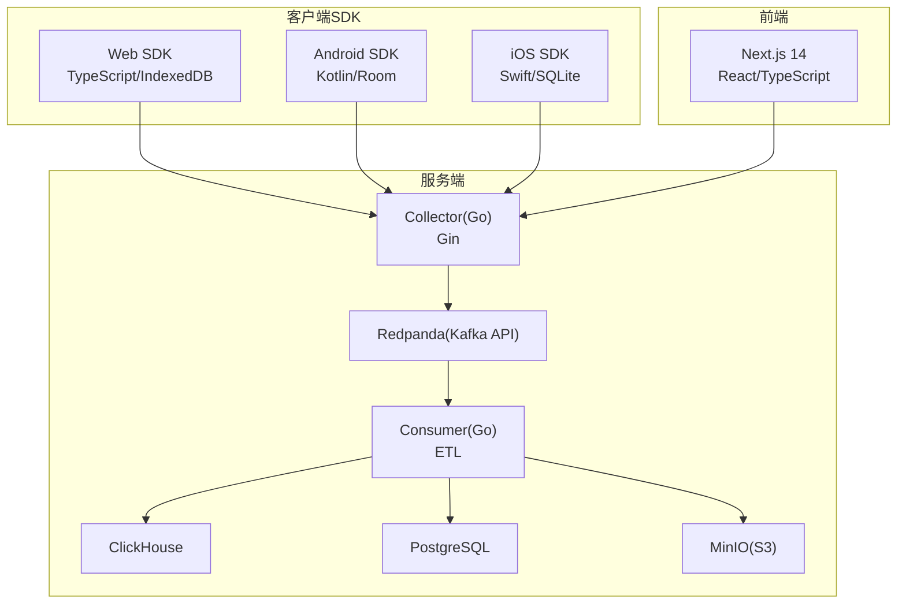
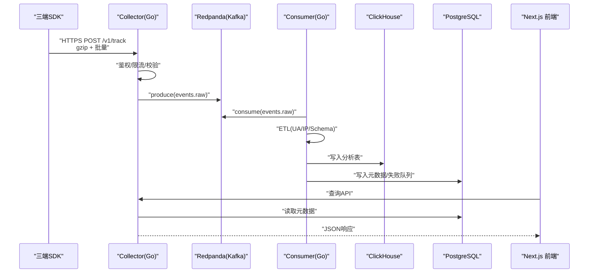
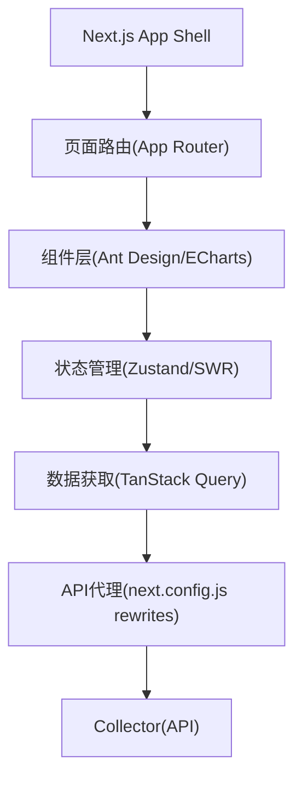
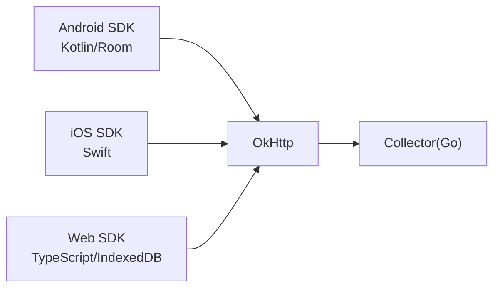
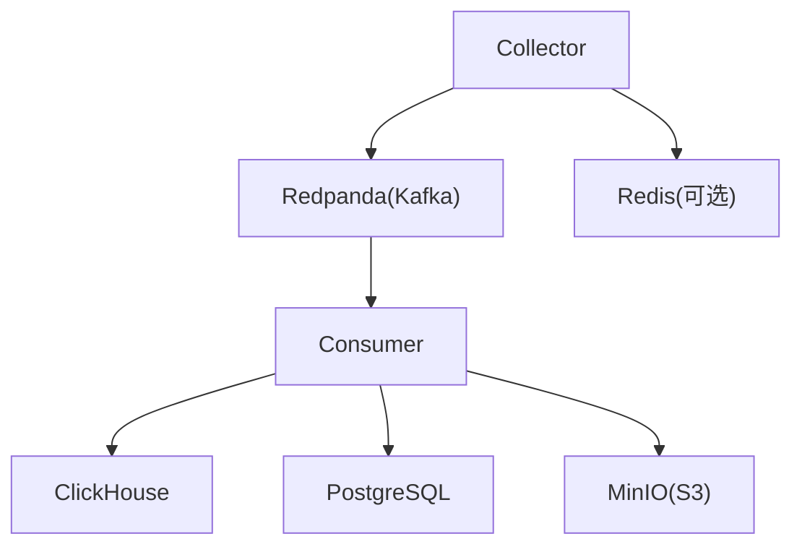
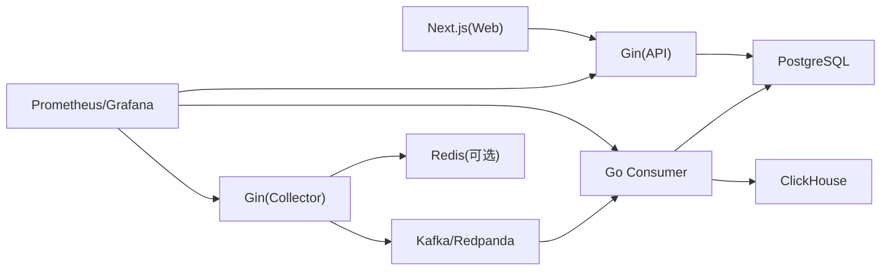

# 技术栈总览

<cite>
**本文引用的文件**
- [README.md](file://README.md)
- [架构文档](file://docs/architecture.md)
- [协议文档](file://docs/protocol.md)
- [事件Schema](file://docs/event.schema.json)
- [docker-compose.yml](file://deploy/docker-compose.yml)
- [web/package.json](file://web/package.json)
- [web/next.config.js](file://web/next.config.js)
- [server/api/go.mod](file://server/api/go.mod)
- [server/collector/go.mod](file://server/collector/go.mod)
- [server/consumer/go.mod](file://server/consumer/go.mod)
- [server/pkg/model/event.go](file://server/pkg/model/event.go)
- [server/pkg/mq/producer.go](file://server/pkg/mq/producer.go)
- [server/collector/internal/handler/track.go](file://server/collector/internal/handler/track.go)
- [server/consumer/internal/chsink/sink.go](file://server/consumer/internal/chsink/sink.go)
- [sdk/web/src/index.ts](file://sdk/web/src/index.ts)
- [sdk/web/src/types.ts](file://sdk/web/src/types.ts)
- [sdk/android/aerolog/build.gradle.kts](file://sdk/android/aerolog/build.gradle.kts)
- [sdk/ios/Package.swift](file://sdk/ios/Package.swift)
</cite>

## 目录
1. [引言](#引言)
2. [项目结构](#项目结构)
3. [核心组件](#核心组件)
4. [架构总览](#架构总览)
5. [详细组件分析](#详细组件分析)
6. [依赖关系分析](#依赖关系分析)
7. [性能考量](#性能考量)
8. [故障排查指南](#故障排查指南)
9. [结论](#结论)
10. [附录](#附录)

## 引言
本文件面向AeroLog技术栈的全面概览，系统阐述前端（Next.js 14、TypeScript、React）、后端（Go语言、Gin框架）、移动端（Kotlin、Swift）、数据库与消息队列（PostgreSQL、ClickHouse、Redis、Redpanda/Kafka）、对象存储（MinIO）及容器化（Docker、Docker Compose）的整体选型与协作方式。文档同时解释各技术在数据流水线中的职责与优势，并给出技术决策依据与最佳实践建议。

## 项目结构
AeroLog采用按层与按端分离的组织方式：
- sdk：三端SDK（Android/Kotlin、iOS/Swift、Web/TypeScript）与公共协议
- server：服务端Go应用，分为collector（采集）、consumer（消费ETL）、api（管理与查询）、pkg（公共库）
- web：Next.js前台与后台管理界面
- deploy：Docker Compose编排与监控（Prometheus/Grafana）
- docs：协议、架构、可观测性等文档



图表来源
- [README.md:24-34](file://README.md#L24-L34)
- [架构文档:5-35](file://docs/architecture.md#L5-L35)

章节来源
- [README.md:6-22](file://README.md#L6-L22)

## 核心组件
- 前端技术栈：Next.js 14、React 18、TypeScript 5、Ant Design 5、ECharts 5、TanStack React Query、SWR、Zustand、Day.js
- 后端技术栈：Go 1.22、Gin 1.10、Sarama 1.43（Kafka客户端）、pgx 5（PostgreSQL驱动）、clickhouse-go 2（ClickHouse驱动）
- 移动端技术栈：Android（Kotlin + Room）、iOS（Swift + Swift Package）、Web（TypeScript + IndexedDB）
- 数据库与消息队列：PostgreSQL（元数据）、ClickHouse（OLAP分析）、Redis（可选缓存）、Redpanda（Kafka API兼容）
- 对象存储：MinIO（S3兼容）
- 容器化：Docker Compose（一键启动开发环境）

章节来源
- [web/package.json:11-31](file://web/package.json#L11-L31)
- [server/api/go.mod:5-10](file://server/api/go.mod#L5-L10)
- [server/collector/go.mod:5-10](file://server/collector/go.mod#L5-L10)
- [server/consumer/go.mod:5-10](file://server/consumer/go.mod#L5-L10)
- [sdk/android/aerolog/build.gradle.kts:25-33](file://sdk/android/aerolog/build.gradle.kts#L25-L33)
- [sdk/ios/Package.swift:4-14](file://sdk/ios/Package.swift#L4-L14)
- [deploy/docker-compose.yml:3-147](file://deploy/docker-compose.yml#L3-L147)

## 架构总览
AeroLog采用“采集-消息-消费-存储”的分层架构：
- SDK在三端收集事件，进行离线缓存与退避重传
- Collector接收HTTPS请求，鉴权与限流后写入Kafka
- Consumer从Kafka消费，做ETL（UA/IP/Schema解析）并写入ClickHouse与PostgreSQL
- 前台通过Next.js访问API服务查询分析结果



图表来源
- [架构文档:5-35](file://docs/architecture.md#L5-L35)
- [server/collector/internal/handler/track.go:60-133](file://server/collector/internal/handler/track.go#L60-L133)
- [server/consumer/internal/chsink/sink.go:45-103](file://server/consumer/internal/chsink/sink.go#L45-L103)

章节来源
- [README.md:24-34](file://README.md#L24-L34)
- [架构文档:1-53](file://docs/architecture.md#L1-L53)

## 详细组件分析

### 前端技术栈（Next.js 14、TypeScript、React）
- 技术组合：Next.js 14（App Router）、React 18、TypeScript 5、Ant Design 5、ECharts 5、TanStack React Query、SWR、Zustand、Day.js
- 用途：管理后台（admin）与控制台（console）页面，提供事件、漏斗、留存等可视化分析
- 配置要点：开发端口3000，运行时通过环境变量NEXT_PUBLIC_API_BASE转发/api/*到后端API；支持重写规则以简化跨域调用



图表来源
- [web/next.config.js:7-12](file://web/next.config.js#L7-L12)
- [web/package.json:11-31](file://web/package.json#L11-L31)

章节来源
- [web/package.json:11-31](file://web/package.json#L11-L31)
- [web/next.config.js:1-16](file://web/next.config.js#L1-L16)

### 后端技术栈（Go + Gin）
- Collector（高并发写入Kafka）：Gin路由、HTTP压缩与批量解析、鉴权与限流、Kafka异步生产者
- Consumer（ETL与写入）：Kafka消费者、ETL（UA/IP/Schema解析）、ClickHouse批量写入、PostgreSQL写入与失败队列
- API（管理与查询）：Gin路由、PostgreSQL元数据查询、ClickHouse查询接口

```mermaid
classDiagram
class TrackHandler {
+Register(engine)
+handle(context)
-readBody()
-parseBody()
-clientIP()
}
class Producer {
+Send(ctx, topic, key, value)
+Close()
}
class Sink {
+New(addr, db, user, pwd)
+WriteBatch(ctx, events)
+Close()
}
TrackHandler --> Producer : "写入Kafka"
Producer -->|"Kafka"| Producer
Sink -->|"ClickHouse"| Sink
```

图表来源
- [server/collector/internal/handler/track.go:39-133](file://server/collector/internal/handler/track.go#L39-L133)
- [server/pkg/mq/producer.go:12-69](file://server/pkg/mq/producer.go#L12-L69)
- [server/consumer/internal/chsink/sink.go:17-103](file://server/consumer/internal/chsink/sink.go#L17-L103)

章节来源
- [server/collector/internal/handler/track.go:1-211](file://server/collector/internal/handler/track.go#L1-L211)
- [server/pkg/mq/producer.go:1-69](file://server/pkg/mq/producer.go#L1-L69)
- [server/consumer/internal/chsink/sink.go:1-126](file://server/consumer/internal/chsink/sink.go#L1-L126)
- [server/api/go.mod:5-10](file://server/api/go.mod#L5-L10)
- [server/collector/go.mod:5-10](file://server/collector/go.mod#L5-L10)
- [server/consumer/go.mod:5-10](file://server/consumer/go.mod#L5-L10)

### 移动端技术栈（Kotlin、Swift）
- Android：Kotlin + Room（离线数据库），OkHttp网络，协程异步，Room注解处理器
- iOS：Swift + Swift Package，AeroLog库目标，测试目标
- Web：TypeScript + IndexedDB（离线存储），浏览器fetch与sendBeacon



图表来源
- [sdk/android/aerolog/build.gradle.kts:25-33](file://sdk/android/aerolog/build.gradle.kts#L25-L33)
- [sdk/ios/Package.swift:4-14](file://sdk/ios/Package.swift#L4-L14)
- [sdk/web/src/index.ts:147-170](file://sdk/web/src/index.ts#L147-L170)

章节来源
- [sdk/android/aerolog/build.gradle.kts:1-34](file://sdk/android/aerolog/build.gradle.kts#L1-L34)
- [sdk/ios/Package.swift:1-15](file://sdk/ios/Package.swift#L1-L15)
- [sdk/web/src/index.ts:1-307](file://sdk/web/src/index.ts#L1-L307)

### 数据库与消息队列（PostgreSQL、ClickHouse、Redis、Redpanda/Kafka）
- PostgreSQL：元数据存储（项目、密钥、Schema等）
- ClickHouse：OLAP分析表（events_buffer等），支持高吞吐写入与复杂查询
- Redis：可选缓存（如会话、限流键空间）
- Redpanda：Kafka API兼容的消息引擎，无Zookeeper依赖，单机友好，支持Schema Registry与REST Proxy



图表来源
- [deploy/docker-compose.yml:37-147](file://deploy/docker-compose.yml#L37-L147)
- [server/consumer/internal/chsink/sink.go:23-43](file://server/consumer/internal/chsink/sink.go#L23-L43)

章节来源
- [deploy/docker-compose.yml:1-147](file://deploy/docker-compose.yml#L1-L147)
- [server/consumer/internal/chsink/sink.go:1-126](file://server/consumer/internal/chsink/sink.go#L1-L126)

### 对象存储（MinIO）
- 作为S3兼容的对象存储，用于原始事件归档或大对象归档
- 通过Docker Compose提供S3 API与Web控制台

章节来源
- [deploy/docker-compose.yml:99-112](file://deploy/docker-compose.yml#L99-L112)

### 容器化（Docker、Docker Compose）
- 使用docker-compose一键启动：PostgreSQL、Redis、Redpanda、ClickHouse、MinIO、Prometheus、Grafana
- 支持健康检查与持久化卷，便于本地开发与演示

章节来源
- [deploy/docker-compose.yml:1-147](file://deploy/docker-compose.yml#L1-L147)

## 依赖关系分析
- 组件耦合：Collector与Kafka强耦合，Consumer与ClickHouse/PostgreSQL强耦合；API层依赖PostgreSQL；前端通过Next.js代理访问Collector
- 外部依赖：Gin用于HTTP服务；Sarama用于Kafka；pgx与clickhouse-go用于数据库访问；Ant Design与ECharts用于前端UI与可视化
- 可观测性：Collector/Consumer/API暴露/metrics，Prometheus抓取，Grafana展示



图表来源
- [server/api/go.mod:5-10](file://server/api/go.mod#L5-L10)
- [server/collector/go.mod:5-10](file://server/collector/go.mod#L5-L10)
- [server/consumer/go.mod:5-10](file://server/consumer/go.mod#L5-L10)
- [deploy/docker-compose.yml:113-147](file://deploy/docker-compose.yml#L113-L147)

章节来源
- [server/api/go.mod:1-13](file://server/api/go.mod#L1-L13)
- [server/collector/go.mod:1-13](file://server/collector/go.mod#L1-L13)
- [server/consumer/go.mod:1-13](file://server/consumer/go.mod#L1-L13)

## 性能考量
- 写入路径优化：Collector启用gzip压缩与批量发送；Kafka生产者配置Snappy压缩、批量大小与频率；Consumer批量写入ClickHouse
- 查询路径优化：ClickHouse使用异步插入与连接池；PostgreSQL用于元数据与失败队列
- 缓存与退避：前端与移动端均具备离线缓存与指数退避策略，保障弱网与离线场景
- 可观测性：通过/metrics暴露关键指标（QPS、延迟、Kafka lag、写入耗时、DLQ数量）

章节来源
- [server/collector/internal/handler/track.go:150-162](file://server/collector/internal/handler/track.go#L150-L162)
- [server/pkg/mq/producer.go:17-40](file://server/pkg/mq/producer.go#L17-L40)
- [server/consumer/internal/chsink/sink.go:23-43](file://server/consumer/internal/chsink/sink.go#L23-L43)
- [架构文档:43-47](file://docs/architecture.md#L43-L47)

## 故障排查指南
- 健康检查：PostgreSQL/Redis/ClickHouse/Redpanda均配置健康检查，可通过compose日志定位
- 日志与指标：Prometheus抓取/metrics，Grafana仪表盘快速定位异常
- 常见问题：
  - Kafka不可用：Collector返回服务不可用，前端与移动端触发退避与离线缓存
  - ClickHouse写入失败：检查连接参数、表结构与权限
  - 前端无法访问API：确认NEXT_PUBLIC_API_BASE与rewrites配置

章节来源
- [deploy/docker-compose.yml:17-21](file://deploy/docker-compose.yml#L17-L21)
- [deploy/docker-compose.yml:31-35](file://deploy/docker-compose.yml#L31-L35)
- [deploy/docker-compose.yml:93-97](file://deploy/docker-compose.yml#L93-L97)
- [server/collector/internal/handler/track.go:123-128](file://server/collector/internal/handler/track.go#L123-L128)
- [web/next.config.js:7-12](file://web/next.config.js#L7-L12)

## 结论
AeroLog的技术栈围绕“高吞吐采集、可靠消息、高效分析”展开：前端采用Next.js与现代生态，后端以Go与Gin构建高性能服务，消息层采用Redpanda/Kafka API兼容方案，存储层结合ClickHouse与PostgreSQL满足分析与元数据需求，对象存储MinIO提供S3兼容能力。整体架构在开发体验、可运维性与性能之间取得平衡，适合从MVP到规模化演进。

## 附录
- 开发环境一键启动：进入deploy目录执行docker compose up -d
- 相关文档：协议、事件Schema、架构详解、可观测性

章节来源
- [README.md:36-50](file://README.md#L36-L50)
- [docs/protocol.md](file://docs/protocol.md)
- [docs/event.schema.json](file://docs/event.schema.json)
- [docs/architecture.md](file://docs/architecture.md)
- [docs/observability.md](file://docs/observability.md)