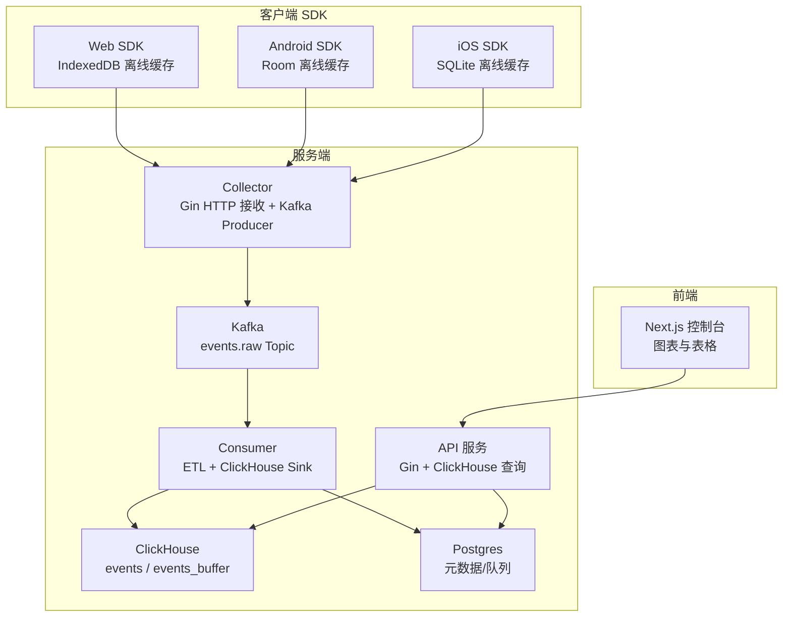
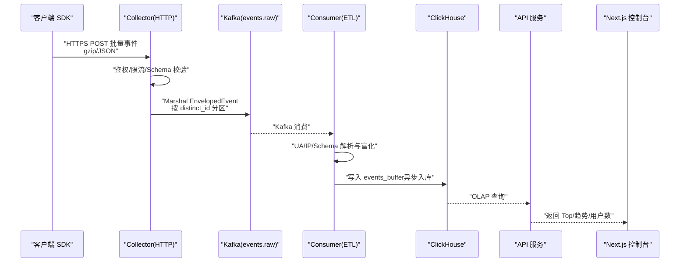
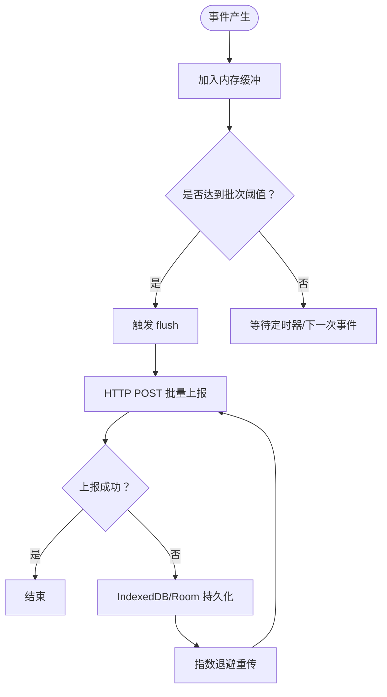
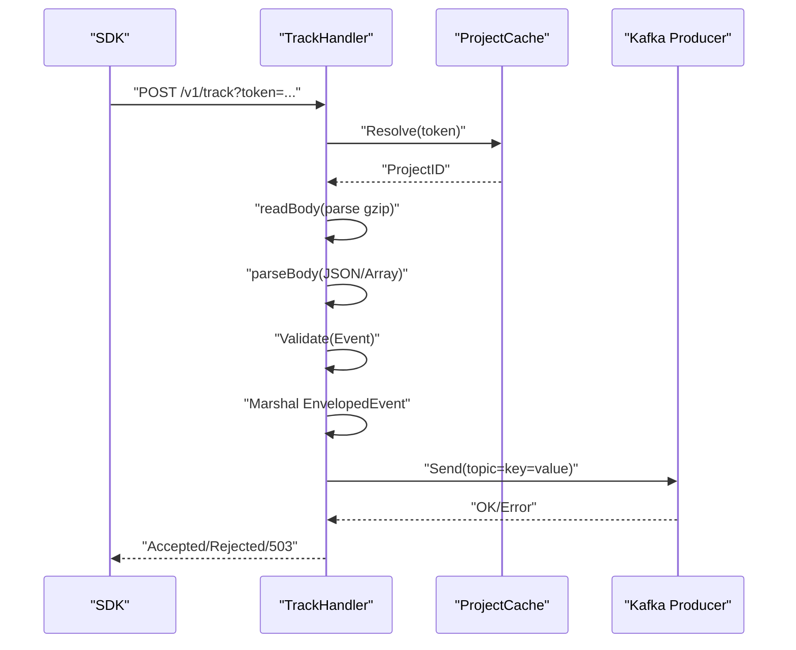
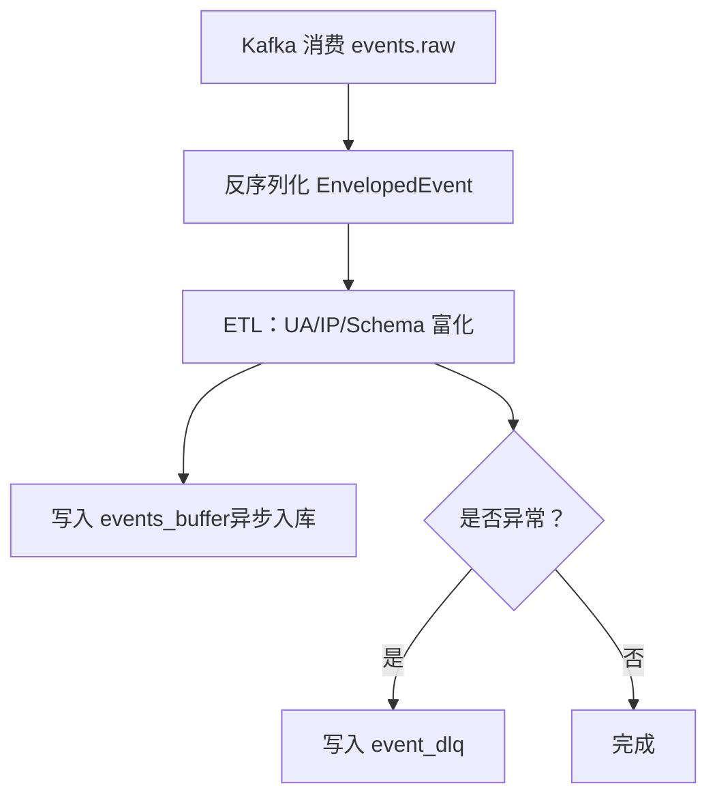
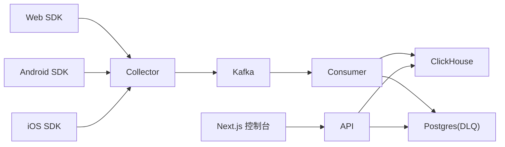

# 数据流概览

<cite>
**本文引用的文件**
- [README.md](file://README.md)
- [docs/architecture.md](file://docs/architecture.md)
- [docs/event.schema.json](file://docs/event.schema.json)
- [sdk/web/src/index.ts](file://sdk/web/src/index.ts)
- [sdk/web/src/storage.ts](file://sdk/web/src/storage.ts)
- [sdk/android/aerolog/src/main/java/dev/aerolog/sdk/AeroLog.kt](file://sdk/android/aerolog/src/main/java/dev/aerolog/sdk/AeroLog.kt)
- [sdk/ios/Sources/AeroLog/AeroLog.swift](file://sdk/ios/Sources/AeroLog/AeroLog.swift)
- [server/collector/cmd/main.go](file://server/collector/cmd/main.go)
- [server/collector/internal/handler/track.go](file://server/collector/internal/handler/track.go)
- [server/pkg/model/event.go](file://server/pkg/model/event.go)
- [server/pkg/mq/producer.go](file://server/pkg/mq/producer.go)
- [server/consumer/cmd/main.go](file://server/consumer/cmd/main.go)
- [server/consumer/internal/etl/etl.go](file://server/consumer/internal/etl/etl.go)
- [server/consumer/internal/chsink/sink.go](file://server/consumer/internal/chsink/sink.go)
- [server/api/cmd/main.go](file://server/api/cmd/main.go)
- [deploy/docker-compose.yml](file://deploy/docker-compose.yml)
- [deploy/init/clickhouse/01_schema.sql](file://deploy/init/clickhouse/01_schema.sql)
- [web/src/app/console/page.tsx](file://web/src/app/console/page.tsx)
</cite>

## 目录
1. [简介](#简介)
2. [项目结构](#项目结构)
3. [核心组件](#核心组件)
4. [架构总览](#架构总览)
5. [详细组件分析](#详细组件分析)
6. [依赖关系分析](#依赖关系分析)
7. [性能考量](#性能考量)
8. [故障排查指南](#故障排查指南)
9. [结论](#结论)
10. [附录](#附录)

## 简介
本文件面向开发者与架构师，提供 AeroLog 从客户端 SDK 到最终数据可视化的端到端数据流概览。内容覆盖：SDK 缓存与批量上报、HTTP 批量上报、Collector 接收与转发、Kafka 消息队列、Consumer ETL 与写入、ClickHouse 存储、Web 控制台查询展示。文档同时解释各环节作用、数据格式变化、性能与可靠性设计，并总结异步处理架构在解耦、可扩展性与容错方面的优势。

## 项目结构
AeroLog 采用“多端 SDK + Go 服务端 + Next.js 前端”的分层架构。数据从三端 SDK 发起，经 Collector 接入层写入 Kafka，Consumer 进行 ETL 与落库，最后通过 API 与前端可视化系统进行查询与展示。

图示来源
- [README.md:24-34](file://README.md#L24-L34)
- [docs/architecture.md:5-35](file://docs/architecture.md#L5-L35)

章节来源
- [README.md:6-22](file://README.md#L6-L22)
- [docs/architecture.md:1-53](file://docs/architecture.md#L1-L53)

## 核心组件
- 客户端 SDK（Web/Android/iOS）：负责事件采集、离线缓存、批量上报与指数退避重试。
- Collector（Go）：鉴权、限流、Schema 校验、批量压缩、写入 Kafka。
- Kafka：高吞吐消息总线，按 distinct_id 分区确保同用户事件顺序一致性。
- Consumer（Go）：Kafka 消费、ETL（UA/IP/Schema）、写入 ClickHouse Buffer 表，异常进入 DLQ。
- ClickHouse：事件明细表与 Buffer 表，支持高并发写入与高效 OLAP 查询。
- API 服务（Go）：提供项目/事件定义与分析接口，对接 ClickHouse 与 Postgres。
- Next.js 控制台：前端看板，调用 API 展示 Top 事件与趋势图。

章节来源
- [sdk/web/src/index.ts:16-50](file://sdk/web/src/index.ts#L16-L50)
- [sdk/android/aerolog/src/main/java/dev/aerolog/sdk/AeroLog.kt:37-80](file://sdk/android/aerolog/src/main/java/dev/aerolog/sdk/AeroLog.kt#L37-L80)
- [sdk/ios/Sources/AeroLog/AeroLog.swift:7-48](file://sdk/ios/Sources/AeroLog/AeroLog.swift#L7-L48)
- [server/collector/internal/handler/track.go:39-51](file://server/collector/internal/handler/track.go#L39-L51)
- [server/pkg/mq/producer.go:12-40](file://server/pkg/mq/producer.go#L12-L40)
- [server/consumer/internal/chsink/sink.go:17-43](file://server/consumer/internal/chsink/sink.go#L17-L43)
- [server/api/cmd/main.go:35-78](file://server/api/cmd/main.go#L35-L78)
- [web/src/app/console/page.tsx:13-26](file://web/src/app/console/page.tsx#L13-L26)

## 架构总览
AeroLog 的数据流遵循“异步解耦 + 流式处理 + 高效存储”的设计原则。整体链路由三端 SDK 发起，经 Collector 写入 Kafka，Consumer 消费并进行 ETL，最终写入 ClickHouse 明细表与 Buffer 表，API 与前端通过 ClickHouse 与 Postgres 提供查询与可视化。

图示来源
- [README.md:24-34](file://README.md#L24-L34)
- [docs/architecture.md:5-35](file://docs/architecture.md#L5-L35)
- [server/collector/internal/handler/track.go:60-133](file://server/collector/internal/handler/track.go#L60-L133)
- [server/pkg/model/event.go:62-83](file://server/pkg/model/event.go#L62-L83)
- [server/pkg/mq/producer.go:42-60](file://server/pkg/mq/producer.go#L42-L60)
- [server/consumer/internal/etl/etl.go:29-73](file://server/consumer/internal/etl/etl.go#L29-L73)
- [server/consumer/internal/chsink/sink.go:45-103](file://server/consumer/internal/chsink/sink.go#L45-L103)
- [deploy/init/clickhouse/01_schema.sql:44-49](file://deploy/init/clickhouse/01_schema.sql#L44-L49)

## 详细组件分析

### 客户端 SDK（Web/Android/iOS）
- Web SDK：内存批量 + IndexedDB 离线缓存 + 定时 flush + sendBeacon 保活；失败事件持久化，恢复后重传；指数退避。
- Android SDK：协程 + Room 离线缓存；周期 flush；失败持久化；自动采集系统与应用生命周期事件。
- iOS SDK：线程安全单例；定时 flush；失败持久化；自动采集系统与生命周期事件。

图示来源
- [sdk/web/src/index.ts:92-124](file://sdk/web/src/index.ts#L92-L124)
- [sdk/web/src/storage.ts:46-60](file://sdk/web/src/storage.ts#L46-L60)
- [sdk/android/aerolog/src/main/java/dev/aerolog/sdk/AeroLog.kt:108-124](file://sdk/android/aerolog/src/main/java/dev/aerolog/sdk/AeroLog.kt#L108-L124)
- [sdk/ios/Sources/AeroLog/AeroLog.swift:77-82](file://sdk/ios/Sources/AeroLog/AeroLog.swift#L77-L82)

章节来源
- [sdk/web/src/index.ts:16-50](file://sdk/web/src/index.ts#L16-L50)
- [sdk/web/src/storage.ts:16-24](file://sdk/web/src/storage.ts#L16-L24)
- [sdk/android/aerolog/src/main/java/dev/aerolog/sdk/AeroLog.kt:37-80](file://sdk/android/aerolog/src/main/java/dev/aerolog/sdk/AeroLog.kt#L37-L80)
- [sdk/ios/Sources/AeroLog/AeroLog.swift:7-48](file://sdk/ios/Sources/AeroLog/AeroLog.swift#L7-L48)

### Collector 接收与转发
- 路由注册：/v1/track 接收批量事件；/healthz 健康检查。
- 处理流程：鉴权（Token 解析）、读取请求体（支持 gzip）、解析为事件数组、基础校验、封装 EnvelopedEvent、按 distinct_id 作为 Kafka key 发送。
- 错误处理：鉴权失败、请求体过大、解析错误、Kafka 发送失败均返回相应状态码与响应体。

图示来源
- [server/collector/cmd/main.go:22-54](file://server/collector/cmd/main.go#L22-L54)
- [server/collector/internal/handler/track.go:48-133](file://server/collector/internal/handler/track.go#L48-L133)
- [server/pkg/model/event.go:39-60](file://server/pkg/model/event.go#L39-L60)
- [server/pkg/mq/producer.go:42-60](file://server/pkg/mq/producer.go#L42-L60)

章节来源
- [server/collector/internal/handler/track.go:39-51](file://server/collector/internal/handler/track.go#L39-L51)
- [server/pkg/model/event.go:62-83](file://server/pkg/model/event.go#L62-L83)

### Kafka 消息队列
- Producer 配置：Snappy 压缩、批量刷盘、最大重试、异步错误通道。
- 分区策略：以 distinct_id 作为 key，确保同一用户事件落在同一分区，利于后续 ETL 与幂等处理。
- Topic：events.raw。

章节来源
- [server/pkg/mq/producer.go:12-40](file://server/pkg/mq/producer.go#L12-L40)
- [server/collector/internal/handler/track.go:119-128](file://server/collector/internal/handler/track.go#L119-L128)

### Consumer ETL 与写入
- 消费：基于 Kafka 消费组，按配置批量与频率消费。
- ETL：解析 UA、地理信息占位、Schema 校验（基础字段校验在 Collector 已做，此处做更严格校验与富化）。
- 写入：批量写入 ClickHouse events_buffer（异步入库），异常事件写入 Postgres DLQ 表。

图示来源
- [server/consumer/cmd/main.go:18-54](file://server/consumer/cmd/main.go#L18-L54)
- [server/consumer/internal/etl/etl.go:29-73](file://server/consumer/internal/etl/etl.go#L29-L73)
- [server/consumer/internal/chsink/sink.go:45-103](file://server/consumer/internal/chsink/sink.go#L45-L103)
- [deploy/init/clickhouse/01_schema.sql:44-49](file://deploy/init/clickhouse/01_schema.sql#L44-L49)

章节来源
- [server/consumer/internal/etl/etl.go:1-90](file://server/consumer/internal/etl/etl.go#L1-L90)
- [server/consumer/internal/chsink/sink.go:17-43](file://server/consumer/internal/chsink/sink.go#L17-L43)

### ClickHouse 存储模型
- events：事件明细表，MergeTree 引擎，按 project_id + 月份分区，TTL 365 天，适合高基数时间序列与宽表分析。
- events_buffer：Buffer 引擎表，异步入库，降低写入压力，提升吞吐。
- users：用户属性表，ReplacingMergeTree，按 latest 更新覆盖。

章节来源
- [deploy/init/clickhouse/01_schema.sql:6-42](file://deploy/init/clickhouse/01_schema.sql#L6-L42)
- [deploy/init/clickhouse/01_schema.sql:44-49](file://deploy/init/clickhouse/01_schema.sql#L44-L49)
- [deploy/init/clickhouse/01_schema.sql:51-61](file://deploy/init/clickhouse/01_schema.sql#L51-L61)

### API 服务与前端控制台
- API：Gin 提供 /v1 项目/事件定义与分析接口，集成 ClickHouse 连接池与 Postgres 元数据查询。
- 控制台：Next.js 页面，调用 API 获取 Top 事件与趋势，渲染折线图与表格。

章节来源
- [server/api/cmd/main.go:35-78](file://server/api/cmd/main.go#L35-L78)
- [web/src/app/console/page.tsx:13-26](file://web/src/app/console/page.tsx#L13-L26)

## 依赖关系分析
- 组件内聚与耦合：SDK 仅依赖 HTTP 与本地存储；Collector 仅依赖 Kafka Producer 与项目缓存；Consumer 仅依赖 Kafka 消费与 ClickHouse Sink；API 仅依赖 ClickHouse 与 Postgres。
- 外部依赖：Kafka（消息总线）、ClickHouse（OLAP 存储）、Postgres（元数据/DLQ）、Prometheus/Grafana（可观测性）。
- 部署编排：docker-compose 启动 PostgreSQL、Redis、Redpanda（Kafka API）、ClickHouse、MinIO、Prometheus、Grafana。

图示来源
- [deploy/docker-compose.yml:3-147](file://deploy/docker-compose.yml#L3-L147)
- [docs/architecture.md:5-35](file://docs/architecture.md#L5-L35)

章节来源
- [deploy/docker-compose.yml:3-147](file://deploy/docker-compose.yml#L3-L147)

## 性能考量
- 异步解耦：SDK 与服务端异步，避免阻塞主线程与网络抖动影响。
- 批量与压缩：HTTP 批量 + gzip 压缩，减少网络开销；Kafka Snappy 压缩进一步降低带宽。
- 缓冲与退避：SDK 离线缓存 + 指数退避，保障弱网与离线场景。
- 写入优化：ClickHouse Buffer 引擎异步入库，降低写入延迟；Producer 批量刷盘与重试。
- 查询优化：ClickHouse 明细表按时间与维度分区排序，支持高效聚合与宽表分析。

## 故障排查指南
- SDK 层
  - 离线缓存：确认 IndexedDB/Room 是否正常创建与写入，容量上限是否触发淘汰。
  - 上报失败：检查 4xx（非 429）直接丢弃逻辑，确认网络与 Token。
  - 重传机制：观察指数退避间隔与定时 flush 是否生效。
- Collector 层
  - 鉴权失败：核对 token 解析与项目缓存命中。
  - 请求体过大/解析错误：检查 Content-Encoding 与 Body 大小限制。
  - Kafka 发送失败：查看 Producer 错误通道与 Broker 可用性。
- Consumer 层
  - ETL 失败：UA/IP 解析与 Schema 校验异常，检查 EnvelopedEvent 结构与属性。
  - 写入失败：检查 ClickHouse 连接与 events_buffer 插入权限。
  - DLQ：异常事件写入 event_dlq，需人工核查与重放。
- 存储与查询
  - ClickHouse：确认 events 与 events_buffer 表结构与分区设置。
  - API 查询：核对 ClickHouse 连接参数与 Postgres 元数据表。

章节来源
- [sdk/web/src/storage.ts:46-60](file://sdk/web/src/storage.ts#L46-L60)
- [server/collector/internal/handler/track.go:67-83](file://server/collector/internal/handler/track.go#L67-L83)
- [server/pkg/mq/producer.go:34-38](file://server/pkg/mq/producer.go#L34-L38)
- [server/consumer/internal/chsink/sink.go:45-103](file://server/consumer/internal/chsink/sink.go#L45-L103)
- [deploy/init/clickhouse/01_schema.sql:44-49](file://deploy/init/clickhouse/01_schema.sql#L44-L49)

## 结论
AeroLog 的数据流通过“SDK 缓存 + HTTP 批量 + Kafka + Consumer ETL + ClickHouse”形成高吞吐、低延迟、可扩展且具备容错能力的端到端链路。异步解耦使各层职责清晰，批量与压缩优化网络与存储成本，Buffer 引擎与分区策略兼顾写入与查询效率。配合 API 与前端控制台，实现从事件采集到可视化分析的完整闭环。

## 附录
- 事件 JSON Schema：统一事件结构，包含类型、名称、标识、时间戳、SDK 信息与自定义属性。
- 协议与架构文档：详见 docs 目录下的 protocol.md 与 architecture.md。

章节来源
- [docs/event.schema.json:1-58](file://docs/event.schema.json#L1-L58)
- [README.md:45-50](file://README.md#L45-L50)