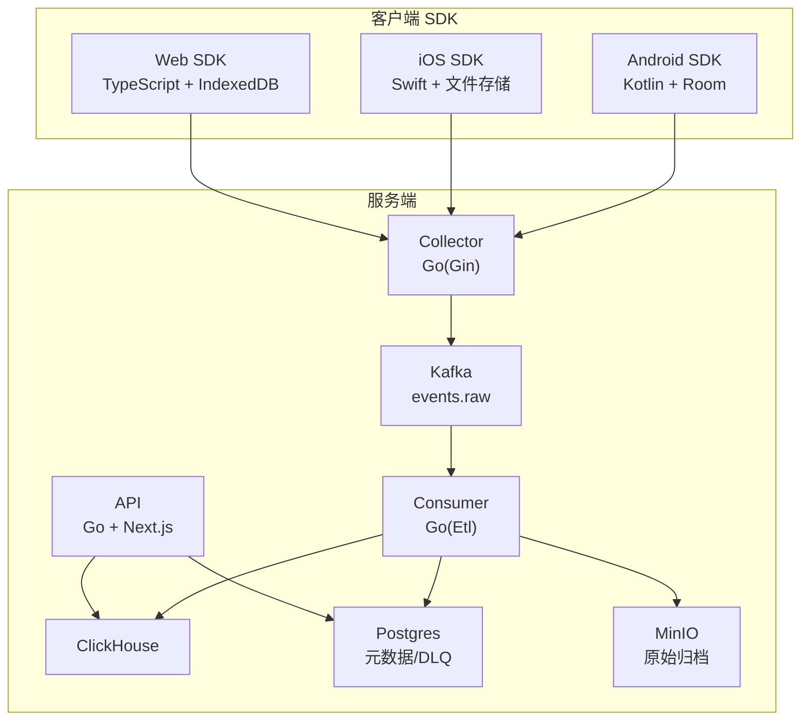
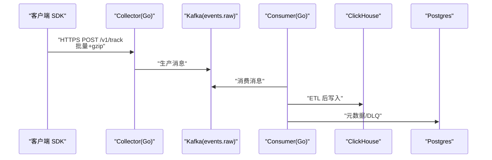
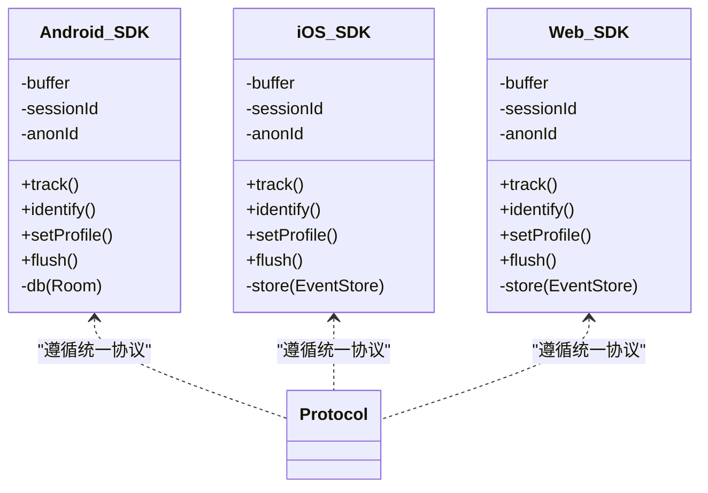
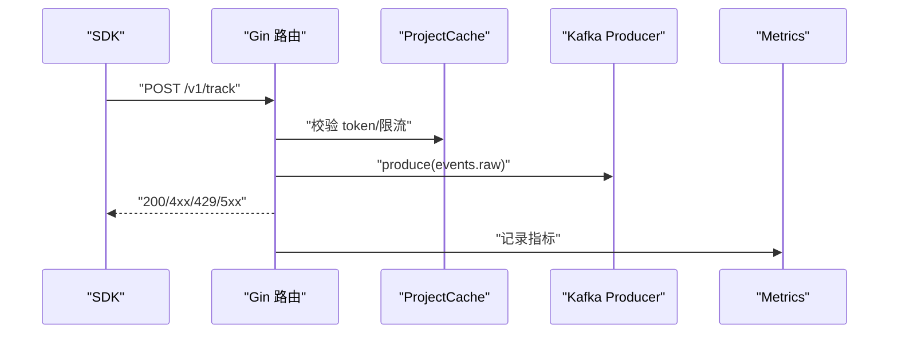
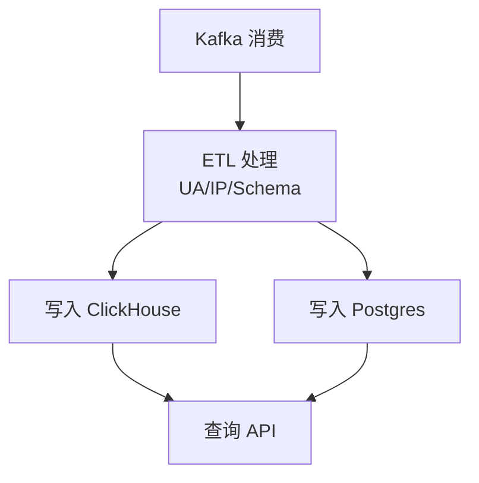
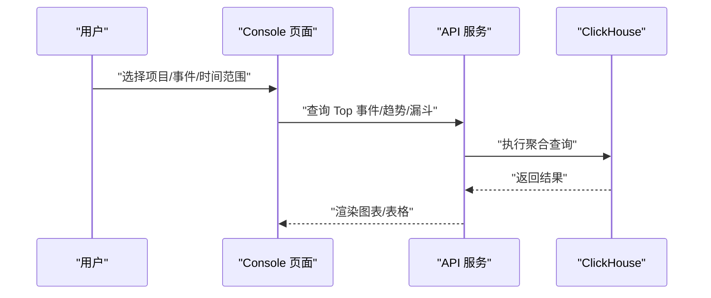
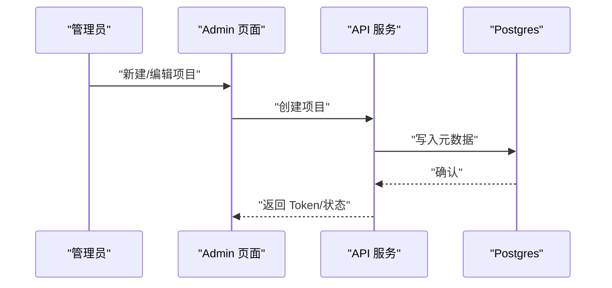
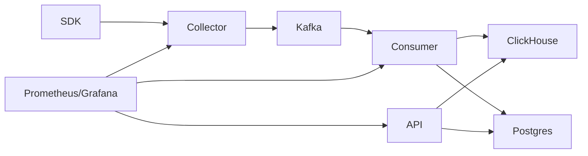

# 核心功能特性

<cite>
**本文引用的文件**
- [README.md](file://README.md)
- [docs/architecture.md](file://docs/architecture.md)
- [docs/protocol.md](file://docs/protocol.md)
- [docs/event.schema.json](file://docs/event.schema.json)
- [sdk/android/README.md](file://sdk/android/README.md)
- [sdk/ios/README.md](file://sdk/ios/README.md)
- [sdk/web/README.md](file://sdk/web/README.md)
- [sdk/android/aerolog/src/main/java/dev/aerolog/sdk/AeroLog.kt](file://sdk/android/aerolog/src/main/java/dev/aerolog/sdk/AeroLog.kt)
- [sdk/ios/Sources/AeroLog/AeroLog.swift](file://sdk/ios/Sources/AeroLog/AeroLog.swift)
- [sdk/web/src/index.ts](file://sdk/web/src/index.ts)
- [server/collector/cmd/main.go](file://server/collector/cmd/main.go)
- [server/consumer/cmd/main.go](file://server/consumer/cmd/main.go)
- [server/api/cmd/main.go](file://server/api/cmd/main.go)
- [web/src/app/console/page.tsx](file://web/src/app/console/page.tsx)
- [web/src/app/console/event/page.tsx](file://web/src/app/console/event/page.tsx)
- [web/src/app/console/funnel/page.tsx](file://web/src/app/console/funnel/page.tsx)
- [web/src/app/admin/projects/page.tsx](file://web/src/app/admin/projects/page.tsx)
- [deploy/grafana/dashboards/aerolog-overview.json](file://deploy/grafana/dashboards/aerolog-overview.json)
</cite>

## 目录
1. [简介](#简介)
2. [项目结构](#项目结构)
3. [核心组件](#核心组件)
4. [架构总览](#架构总览)
5. [详细组件分析](#详细组件分析)
6. [依赖关系分析](#依赖关系分析)
7. [性能考量](#性能考量)
8. [故障排查指南](#故障排查指南)
9. [结论](#结论)
10. [附录](#附录)

## 简介
AeroLog 是一个自研的多端埋点平台，参考神策（Sensors Analytics）分层架构设计。它提供统一的上报协议，覆盖 Android/iOS/Web 三端 SDK，并通过 Go 编写的接收层、Kafka 流水线与 ClickHouse 存储实现高并发、低延迟的数据采集与分析能力。项目还配套了基于 Next.js 的 Web 控制台，支持事件统计、趋势分析、漏斗分析与留存分析等可视化功能；后管模块支持项目创建、埋点定义与权限控制。

## 项目结构
- 顶层 README 提供仓库结构概览与一键启动说明
- docs 目录包含协议、架构、事件 Schema 与可观测性文档
- sdk 目录包含 Android/Kotlin、iOS/Swift、Web/TypeScript 三端 SDK
- server 目录包含 Go 微服务：collector（接收层）、consumer（Kafka 消费+ETL）、api（管理与查询 API）、pkg（公共库）
- web 目录为 Next.js 前后台应用（admin + console）
- deploy 目录包含 Grafana/ClickHouse/Prometheus 等部署资源与 docker-compose



图表来源
- [README.md:24-34](file://README.md#L24-L34)
- [docs/architecture.md:3-35](file://docs/architecture.md#L3-L35)

章节来源
- [README.md:6-22](file://README.md#L6-L22)

## 核心组件
- 多端 SDK 支持：Android/iOS/Web 三端复用统一上报协议，具备批量上报、压缩、指数退避重试与本地持久化能力
- 统一上报协议：支持单条/批量 JSON，含预置属性与事件、鉴权与限流、响应码约定
- 接收层（Collector）：Gin 服务，负责鉴权、限流、Schema 校验、批量入库 Kafka
- 消费层（Consumer）：Kafka 消费、ETL（UA/IP/Schema 解析）、写入 ClickHouse 与 Postgres
- 查询与分析：Next.js 控制台提供事件统计、趋势分析、漏斗分析、留存分析
- 项目管理：支持项目创建、埋点定义与权限控制（基于 Token）

章节来源
- [docs/protocol.md:1-118](file://docs/protocol.md#L1-L118)
- [docs/architecture.md:3-35](file://docs/architecture.md#L3-L35)
- [server/collector/cmd/main.go:22-74](file://server/collector/cmd/main.go#L22-L74)
- [server/consumer/cmd/main.go:18-55](file://server/consumer/cmd/main.go#L18-L55)
- [server/api/cmd/main.go:35-78](file://server/api/cmd/main.go#L35-L78)

## 架构总览
AeroLog 采用“采集-传输-存储-查询”的分层架构。客户端 SDK 将事件批量压缩后上报至 Collector，经 Kafka 缓冲后由 Consumer 进行 ETL 并写入 ClickHouse 与 Postgres，API 层提供查询与管理接口，Web 控制台进行可视化展示。



图表来源
- [docs/architecture.md:5-35](file://docs/architecture.md#L5-L35)
- [docs/protocol.md:5-15](file://docs/protocol.md#L5-L15)

章节来源
- [docs/architecture.md:37-47](file://docs/architecture.md#L37-L47)

## 详细组件分析

### 多端 SDK 能力全景
- Android SDK：Kotlin + Room，支持自动生命周期与页面视图采集，内存批量与 Room 持久化，周期 flush
- iOS SDK：Swift，支持自动生命周期采集，内存批量与文件持久化，定时 flush
- Web SDK：TypeScript + IndexedDB，支持自动页面浏览与点击采集，sendBeacon 卸载兜底，指数退避重试



图表来源
- [sdk/android/aerolog/src/main/java/dev/aerolog/sdk/AeroLog.kt:37-216](file://sdk/android/aerolog/src/main/java/dev/aerolog/sdk/AeroLog.kt#L37-L216)
- [sdk/ios/Sources/AeroLog/AeroLog.swift:6-207](file://sdk/ios/Sources/AeroLog/AeroLog.swift#L6-L207)
- [sdk/web/src/index.ts:16-307](file://sdk/web/src/index.ts#L16-L307)

章节来源
- [sdk/android/README.md:1-44](file://sdk/android/README.md#L1-L44)
- [sdk/ios/README.md:1-42](file://sdk/ios/README.md#L1-L42)
- [sdk/web/README.md:1-56](file://sdk/web/README.md#L1-L56)

### 统一上报协议与离线兜底
- 协议端点与头部：统一的 /v1/track 端点，支持 Content-Encoding gzip，X-AeroLog-SDK/X-AeroLog-Sign/X-AeroLog-Ts 等头部
- 请求体：支持单条或批量数组，包含 type/event/distinct_id/time/lib/properties 等字段
- 预置属性与事件：以 $ 开头的自动采集属性与常见预置事件
- 响应码：明确的错误码与限流提示
- 离线兜底：批量、持久化、指数退避、容量限制、去重（$insert_id）

```mermaid
flowchart TD
Start(["事件采集"]) --> Build["构建事件对象<br/>填充预置属性/去重ID"]
Build --> Batch["内存批量/定时触发"]
Batch --> Send["发送到 Collector"]
Send --> Resp{"HTTP 响应"}
Resp --> |2xx| Done["完成"]
Resp --> |4xx(非429)| Drop["丢弃服务端拒绝"]
Resp --> |429/5xx/网络错误| Store["本地持久化"]
Store --> Retry["指数退避重试"]
Retry --> Send
Drop --> End(["结束"])
Done --> End
```

图表来源
- [docs/protocol.md:19-107](file://docs/protocol.md#L19-L107)

章节来源
- [docs/protocol.md:5-118](file://docs/protocol.md#L5-L118)
- [docs/event.schema.json:1-58](file://docs/event.schema.json#L1-L58)

### 接收层（Collector）与高并发处理
- Gin 服务：注册路由、鉴权、限流、Schema 校验
- Producer：连接 Kafka，将事件写入 events.raw Topic
- 指标暴露：/metrics Prometheus 指标，便于监控 QPS、p99、Kafka lag、DLQ 数量等



图表来源
- [server/collector/cmd/main.go:22-74](file://server/collector/cmd/main.go#L22-L74)

章节来源
- [server/collector/cmd/main.go:22-74](file://server/collector/cmd/main.go#L22-L74)

### 消费层（Consumer）与数据处理流水线
- Kafka 消费：按配置批量拉取、限流参数
- ETL：解析 UA/IP、Schema 校验、富化地理信息
- Sink：写入 ClickHouse（明细表）与 Postgres（元数据/DLQ）
- 指标：/metrics 暴露 flush 耗时、速率、DLQ 等



图表来源
- [docs/architecture.md:17-35](file://docs/architecture.md#L17-L35)
- [server/consumer/cmd/main.go:18-55](file://server/consumer/cmd/main.go#L18-L55)

章节来源
- [server/consumer/cmd/main.go:18-55](file://server/consumer/cmd/main.go#L18-L55)

### Web 控制台数据分析能力
- 控制台首页：项目选择、Top 事件、趋势图（折线/面积）
- 事件分析：事件趋势（柱状）、时间范围、粒度（小时/天）
- 漏斗分析：多步转化漏斗、窗口期设置、结果表格
- 留存分析：基于 API 的留存计算（页面提供交互与图表）



图表来源
- [web/src/app/console/page.tsx:13-124](file://web/src/app/console/page.tsx#L13-L124)
- [web/src/app/console/event/page.tsx:13-104](file://web/src/app/console/event/page.tsx#L13-L104)
- [web/src/app/console/funnel/page.tsx:30-165](file://web/src/app/console/funnel/page.tsx#L30-L165)

章节来源
- [web/src/app/console/page.tsx:13-124](file://web/src/app/console/page.tsx#L13-L124)
- [web/src/app/console/event/page.tsx:13-104](file://web/src/app/console/event/page.tsx#L13-L104)
- [web/src/app/console/funnel/page.tsx:30-165](file://web/src/app/console/funnel/page.tsx#L30-L165)

### 项目管理与权限控制
- 项目管理：支持创建项目、查看 Token、启停状态、描述信息
- 权限控制：通过项目 Token 与可选签名头进行鉴权与限流
- 埋点定义：通过 API 获取事件 Top、趋势与漏斗，辅助埋点策略制定



图表来源
- [web/src/app/admin/projects/page.tsx:8-85](file://web/src/app/admin/projects/page.tsx#L8-L85)

章节来源
- [web/src/app/admin/projects/page.tsx:8-85](file://web/src/app/admin/projects/page.tsx#L8-L85)

## 依赖关系分析
- 客户端 SDK 依赖统一协议与离线存储，确保在网络异常时可靠落地
- Collector 依赖 Kafka 作为缓冲层，避免直接对下游数据库造成压力
- Consumer 依赖 ClickHouse 与 Postgres，分别承担明细与元数据存储
- API 依赖 ClickHouse 与 Postgres 提供查询与管理能力
- 监控体系：Prometheus 指标与 Grafana 仪表盘



图表来源
- [docs/architecture.md:3-35](file://docs/architecture.md#L3-L35)
- [deploy/grafana/dashboards/aerolog-overview.json:1-131](file://deploy/grafana/dashboards/aerolog-overview.json#L1-L131)

章节来源
- [deploy/grafana/dashboards/aerolog-overview.json:1-131](file://deploy/grafana/dashboards/aerolog-overview.json#L1-L131)

## 性能考量
- 批量与压缩：三端默认批量与 gzip 压缩，降低网络开销
- 指数退避：网络异常时逐步延长重试间隔，避免雪崩
- 本地容量限制：默认最多保留 10000 条，超限丢弃最旧，保障稳定性
- 无状态接收层：Collector 无状态设计，便于水平扩展
- Kafka 缓冲：在短暂不可用时提供 WAL 兜底，恢复后回灌
- ClickHouse 幂等去重：基于 $insert_id 去重，确保数据一致性

章节来源
- [docs/protocol.md:100-107](file://docs/protocol.md#L100-L107)
- [docs/architecture.md:43-47](file://docs/architecture.md#L43-L47)

## 故障排查指南
- 常见错误码定位：token 无效、签名失败、时间戳过期、请求体过大、Schema 校验失败、触发限流、服务端错误
- 离线兜底检查：确认本地存储是否写入、重试间隔是否正确、容量上限是否触发
- 指标监控：通过 /metrics 与 Grafana 仪表盘观察 Collector/Consumer/API 的 QPS、p99、Kafka lag、DLQ 数量
- 重试策略：遇到 429/5xx/网络错误时，SDK 会指数退避；网络恢复后会立即触发 flush

章节来源
- [docs/protocol.md:80-99](file://docs/protocol.md#L80-L99)
- [deploy/grafana/dashboards/aerolog-overview.json:10-131](file://deploy/grafana/dashboards/aerolog-overview.json#L10-L131)

## 结论
AeroLog 通过统一协议与多端 SDK，实现了跨平台的一致埋点体验；借助 Kafka 缓冲与 ETL 流水线，满足高并发场景下的数据可靠性与性能要求；Web 控制台提供丰富的分析能力，配合项目管理与权限控制，形成从采集、传输、存储到可视化的完整闭环。该方案适合需要快速落地、稳定扩展的埋点与分析平台。

## 附录
- 一键启动：进入 deploy 目录，使用 docker compose 启动 PostgreSQL、Redis、Redpanda（Kafka API）、ClickHouse、MinIO
- 协议与 Schema：详见 docs/protocol.md 与 docs/event.schema.json
- 三端 SDK 使用：参阅各端 README 与源码入口类

章节来源
- [README.md:36-50](file://README.md#L36-L50)