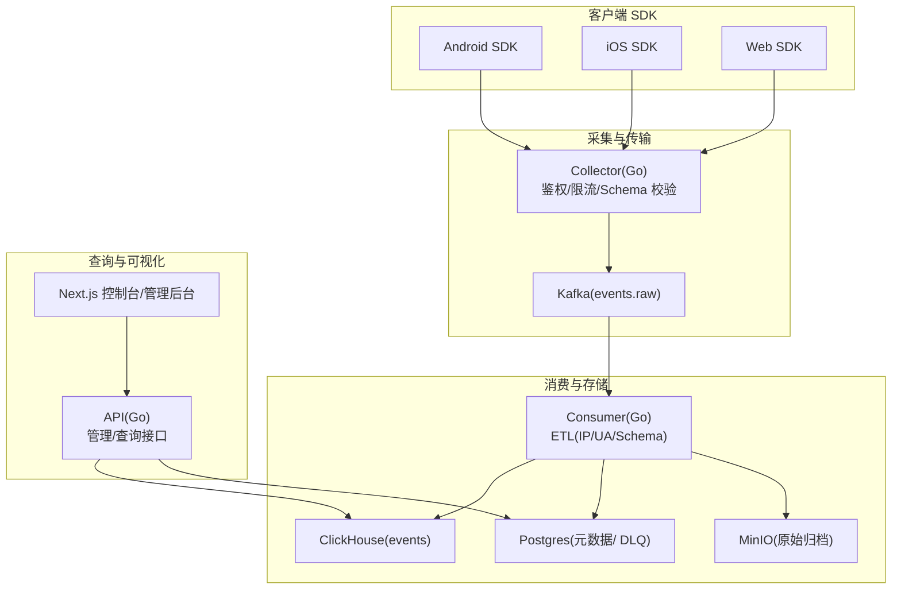
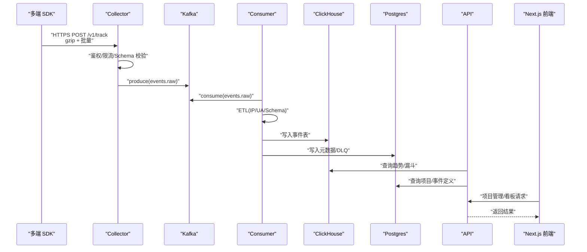
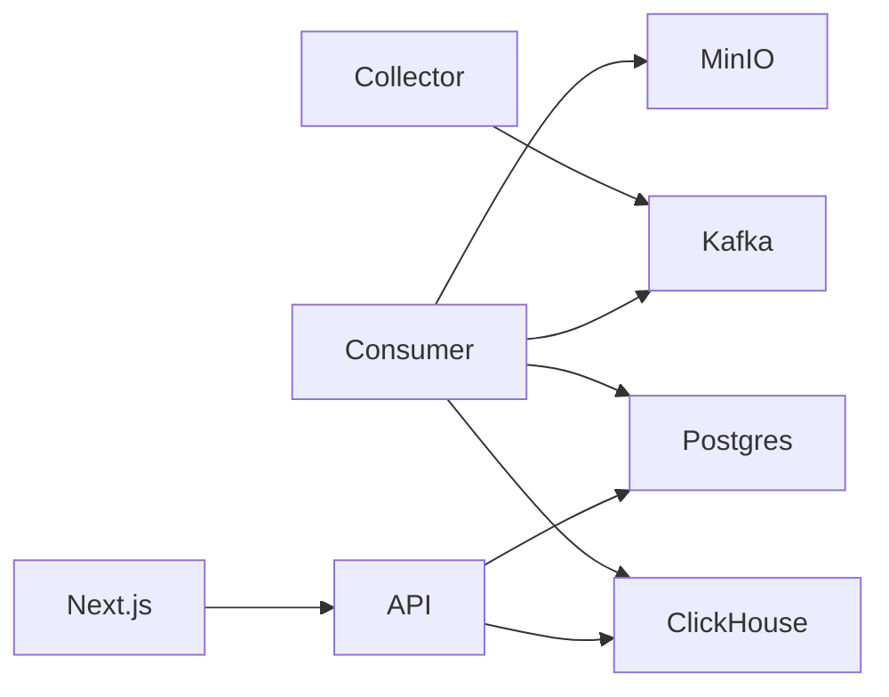

# 项目介绍与背景

<cite>
**本文引用的文件**
- [README.md](file://README.md)
- [架构详解.md](file://docs/architecture.md)
- [上报协议.md](file://docs/protocol.md)
- [Android SDK 说明.md](file://sdk/android/README.md)
- [iOS SDK 说明.md](file://sdk/ios/README.md)
- [Web SDK 说明.md](file://sdk/web/README.md)
- [API 服务入口 main.go](file://server/api/cmd/main.go)
- [收集器服务入口 main.go](file://server/collector/cmd/main.go)
- [消费者服务入口 main.go](file://server/consumer/cmd/main.go)
- [收集器配置 config.go](file://server/collector/internal/config/config.go)
- [API 配置 config.go](file://server/api/internal/config/config.go)
- [消费者配置 config.go](file://server/consumer/internal/config/config.go)
- [事件模型 event.go](file://server/pkg/model/event.go)
- [docker-compose.yml](file://deploy/docker-compose.yml)
- [项目管理页面 page.tsx](file://web/src/app/admin/projects/page.tsx)
- [控制台首页 page.tsx](file://web/src/app/console/page.tsx)
</cite>

## 目录
1. [引言](#引言)
2. [项目结构](#项目结构)
3. [核心组件](#核心组件)
4. [架构总览](#架构总览)
5. [详细组件分析](#详细组件分析)
6. [依赖关系分析](#依赖关系分析)
7. [性能考量](#性能考量)
8. [故障排查指南](#故障排查指南)
9. [结论](#结论)
10. [附录](#附录)

## 引言
AeroLog 是一个自研的多端埋点平台，定位为企业级数据采集与分析基础设施，目标是以统一协议与工程实践支撑 Android、iOS、Web 三端的数据采集与可视化分析。项目参考神策（Sensors Analytics）分层架构理念，采用“采集—传输—消费—存储—查询—可视化”的解耦设计，强调高可用、低丢失、可观测与可扩展。

AeroLog 解决的核心问题包括：
- 多端数据采集一致性：通过统一上报协议与 SDK 工程规范，确保三端行为与属性采集口径一致。
- 数据可靠性与离线兜底：在弱网、离线场景下，SDK 本地持久化与指数退避重试保障数据最终到达。
- 流式处理与可扩展：基于 Kafka 的异步传输与可水平扩展的消费者，满足从 MVP 到大规模场景的容量演进。
- 可观测性与运维效率：Collector/Consumer/API 统一暴露 Prometheus 指标，结合 Grafana 面板快速定位瓶颈。

在企业数据埋点领域，AeroLog 的价值体现在：
- 降低接入成本：统一协议与多端 SDK，减少重复开发与维护成本。
- 提升稳定性：严格的离线兜底、幂等插入与 DLQ 机制，显著降低数据丢失风险。
- 加速分析：ClickHouse 作为 OLAP 存储，配合前端看板实现即开即用的趋势与漏斗分析。

## 项目结构
AeroLog 采用“多模块并行”的组织方式，分为三大类：
- SDK 层：Android、iOS、Web 三端 SDK，负责事件采集、本地缓存与上报。
- 服务端：Go 编写的 Collector（接收层）、Consumer（Kafka 消费与 ETL）、API（查询与管理）。
- 前端：Next.js 管理后台与控制台，提供项目管理、事件查询与趋势看板。
- 部署：docker-compose 将 PostgreSQL、Redis、Redpanda（Kafka API）、ClickHouse、MinIO、Prometheus、Grafana 一键拉起。

图表来源
- [README.md:24-34](file://README.md#L24-L34)
- [架构详解.md:5-35](file://docs/architecture.md#L5-L35)

章节来源
- [README.md:6-22](file://README.md#L6-L22)
- [架构详解.md:37-53](file://docs/architecture.md#L37-L53)

## 核心组件
- 多端 SDK：Android（Room 离线）、iOS（SQLite 离线）、Web（IndexedDB 离线），均遵循统一上报协议，支持批量、压缩、指数退避与去重。
- Collector：接收 SDK 的 HTTPS POST 请求，进行鉴权、限流、Schema 校验，并将事件投递至 Kafka。
- Consumer：从 Kafka 消费事件，执行 UA/IP/Schema 等 ETL，落库 ClickHouse 与 Postgres（含 DLQ），并可扩展到 MinIO 做原始归档。
- API：提供项目管理、事件定义、趋势与漏斗等查询接口，连接 ClickHouse 与 Postgres。
- 前端：Next.js 控制台与管理后台，支持项目管理、Top 事件、趋势图等。
- 部署：docker-compose 一键拉起全栈组件，便于本地开发与演示。

章节来源
- [README.md:10-21](file://README.md#L10-L21)
- [架构详解.md:3-35](file://docs/architecture.md#L3-L35)
- [上报协议.md:1-118](file://docs/protocol.md#L1-L118)

## 架构总览
AeroLog 的整体链路如下：
- SDK 通过 HTTPS POST 以 gzip 压缩与批量上报，支持指数退避与本地持久化。
- Collector 进行鉴权、限流与基础校验，随后将事件写入 Kafka。
- Consumer 从 Kafka 消费并执行 ETL，分别写入 ClickHouse 与 Postgres，并可写入 MinIO。
- API 提供查询与管理能力，前端 Next.js 用于项目管理与数据看板。

图表来源
- [架构详解.md:5-35](file://docs/architecture.md#L5-L35)
- [上报协议.md:5-15](file://docs/protocol.md#L5-L15)

章节来源
- [架构详解.md:3-35](file://docs/architecture.md#L3-L35)
- [上报协议.md:19-48](file://docs/protocol.md#L19-L48)

## 详细组件分析

### 多端 SDK 统一协议与离线兜底
- 统一协议：三端 SDK 使用相同的上报端点、头部参数与请求体结构，确保服务端处理逻辑一致。
- 预置属性：自动采集设备、系统、浏览器、网络、会话等属性，减少业务侧重复采集。
- 预置事件：覆盖 App 生命周期、页面浏览、点击等常见事件，便于开箱即用。
- 离线兜底：批量策略、本地持久化、指数退避重试、容量上限与去重策略，保障弱网与离线场景下的数据完整性。

章节来源
- [上报协议.md:3-15](file://docs/protocol.md#L3-L15)
- [上报协议.md:50-69](file://docs/protocol.md#L50-L69)
- [上报协议.md:70-79](file://docs/protocol.md#L70-L79)
- [上报协议.md:100-107](file://docs/protocol.md#L100-L107)
- [Android SDK 说明.md:38-44](file://sdk/android/README.md#L38-L44)
- [iOS SDK 说明.md:36-42](file://sdk/ios/README.md#L36-L42)
- [Web SDK 说明.md:37-44](file://sdk/web/README.md#L37-L44)

### 收集器（Collector）：鉴权、限流与投递
- 职责：接收 SDK 请求，完成鉴权、限流、基础校验与投递 Kafka。
- 配置：通过环境变量配置监听地址、Kafka 地址、主题、Postgres DSN、Redis 地址与最大请求体大小。
- 指标：暴露 Prometheus 指标，便于监控 QPS、延迟与 Kafka lag。

章节来源
- [收集器服务入口 main.go:22-74](file://server/collector/cmd/main.go#L22-L74)
- [收集器配置 config.go:8-30](file://server/collector/internal/config/config.go#L8-L30)

### 消费者（Consumer）：ETL 与落库
- 职责：从 Kafka 消费事件，执行 ETL（UA/IP/Schema 等），写入 ClickHouse 与 Postgres，并可写入 MinIO。
- 配置：Kafka 地址、主题、消费者组、批量大小、批次间隔、ClickHouse 连接与 Postgres DSN。
- 指标：暴露 Prometheus 指标，关注吞吐、ETL 耗时与 DLQ 数量。

章节来源
- [消费者服务入口 main.go:18-55](file://server/consumer/cmd/main.go#L18-L55)
- [消费者配置 config.go:8-44](file://server/consumer/internal/config/config.go#L8-L44)

### API 服务：查询与管理
- 职责：提供项目管理、事件定义、趋势与漏斗等查询接口，连接 ClickHouse 与 Postgres。
- 配置：监听地址、指标地址、Postgres DSN、ClickHouse 连接与 JWT 密钥、CORS 允许来源。
- 中间件：统一健康检查、CORS、指标埋点与异常恢复。

章节来源
- [API 服务入口 main.go:35-121](file://server/api/cmd/main.go#L35-L121)
- [API 配置 config.go:8-37](file://server/api/internal/config/config.go#L8-L37)

### 事件模型与数据流转
- 事件类型：支持 track、profile_set、profile_set_once、profile_increment、profile_unset、profile_delete 等。
- 原始事件：SDK 上报到 Collector 的事件结构，包含类型、事件名、匿名/登录 ID、时间、SDK 标识与属性。
- 包装事件：Collector → Kafka 的事件结构，附加项目 ID、IP、UA、接收时间等上下文，避免消费者重复解析 HTTP 头。
- 校验：基础字段校验在 Collector 完成，详细校验在 Consumer 执行。

章节来源
- [事件模型 event.go:9-84](file://server/pkg/model/event.go#L9-L84)

### 前端控制台与管理后台
- 控制台：支持项目选择、Top 事件展示与趋势折线图，基于 ECharts 渲染。
- 管理后台：项目管理页面，支持创建项目、查看 Token、状态与描述等。
- 数据来源：通过 API 查询 ClickHouse 与 Postgres，实现即开即用的数据看板。

章节来源
- [控制台首页 page.tsx:13-124](file://web/src/app/console/page.tsx#L13-L124)
- [项目管理页面 page.tsx:8-85](file://web/src/app/admin/projects/page.tsx#L8-L85)

## 依赖关系分析
- 组件耦合：Collector 与 Kafka 强耦合，Consumer 与 Kafka 强耦合；API 与 ClickHouse/Postgres 强耦合；前端与 API 强耦合。
- 外部依赖：Kafka（消息传输）、ClickHouse（OLAP 存储）、Postgres（元数据与 DLQ）、MinIO（原始归档）、Prometheus/Grafana（可观测）。
- 配置集中：各服务通过环境变量集中配置，便于容器化与多环境部署。

图表来源
- [架构详解.md:12-34](file://docs/architecture.md#L12-L34)

章节来源
- [docker-compose.yml:3-147](file://deploy/docker-compose.yml#L3-L147)

## 性能考量
- 批量与压缩：SDK 默认批量与 gzip 压缩，降低网络与存储压力。
- 指数退避：弱网与服务端限流时，指数退避重试避免雪崩。
- 水平扩展：Collector/Consumer 可水平扩展；Kafka/ClickHouse 可横向扩容；API 可多实例部署。
- 指标监控：统一暴露 Prometheus 指标，结合 Grafana 快速定位瓶颈。

章节来源
- [架构详解.md:43-47](file://docs/architecture.md#L43-L47)
- [上报协议.md:100-107](file://docs/protocol.md#L100-L107)

## 故障排查指南
- 健康检查：各服务均提供健康检查端点，优先确认服务存活。
- 指标监控：通过 Prometheus 抓取各服务 /metrics，关注 QPS、p99、Kafka lag、CH 写入耗时、DLQ 数量。
- 日志与信号：服务优雅关闭，收到 SIGINT/SIGTERM 后有序退出，便于排障与重启。
- 离线兜底：若出现 4xx（非限流）丢弃，确认 SDK 本地持久化与重试是否生效；若出现 5xx/限流，检查指数退避与容量上限。

章节来源
- [API 服务入口 main.go:53-78](file://server/api/cmd/main.go#L53-L78)
- [收集器服务入口 main.go:50-73](file://server/collector/cmd/main.go#L50-L73)
- [消费者服务入口 main.go:39-54](file://server/consumer/cmd/main.go#L39-L54)
- [上报协议.md:88-99](file://docs/protocol.md#L88-L99)

## 结论
AeroLog 以“统一协议 + 多端 SDK + 分层架构”为核心，构建了从采集、传输、消费到存储与可视化的完整闭环。通过严格的离线兜底、可观测性与可扩展设计，AeroLog 能够在企业数据埋点场景中提供稳定、可靠且易于运维的解决方案。对于初学者，建议从 docker-compose 一键启动开始，逐步理解协议、SDK 与服务端职责，再根据业务规模演进到水平扩展与实时聚合。

## 附录
- 一键启动：进入 deploy 目录，执行 docker compose up -d，即可启动 PostgreSQL、Redis、Redpanda/Kafka、ClickHouse、MinIO、Prometheus、Grafana。
- 协议与模式：参考上报协议文档，了解端点、请求体、预置属性与事件、响应码与离线兜底约定。
- 兼容性：提供 /sa?project=xxx 兼容神策 SDK 协议，便于复用调试工具。

章节来源
- [README.md:36-50](file://README.md#L36-L50)
- [上报协议.md:115-118](file://docs/protocol.md#L115-L118)