# AeroLog项目概述

<cite>
**本文档引用的文件**
- [README.md](file://README.md)
- [docs/architecture.md](file://docs/architecture.md)
- [docs/protocol.md](file://docs/protocol.md)
- [docs/event.schema.json](file://docs/event.schema.json)
- [deploy/docker-compose.yml](file://deploy/docker-compose.yml)
- [server/api/cmd/main.go](file://server/api/cmd/main.go)
- [server/collector/cmd/main.go](file://server/collector/cmd/main.go)
- [server/consumer/cmd/main.go](file://server/consumer/cmd/main.go)
- [sdk/android/aerolog/src/main/java/dev/aerolog/sdk/AeroLog.kt](file://sdk/android/aerolog/src/main/java/dev/aerolog/sdk/AeroLog.kt)
- [sdk/ios/Sources/AeroLog/AeroLog.swift](file://sdk/ios/Sources/AeroLog/AeroLog.swift)
- [sdk/web/src/index.ts](file://sdk/web/src/index.ts)
- [server/pkg/model/event.go](file://server/pkg/model/event.go)
- [server/pkg/mq/producer.go](file://server/pkg/mq/producer.go)
- [server/consumer/internal/etl/etl.go](file://server/consumer/internal/etl/etl.go)
- [server/consumer/internal/chsink/sink.go](file://server/consumer/internal/chsink/sink.go)
</cite>

## 目录
1. [简介](#简介)
2. [项目结构](#项目结构)
3. [核心组件](#核心组件)
4. [架构总览](#架构总览)
5. [详细组件分析](#详细组件分析)
6. [依赖关系分析](#依赖关系分析)
7. [性能考量](#性能考量)
8. [故障排查指南](#故障排查指南)
9. [结论](#结论)

## 简介
AeroLog是一个自研的多端埋点平台，参考神策（Sensors Analytics）分层架构理念，提供统一的数据采集-传输-存储-分析流水线。项目采用三端SDK（Android/iOS/Web）覆盖全平台，统一上报协议，服务端基于Go语言实现，前端采用Next.js构建管理后台与控制台。

AeroLog的核心目标是为应用提供可靠、可观测、高性能的用户行为数据采集能力，支持高并发写入、离线持久化、幂等去重与实时分析，满足从MVP到大规模生产的演进需求。

**章节来源**
- [README.md:1-50](file://README.md#L1-L50)

## 项目结构
项目采用模块化组织方式，分为SDK、服务端、前端和部署四个主要部分：

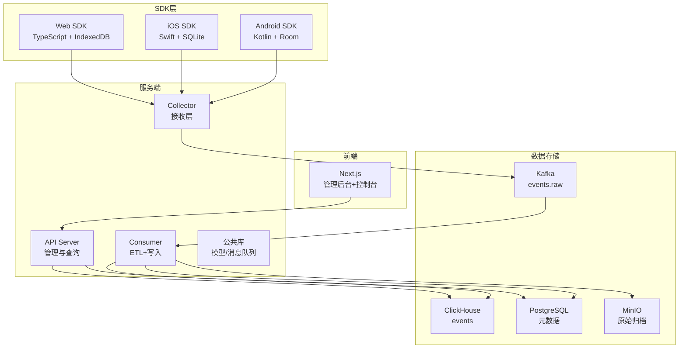

**图表来源**
- [README.md:6-22](file://README.md#L6-L22)
- [docs/architecture.md:3-35](file://docs/architecture.md#L3-L35)

**章节来源**
- [README.md:6-22](file://README.md#L6-L22)

## 核心组件
AeroLog的核心组件包括：

### 多端SDK一致性设计
- **统一协议**：三端SDK遵循相同的上报协议，确保数据格式一致
- **离线持久化**：各自平台的本地存储机制（Room/SQLite/IndexedDB）
- **批处理与退避**：统一的批量策略和指数退避重试机制
- **会话管理**：统一的$session_id生成与管理

### 服务端Go架构
- **Collector**：高并发接收层，负责鉴权、限流、Schema校验
- **Consumer**：Kafka消费与ETL处理，完成UA/IP解析与数据富化
- **API Server**：提供管理与查询接口，支持分析报表
- **公共库**：统一的事件模型、消息队列封装

### 数据存储栈
- **Kafka**：高吞吐消息队列，作为数据管道
- **ClickHouse**：OLAP数据库，支持高效分析查询
- **PostgreSQL**：元数据存储，保存项目配置等信息
- **MinIO**：对象存储，用于原始数据归档

**章节来源**
- [docs/architecture.md:37-53](file://docs/architecture.md#L37-L53)
- [docs/protocol.md:100-118](file://docs/protocol.md#L100-L118)

## 架构总览
AeroLog采用分层架构，参考神策的成熟实践，实现数据从采集到分析的完整闭环：

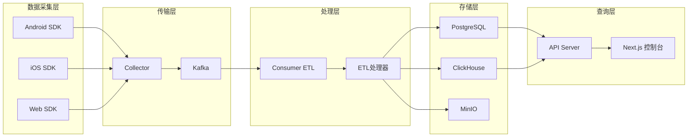

**图表来源**
- [docs/architecture.md:5-35](file://docs/architecture.md#L5-L35)

该架构的关键优势：
- **解耦性**：各层职责明确，便于独立扩展
- **弹性**：支持水平扩展，适应不同规模需求
- **可靠性**：多级冗余设计，确保数据不丢失
- **可观测性**：完善的监控指标与告警机制

## 详细组件分析

### SDK层组件分析

#### Android SDK架构
Android SDK采用协程+Room的现代架构，确保线程安全与高性能：

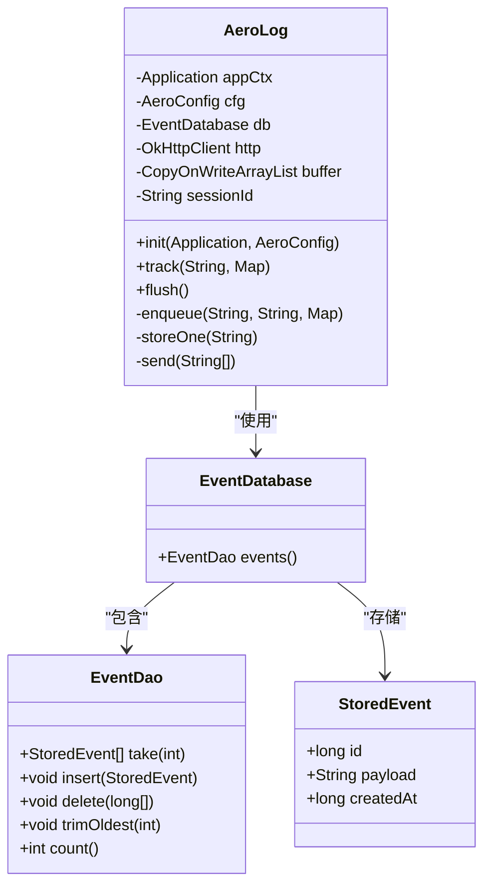

**图表来源**
- [sdk/android/aerolog/src/main/java/dev/aerolog/sdk/AeroLog.kt:37-216](file://sdk/android/aerolog/src/main/java/dev/aerolog/sdk/AeroLog.kt#L37-L216)

#### iOS SDK架构
iOS SDK采用单例模式与线程锁保护，确保在多线程环境下的安全性：

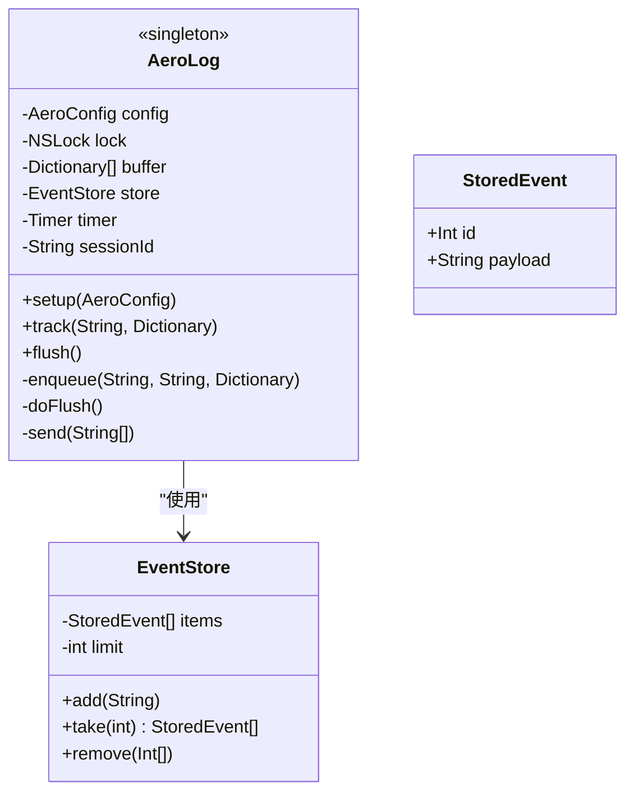

**图表来源**
- [sdk/ios/Sources/AeroLog/AeroLog.swift:6-207](file://sdk/ios/Sources/AeroLog/AeroLog.swift#L6-L207)

#### Web SDK架构
Web SDK采用现代浏览器特性，支持sendBeacon与IndexedDB：

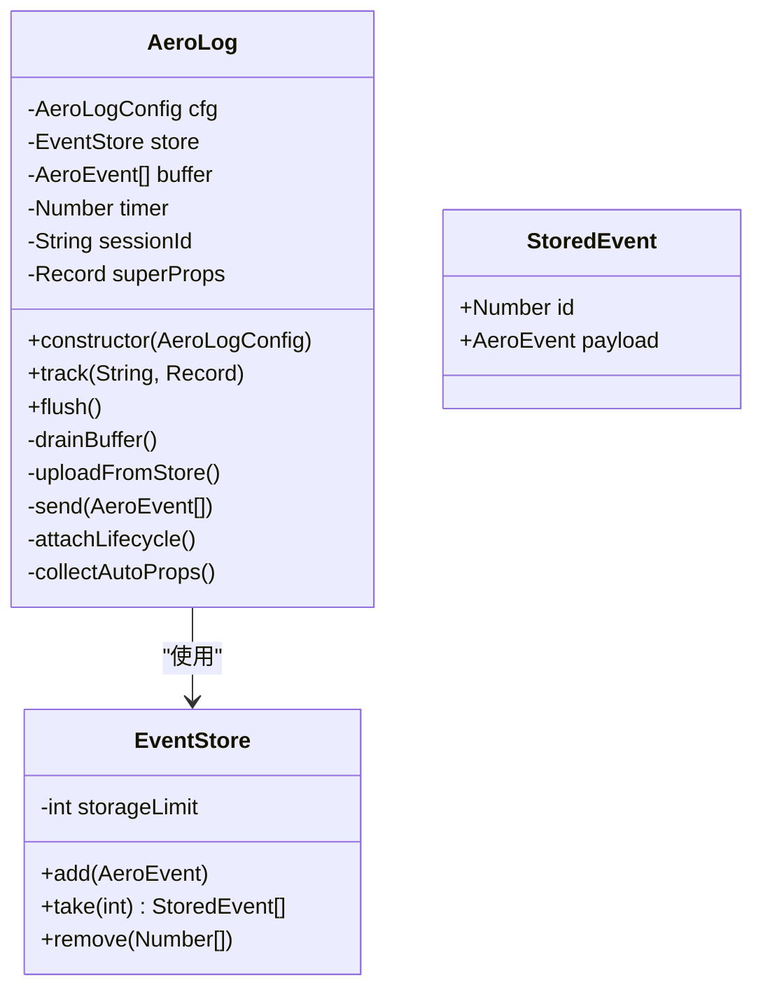

**图表来源**
- [sdk/web/src/index.ts:16-307](file://sdk/web/src/index.ts#L16-L307)

**章节来源**
- [sdk/android/aerolog/src/main/java/dev/aerolog/sdk/AeroLog.kt:1-216](file://sdk/android/aerolog/src/main/java/dev/aerolog/sdk/AeroLog.kt#L1-L216)
- [sdk/ios/Sources/AeroLog/AeroLog.swift:1-207](file://sdk/ios/Sources/AeroLog/AeroLog.swift#L1-L207)
- [sdk/web/src/index.ts:1-307](file://sdk/web/src/index.ts#L1-L307)

### 服务端组件分析

#### Collector组件
Collector作为数据接收入口，承担着高并发处理、鉴权与限流的重要职责：

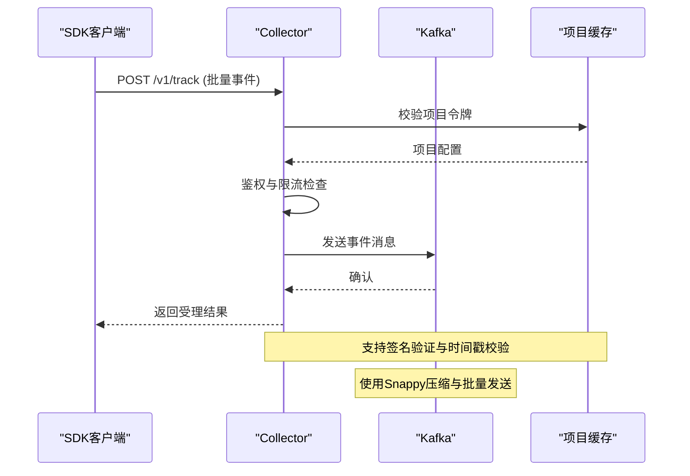

**图表来源**
- [server/collector/cmd/main.go:22-74](file://server/collector/cmd/main.go#L22-L74)
- [server/pkg/mq/producer.go:12-69](file://server/pkg/mq/producer.go#L12-L69)

#### Consumer组件
Consumer负责从Kafka消费数据并进行ETL处理：

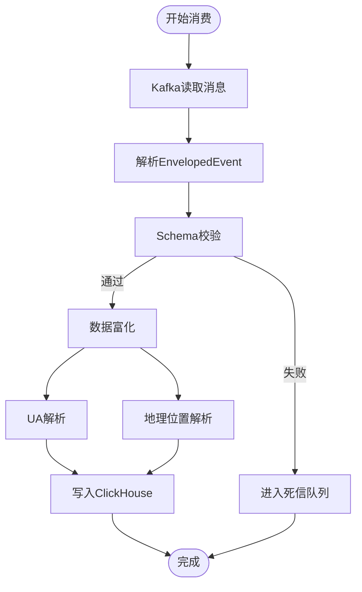

**图表来源**
- [server/consumer/cmd/main.go:18-55](file://server/consumer/cmd/main.go#L18-L55)
- [server/consumer/internal/etl/etl.go:29-90](file://server/consumer/internal/etl/etl.go#L29-L90)
- [server/consumer/internal/chsink/sink.go:45-103](file://server/consumer/internal/chsink/sink.go#L45-L103)

#### API组件
API服务器提供管理与查询接口：

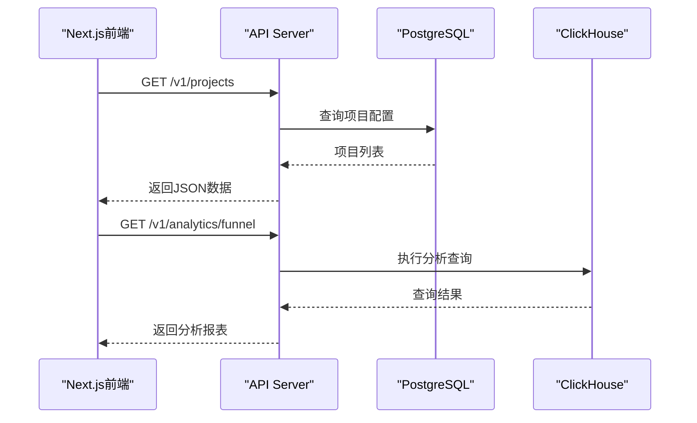

**图表来源**
- [server/api/cmd/main.go:35-78](file://server/api/cmd/main.go#L35-L78)

**章节来源**
- [server/collector/cmd/main.go:1-74](file://server/collector/cmd/main.go#L1-L74)
- [server/consumer/cmd/main.go:1-55](file://server/consumer/cmd/main.go#L1-L55)
- [server/api/cmd/main.go:1-121](file://server/api/cmd/main.go#L1-L121)

### 数据模型与协议

#### 统一事件模型
AeroLog定义了跨平台统一的事件结构：

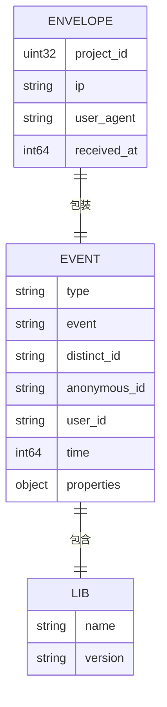

**图表来源**
- [server/pkg/model/event.go:27-84](file://server/pkg/model/event.go#L27-L84)
- [docs/event.schema.json:1-58](file://docs/event.schema.json#L1-L58)

#### 上报协议规范
AeroLog采用简洁高效的上报协议：

| 组件 | 描述 | 实现要点 |
|------|------|----------|
| **端点** | POST /v1/track | 支持token参数与可选签名 |
| **头部** | Content-Encoding: gzip | 建议启用压缩 |
| **请求体** | JSON数组 | 支持批量上报 |
| **响应** | 标准化错误码 | 429指数退避，5xx缓存重试 |

**章节来源**
- [docs/protocol.md:1-118](file://docs/protocol.md#L1-L118)
- [docs/event.schema.json:1-58](file://docs/event.schema.json#L1-L58)

## 依赖关系分析

### 技术栈依赖图
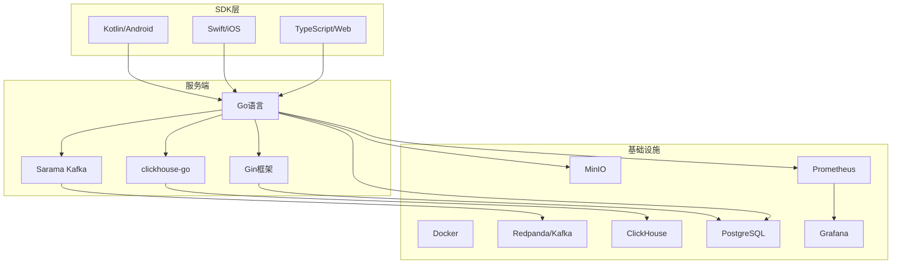

**图表来源**
- [deploy/docker-compose.yml:3-147](file://deploy/docker-compose.yml#L3-L147)

### 组件间耦合度分析
- **低耦合设计**：各组件通过消息队列解耦，支持独立扩展
- **接口契约**：统一的事件模型和上报协议确保跨组件兼容性
- **可替换性**：存储层可替换，ETL逻辑可扩展

**章节来源**
- [deploy/docker-compose.yml:1-147](file://deploy/docker-compose.yml#L1-L147)

## 性能考量
AeroLog在设计上充分考虑了性能优化：

### 写入性能优化
- **批量处理**：默认50条批量上报，减少网络开销
- **异步发送**：Kafka异步生产者，提高吞吐量
- **压缩传输**：Snappy压缩减少带宽占用
- **连接池**：ClickHouse连接池复用

### 查询性能优化
- **列式存储**：ClickHouse针对分析场景优化
- **分区策略**：按时间分区提升查询效率
- **索引优化**：合理使用物化视图和预计算

### 可靠性保障
- **多级持久化**：SDK本地存储 → Kafka副本 → ClickHouse
- **幂等处理**：基于$insert_id的去重机制
- **监控告警**：完善的指标体系与告警机制

## 故障排查指南

### 常见问题诊断流程
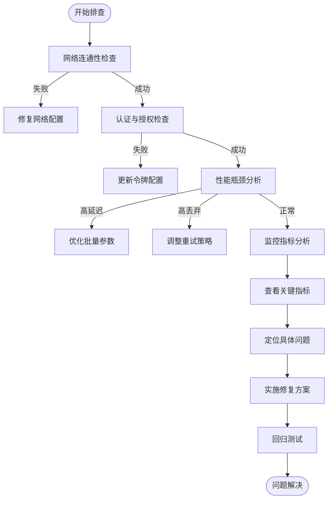

### 关键监控指标
- **Collector指标**：QPS、p99延迟、Kafka lag、内存使用
- **Consumer指标**：消费速率、ETL耗时、死信队列数量
- **存储指标**：ClickHouse写入延迟、磁盘空间、连接数

**章节来源**
- [docs/architecture.md:43-47](file://docs/architecture.md#L43-L47)

## 结论
AeroLog作为一个现代化的多端埋点平台，在架构设计上充分借鉴了神策的成功经验，通过分层解耦、统一协议和现代化技术栈，实现了从数据采集到分析的完整解决方案。

### 核心优势
- **一致性设计**：三端SDK共享协议与最佳实践
- **高扩展性**：支持从单机到大规模集群的演进
- **高可靠性**：多级冗余与监控保障数据质量
- **易维护性**：清晰的模块划分与完善的文档

### 技术特色
- **Go语言服务端**：高性能并发处理与现代化微服务架构
- **Kafka消息队列**：高吞吐量数据管道
- **ClickHouse OLAP**：面向分析的高性能数据库
- **Next.js前端**：现代化的管理界面

AeroLog为团队提供了稳定可靠的埋点基础设施，既适合初学者快速上手，也为有经验的开发者提供了深入定制的空间。通过合理的架构设计和完善的监控体系，能够支撑业务从起步到规模化发展的各个阶段。